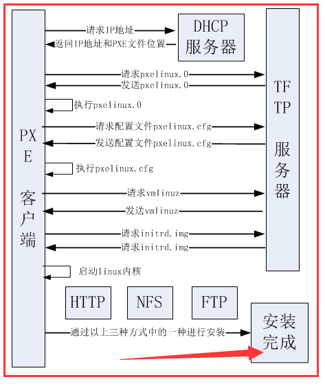
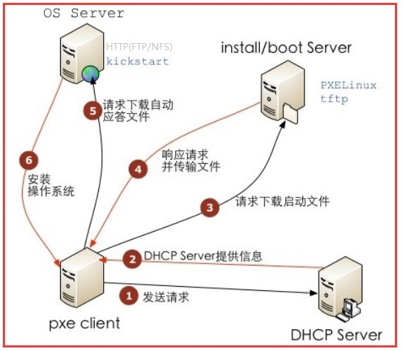
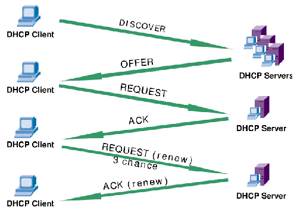

### PXE

##### PXE概念

PXE(Pre-boot Execution Environment，预启动执行环境)是由Intel公司开发的最新技术，工作于Client/Server的网络模式，支持工作站通过网络从远端服 务器下载映像，并由此支持通过网络启动操作系统，在启动过程中，终端要求服务器分配IP地址，再用TFTP（trivial file transfer protocol）或MTFTP(multicast trivial file transfer protocol)协议下载一个启动软件包到本机内存中执行，由这个启动软件包完成终端基本软件设置，从而引导预先安装在服务器中的终端操作系统。

严格来说，PXE 并不是一种安装方式，而是一种引导方式。进行 PXE 安装的必要条件是在要安装的计算机中必须包含一个 PXE 支持的网卡（NIC），即网卡中必须要有 PXE Client。PXE 协议可以使计算机通过网络启动。此协议分为 Client端和 Server 端，而PXE Client则在网卡的 ROM 中。当计算机引导时，BIOS 把 PXE Client 调入内存中执行，然后由 PXE Client 将放置在远端的文件通过网络下载到本地运行。运行 PXE 协议需要设置 DHCP 服务器和 TFTP 服务器。DHCP 服务器会给 PXE Client（将要安装系统的主机）分配一个 IP 地址，由于是给 PXE Client 分配 IP 地址，所以在配置 DHCP 服务器时需要增加相应的 PXE 设置。此外，在 PXE Client 的 ROM 中，已经存在了 TFTP Client，那么它就可以通过 TFTP 协议到 TFTP Server 上下载所需的文件了。

##### PXE装机步骤

PXE工作流程如图：




PXE+Kickstart安装过程如下图：




PXE装机步骤如下：

1. PXE Client向DHCP发送请求。PXE Client从自己的PXE网卡启动，通过PXE BootROM(自启动芯片)会以UDP(简单用户数据报协议)发送一个广播请求，向本网络中的DHCP服务器索取IP。

2. DHCP服务器提供信息。DHCP服务器收到客户端的请求，验证是否来至合法的PXE Client的请求，验证通过它将给客户端一个“提供”响应，这个“提供”响应中包含了为客户端分配的IP地址、pxelinux启动程序(TFTP)位置，以及配置文件所在位置。

3. PXE客户端请求下载启动文件。客户端收到服务器的“回应”后，会回应一个帧，以请求传送启动所需文件。这些启动文件包括：pxelinux.0、pxelinux.cfg/default、vmlinuz、initrd.img等文件。

4. Boot Server响应客户端请求并传送文件。当服务器收到客户端的请求后，他们之间之后将有更多的信息在客户端与服务器之间作应答, 用以决定启动参数。BootROM由TFTP通讯协议从Boot Server下载启动安装程序所必须的文件(pxelinux.0、pxelinux.cfg/default)。default文件下载完成后，会根据该文件中定义的引导顺序，启动Linux安装程序的引导内核。

5. 请求下载自动应答文件。客户端通过pxelinux.cfg/default文件成功的引导Linux安装内核后，安装程序首先必须确定你通过什么安装介质来安装linux，如果是通过网络安装(NFS, FTP, HTTP)，则会在这个时候初始化网络，并定位安装源位置。接着会读取default文件中指定的自动应答文件ks.cfg所在位置，根据该位置请求下载该文件。这里有个问题，在第2步和第5步初始化2次网络了，这是由于PXE获取的是安装用的内核以及安装程序等，而安装程序要获取的是安装系统所需的二进制包以及配置文件。因此PXE模块和安装程序是相对独立的，PXE的网络配置并不能传递给安装程序，从而进行两次获取IP地址过程，但IP地址在DHCP的租期内是一样的。

6. 客户端安装操作系统。将ks.cfg文件下载回来后，通过该文件找到OS Server，并按照该文件的配置请求下载安装过程需要的软件包。OS Server和客户端建立连接后，将开始传输软件包，客户端将开始安装操作系统。安装完成后，将提示重新引导计算机。


### 设备信息

|    软件名称     |   所在设备IP   |   版本   | 网卡名称 |     网卡IP     |
| :---------: | :--------: | :----: | :--: | :----------: |
| 待安装服务器(PXE) |     -      |   -    |  -   |      -       |
|    DHCP     | 10.13.17.9 | 4.2.5  | eth1 | 192.168.20.1 |
|    TFTP     | 10.13.17.9 | 5.2-13 |      |              |
|     FTP     | 10.13.17.9 | 3.0.2  |      |              |
|  syslinux   | 10.13.17.9 |  4.05  |      |              |

### 关闭防火墙

``` shell
sed -i "s/SELINUX=enforcing/SELINUX=disabled/g" /etc/selinux/config

systemctl stop firewalld.service
systemctl disable firewalld.service

# 查询selinux状态
sestatus
# 查询防火墙状态
systemctl status firewalld
```

### DHCP服务器

##### 概念

DHCP是一个局域网的网络协议，使用UDP协议工作，主要有两个用途：给内部网络或网络服务供应商自动分配IP地址，给用户或者内部网络管理员作为对所有计算机作中央管理的手段。

- DHCP  Client

  DHCP客户端，通过DHCP协议请求IP地址的客户端。DHCP客户端是接口级的概念，如果一个主机有多个以太接口，则该主机上的每个接口都可以配置成一个DHCP  客户端。交换机上每个Vlan接口也可以配置成一个DHCP客户端。

- DHCP Server

  DHCP 服务端，负责为DHCP客户端提供IP地址，并且负责管理分配的IP地址。

- DHCP Relay

  DHCP中继器，DHCP客户端跨网段申请IP地址的时候，实现DHCP报文的转发功能。

- DHCP Security

  DHCP安全特性，实现合法用户IP地址表的管理功能

- DHCP Snooping

  DHCP监听，记录通过二层设备申请到IP地址的用户信息


##### 工作原理



##### 安装操作

``` shell
yum install -y dhcp

cat >> /etc/dhcp/dhcpd.conf <<EOF
ddns-update-style interim;
ignore client-updates;
allow booting;
allow bootp;
next-server 192.168.20.1;

subnet 192.168.20.0 netmask 255.255.254.0 {
        option subnet-mask              255.255.254.0;
        option broadcast-address        192.168.20.255;
        option time-offset              -18000; # Eastern Standard Time
        range dynamic-bootp 192.168.20.2 192.168.20.253;
        default-lease-time 2100;
        max-lease-time 4320;
        #next-server 192.168.20.1;
        filename "pxelinux.0";
}
EOF

systemctl start dhcpd.service
```

### TFTP服务器

``` shell
yum install -y tftp-server

systemctl start tftp.socket
systemctl start tftp.service

s -anulpe | grep tftp
<<'COMMENT'
UNCONN     0      0           :::69                      :::*                   users:(("in.tftpd",pid=21745,fd=0),("systemd",pid=1,fd=25)) ino:66263 sk:ffff881fedbd84c0 v6only:0 <->
COMMENT

# 将 "disable=yes" 改为 "disable=no"
cat /etc/xinetd.d/tftp
<<'COMMENT'
service tftp
{
        socket_type             = dgram
        protocol                = udp
        wait                    = yes
        user                    = root
        server                  = /usr/sbin/in.tftpd
        server_args             = -u root -c -s /tftpboot
        disable                 = no
        per_source              = 11
        cps                     = 100 2
        flags                   = IPv4
}
COMMENT
```

### FTP服务器

``` shell
yum install -y vsftpd

systemctl start vsftpd.service
```

### 启动文件准备

##### PXE文件准备

``` shell
yum -y install syslinux

cp /usr/share/syslinux/pxelinux.0 /var/lib/tftpboot/

# 将光盘镜像isolinux下的所有文件拷贝到指定目录，主要是vmlinuz和initrd.img两个文件
mkdir -p /var/lib/tftpboot/img7_4
cp -rf /media/cdrom/isolinux/* /var/lib/tftpboot/img7_4

mv /var/lib/tftpboot/isolinux.cfg /var/lib/tftpboot/pxelinux.cfg/default

# 添加启动引导项
<<'COMMENT'
label centos_7_4
  menu label ^Install CentOS 7.4
  menu default
  kernel img7_4/vmlinuz
  append initrd=img7_4/initrd.img inst.stage2=ftp://192.168.20.1/CentOS_7_4 inst.repo=ftp://192.168.20.1/CentOS_7_4 inst.ks=ftp://192.168.20.1/CentOS_7_4/ks.cfg ksdevice=link modprobe.blacklist=nouveau quiet
COMMENT
```

##### FTP文件准备

``` shell
cd /var/ftp/
mkdir CentOS_7_4
cd CentOS_7_4

# 将系统镜像文件拷贝到该目录下
ls -al
<<'COMMENT'
total 15556
drwxrwxrwx 13 root root     4096 Jul 11 11:47 .
drwxr-xr-x  6 root root       85 Jul 11 11:08 ..
-rwxrwxrwx  1 root root       14 Apr 16 19:32 CentOS_BuildTag
-rwxrwxrwx  1 root root    28935 Jul  6 16:49 comps.xml
-rwxrwxrwx  1 root root       29 Apr 16 19:29 .discinfo
drwxrwxrwx  3 root root       33 Jul 10 17:44 EFI
-rwxrwxrwx  1 root root      227 Apr 16 19:32 EULA
-rwxrwxrwx  1 root root    18009 Apr 16 19:32 GPL
drwxrwxrwx  3 root root       54 Jul 10 17:44 images
drwxrwxrwx  2 root root     4096 Jul 10 18:02 isolinux
-rwxrwxrwx  1 root root     3824 Jul 11 11:05 ks.cfg
drwxrwxrwx  2 root root       41 Jul 10 17:45 LiveOS
drwxrwxrwx  2 root root    32768 Jul 10 17:45 Packages
drwxrwxrwx  2 root root     4096 Jul 10 17:45 repodata
-rwxrwxrwx  1 root root     1690 Apr 16 19:32 RPM-GPG-KEY-CentOS-7
-rwxrwxrwx  1 root root     1690 Apr 16 19:32 RPM-GPG-KEY-CentOS-Testing-7
-rwxrwxrwx  1 root root        0 Apr 16 19:32 sed
-rwxrwxrwx  1 root root     2883 Apr 16 19:32 TRANS.TBL
-rwxrwxrwx  1 root root      354 Apr 16 19:29 .treeinfo
COMMENT

# 注意一下repodata目录下的文件
ls -la repodata/
<<'COMMENT'
total 2612
drwxrwxrwx  2 root root   4096 Jul 12 17:45 .
drwxrwxrwx 13 root root   4096 Jul 15 11:47 ..
-rwxrwxrwx  1 root root  15127 Jul  6 16:15 125a166f3195a09a1824403679ww66e6bcc20940a92e9895ac0cb993197dab86b-other.xml.gz
-rwxrwxrwx  1 root root   5068 Jul  6 16:15 80579b0e19d98f33b666963e4fb06af4562d2f38b3bcfbd2af0caabf317c6fe-comps.xml.gz
-rwxrwxrwx  1 root root  45140 Jul  6 16:15 a067cf956f9b2bd09fdfe02ce0578deec696e6b78de72f1c186e96df060-primary.sqlite.bz2
-rwxrwxrwx  1 root root  12847 Jul  6 16:15 a9f728217f653e3f6510d89w2f858c6e77ca52023e9b7d3f785f5802e3320dc14-primary.xml.gz
-rwxrwxrwx  1 root root  17701 Jul  6 16:15 b536f9a8bceea6ec9b9a91904110339983be301c5d14f273bb1862027fb-filelists.sqlite.bz2
-rwxrwxrwx  1 root root  36927 Jul  6 16:15 bb7452sdfc66d1a578f81c666710c01b041f0f517436315a43946c7d694-filelists.xml.gz
-rwxrwxrwx  1 root root  24755 Jul  6 16:15 d3733c069090648234a32741c3a1379f057b6fbaa0d71ae17d1119dddd1d72f2de-other.sqlite.bz2
-rwxrwxrwx  1 root root  28935 Jul  6 16:15 e857be947736d076f6717ab8854bdac225xxd3ac596a3618a90bdfbc5cb8dae18-comps.xml
-rwxrwxrwx  1 root root   3700 Jul  6 16:15 repomd.xml
COMMENT
```

##### FTP文件的ks.cfg文件

``` config
#platform=x86, AMD64, or Intel EM64T
#version=DEVEL
# Install OS instead of upgrade
install
# Keyboard layouts
keyboard --vckeymap=us --xlayouts='us'
# Root password
rootpw --iscrypted $1$Jg7P7.19/$T.dd/wOkddT/
# (Required) Wrapper around the authconfig command CCE-14063-2 (row 80)
authconfig --enableshadow --passalgo=sha512
# System language
lang en_US.UTF-8
# Firewall configuration
firewall --disabled
# System authorization information
auth  --useshadow  --passalgo=sha512
# Use Web installation
url --url=ftp://192.168.20.1/CentOS_7_4/
# Use text mode install
text
# Run the Setup Agent on first boot
firstboot --enable
ignoredisk --only-use=sda
# SELinux configuration
selinux --disabled
# Do not configure the X Window System
skipx

# Reboot after installation
reboot --eject
# System timezone
timezone Asia/Shanghai --isUtc
# System bootloader configuration
bootloader --location=mbr --driveorder=sda --append=""
# Clear the Master Boot Record
zerombr
# Partition clearing information
clearpart --all --initlabel


%packages
@^minimal
@core
@chenjianrpm

%end

echo "                                                                 " >> /etc/motd
echo " ▄████▄   ██░ ██ ▓█████ ███▄    █  ▄▄▄██▀▀▀██▓▄▄▄      ███▄    █ " >> /etc/motd
echo "▒██▀ ▀█  ▓██░ ██▒▓█   ▀ ██ ▀█   █    ▒██  ▓██▒████▄    ██ ▀█   █ " >> /etc/motd
echo "▒▓█    ▄ ▒██▀▀██░▒███  ▓██  ▀█ ██▒   ░██  ▒██▒██  ▀█▄ ▓██  ▀█ ██▒" >> /etc/motd
echo "▒▓▓▄ ▄██▒░▓█ ░██ ▒▓█  ▄▓██▒  ▐▌██▒▓██▄██▓ ░██░██▄▄▄▄██▓██▒  ▐▌██▒" >> /etc/motd
echo "▒ ▓███▀ ░░▓█▒░██▓░▒████▒██░   ▓██░ ▓███▒  ░██░▓█   ▓██▒██░   ▓██░" >> /etc/motd
echo "░ ░▒ ▒  ░ ▒ ░░▒░▒░░ ▒░ ░ ▒░   ▒ ▒  ▒▓▒▒░  ░▓  ▒▒   ▓▒█░ ▒░   ▒ ▒ " >> /etc/motd
echo "  ░  ▒    ▒ ░▒░ ░ ░ ░  ░ ░░   ░ ▒░ ▒ ░▒░   ▒ ░ ▒   ▒▒ ░ ░░   ░ ▒░" >> /etc/motd
echo "░         ░  ░░ ░   ░     ░   ░ ░  ░ ░ ░   ▒ ░ ░   ▒     ░   ░ ░ " >> /etc/motd
echo "░ ░       ░  ░  ░   ░  ░        ░  ░   ░   ░       ░  ░        ░ " >> /etc/motd
echo "░                                                                " >> /etc/motd
echo "                                                                 " >> /etc/motd
echo "                 blog: https://o-my-chenjian.com                 " >> /etc/motd
echo "                 gmail: chenjian158978@gmail.com                 " >> /etc/motd

# 尝试次数：5  最少不同字符：3 最小密码长度：10  最少大写字母：1 最少小写字母：3 最少数字：3 密码字典：/usr/share/cracklib/pw_dict
sed -i 's/pam_cracklib\.so$/password  requisite pam_cracklib.so retry=5  difok=3 minlen=10 ucredit=-1 lcredit=-3 dcredit=-3/g' /etc/pam.d/system-auth
chage -d 0 root

%post --log=/mnt/sysimage/root/ks-post.log

%end

%post --nochroot --log=/mnt/sysimage/root/ks-post-nochroot.log

wget ftp://192.168.20.1/CentOS_7_4/chenjian/* -r -nd -c -P /mnt/sysimage/root/chenjian
wget ftp://192.168.20.1/CentOS_7_4/o-my-chenjian -c -P /mnt/sysimage/root/o-my-chenjian

%addon com_RedHat_kdump --disable --reserve-mb='auto'

%end
```

注意内容：

- 安装模式改为Web安装，即url

- 拷贝文件的方式，从cp模式转为wget模式

- - 星号*: 代表文件夹内部所有文件，是下载文件夹所需

- - 参数r: 代表下载文件夹

- - 参数c: 代表使用断点续传

- - 参数nd: 代表递归下载时不创建一层一层的目录，把所有的文件下载到当前目录

- - 参数P: 代表目标下载文件夹路径

### 开机安装操作

1. 待安装的服务器，需BIOS支持PXE安装；

2. 待安装服务器的网线连到DHCP服务器上，或共连一个交换机;

3. 开机，F11进入Boot管理(不同品牌设备快捷键不同)，选择PXE引导项；

4. 等待安装结束，自动重启完。

### 解压文件包

在使用`wget`从	`ftp`上下载文件包的时候，发现一个问题：会丢失一些目录结构较深的文件。对于这个问题的解决方案，采用**下载解压包，在本地解压**。同样带来了一个问题，如歌解压更快，同时不丢失文件。

##### linux下使用cpu并发解压缩来加快速度

`pigz`是支持并行的gzip,默认用当前逻辑cpu个数来并发压缩，无法检测个数的话，则并发8个线程。

##### 安装pigz

``` shell
yum install -y pigz
```

##### 压缩

``` shell
starttime=`date +'%Y-%m-%d %H:%M:%S'`

tar --use-compress-program=pigz -cvpf package.tgz -C /root/package .

endtime=`date +'%Y-%m-%d %H:%M:%S'`
start_seconds=$(date --date="$starttime" +%s);
end_seconds=$(date --date="$endtime" +%s);
echo "本次运行时间： "$((end_seconds-start_seconds))"s"
```

##### 解压

``` shell
starttime=`date +'%Y-%m-%d %H:%M:%S'`

mkdir -p /home/chenjian/package
tar --use-compress-program=pigz -xvpf package.tgz -C /home/chenjian/package

endtime=`date +'%Y-%m-%d %H:%M:%S'`
start_seconds=$(date --date="$starttime" +%s);
end_seconds=$(date --date="$endtime" +%s);
echo "本次运行时间： "$((end_seconds-start_seconds))"s"
```

- 可选进程数的解压方式

``` shell
pigz -dc -p 28 package.tgz | tar -xC  /home/chenjian/package

# -p 是指进程数，可通过以下命令查看
cat /proc/cpuinfo |grep "processor" | wc -l
```

### 参考博文

1. [wget命令下载FTP整个目录进行文件备份](https://www.cnblogs.com/crxis/p/7072813.html)
2. [wget指定文件，指定目录，指定路径下载](https://blog.csdn.net/xiaosi1202/article/details/50817176)
3. [PXE网络装系统PXE+DHCP+TFTP+FTP](https://www.2cto.com/net/201707/659908.html)
4. [Linux学习pxe自动化安装系统](https://blog.csdn.net/a10742864/article/details/78795166)
5. [通过PXE网络安装linux服务器](http://www.docin.com/p-208713687.html)
6. [超详细的pxe实现系统自动安装的图文说明](https://blog.csdn.net/heshijie87/article/details/74090335)
7. [Kickstart无人值守安装系统](http://blog.51cto.com/renjunjie622/1782543)
8. [pxe+kickstart部署多个版本的Linux操作系统](https://www.cnblogs.com/sunhongleibibi/p/7851382.html)
9. [CentOS设置密码复杂度及过期时间等](https://www.cnblogs.com/minseo/p/7880338.html)
10. [linux下使用cpu并发解压缩来加快速度](https://blog.csdn.net/lj402159806/article/details/76618174)
11. [Shell 脚本计算时间差](https://www.cnblogs.com/leixingzhi7/p/6281675.html)
12. [pigz多线程压缩工具](http://www.ywnds.com/?p=10332)
13. [linux下使用cpu并发解压缩来加快速度](https://blog.csdn.net/lj402159806/article/details/76618174)


<a rel="license" href="http://creativecommons.org/licenses/by-nc-sa/4.0/"></a>本作品由<a xmlns:cc="http://creativecommons.org/ns#" href="https://o-my-chenjian.com/2018/07/11/Install-CentOS7-By-Using-PXE/" property="cc:attributionName" rel="cc:attributionURL">陈健</a>采用<a rel="license" href="http://creativecommons.org/licenses/by-nc-sa/4.0/">知识共享署名-非商业性使用-相同方式共享 4.0 国际许可协议</a>进行许可。