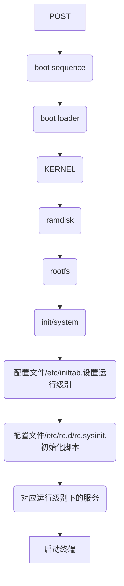

# CentOS6系统启动流程
先来说说开机流程,为了方便大家理解，这里由浅入深分为3个部分：[简述流程](#1)、[启动流程思维导图](#2)、[启动流程详解](#3)

+ <h2 id="1">简述流程</h2>


+ <h2 id="2">启动流程的思维导图</h2>


+ <h2 id="3">启动流程详解</h2>
配合思维导图食用更佳
> **1. POST加电自检**

通电后，主板上的BIOS会对硬件进行检测，如CPU、内存级I/O设备等。

> **2. Boot Sequence 选择引导顺序**

这一步也是在BIOS上进行的，BIOS会根据启动顺序，依次扫描各个引导设备，启动第一个具有bootloader的设备。

> **3. Bootloader 引导加载器**

+ bootloader类型
1. windows: ntloader，仅是启动OS
2. Linux：LILO、GRUB（常用）

在[《Linux基础_磁盘存储和文件系统》](https://thson.blog.csdn.net/article/details/90236493)这篇文章中写到，bootloader就是MBR引导记录的512字节中的前446个字节。主要是用来引导用户选择要启动的系统或者不同的内核版本，把用户选中的内核加载到内存RAM中。


+ GRUB就是bootloader的一种类型：
GRUB通过三个阶段来加载内核：stage1、stage1.5、stage2
**stage1：** 存放在MBR的前446字节中(`/boot/grub/stage1`为MBR的前512字节的副本)，用于加载stage1.5，目的是为了识别并驱动stage2(或/boot)所在分区的文件系统
**stage1.5：** 存放于MBR之后的扇区，用于加载stage2所在分区的文件系统驱动(目录`/boot/grub/*stage1_5`下，存放了一些分区文件系统的驱动)
**stage2：** 存放于`/boot/grub/stage2`下，读取配置文件`/boot/gurb/grub.conf`，显示系统启动菜单，用于加载内核文件(vmlinuz*)及ramdisk虚拟文件系统(initramfs)

这个就是stage2(启动时在倒计时界面按ENTER键)


**下面列出/boot目录下的文件**
+ `/boot`目录下的文件

```bash
[root@CentOS6 boot]$#ls -1 /boot
#此版本内核被编译时选择的功能与模块配置文件
config-2.6.32-754.el6.x86_64
efi/
#grub相关配置文件的目录
grub/
#虚拟文件系统
initramfs-2.6.32-754.el6.x86_64.img
#
symvers-2.6.32-754.el6.x86_64.gz
#内核功能放置到内存地址的映射表
System.map-2.6.32-754.el6.x86_64
#内核文件
vmlinuz-2.6.32-754.el6.x86_64
```

+ `/boot/grub`目录下的文件

```bash
[root@CentOS6 boot]$#ls -1 /boot/grub
#设备的映射
device.map
grub.conf
menu.lst
splash.xpm.gz
#MBR前512字节的副本文件
stage1
#stage2
stage2
#以下都是各文件系统的驱动
e2fs_stage1_5
fat_stage1_5
ffs_stage1_5
iso9660_stage1_5
jfs_stage1_5
minix_stage1_5
reiserfs_stage1_5
ufs2_stage1_5
vstafs_stage1_5
xfs_stage1_5
```

+ `/boot/grub/grub.conf`配置文件说明

```bash
[root@CentOS6 boot]$#cat /boot/grub/grub.conf
# grub.conf generated by anaconda
#
# Note that you do not have to rerun grub after making changes to this file
# NOTICE:  You have a /boot partition.  This means that
#          all kernel and initrd paths are relative to /boot/, eg.
#          root (hd0,0)
#          kernel /vmlinuz-version ro root=/dev/sda2
#          initrd /initrd-[generic-]version.img
#boot=/dev/sda
default=0   #设置默认的启动项
timeout=5   #等待时长
splashimage=(hd0,0)/grub/splash.xpm.gz #指定菜单的图片背景
hiddenmenu  #是否隐藏菜单
title CentOS 6 (2.6.32-754.el6.x86_64) #菜单标题
        root (hd0,0)    #stage2和kernel文件所在设备分区，即GRUB的根
        #内核匹配的ramfs文件
        kernel /vmlinuz-2.6.32-754.el6.x86_64 ro  root=UUID=e5a4491f-5c14-4445-a1bc-f183825eedaa rd_NO_LUKS rd_NO_LVM LANG=en_US.UTF-8 rd_NO_MD SYSFONT=latarcyrheb-sun16 crashkernel=auto  KEYBOARDTYPE=pc KEYTABLE=us rd_NO_DM rhgb quiet
        #根文件系统驱动及其它驱动
        initrd /initramfs-2.6.32-754.el6.x86_64.img
```

> **4. Kernel初始化**

1. 当内核加载完毕后，控制权就从stage2传递给内核，内核镜像是一个被压缩过的文件，镜像的开头是一个程序，可以对硬件进程简单的配置并解压内核。如果`initramfs`存在，则也加载到内存中，接下来就是真正的内核启动了。
2. 在内核启动时，原本的stage2加载到内存的`initramfs`充当临时的根文件系统，并允许启动内核，当内核启动后，这个`initramfs`会被卸载，挂载真正的根文件系统。
3. 在`initramfs`中，提供了访问磁盘和挂载真正的根文件系统的方法，同时也提供了访问其它硬件设备的方法。这个`initramfs`存放在`/boot/initramfs*.img`。
4. 当内核初始化完毕后，内核会启动第一个用户空间的程序——init(在centos7上为systemd)
```bash
#CentOS 7
[root@localhost /boot]$ll /usr/sbin/init
lrwxrwxrwx. 1 root root 22 May 28 02:07 /usr/sbin/init -> ../lib/systemd/systemd
```

> **5. init(systemd) 用户空间的第一个应用程序**

+ 在这个阶段主要：1.设定默认启动级别 --> 2.设定系统初始化脚本 --> 3.启动或关闭对应级别的服务 --> 4.启动终端，进入登录界面

> **5.1设定默认启动级别**

+ 查看当前启动级别：`runlevel`、`who -r`
+ 切换级别：`init #`
+ init的配置文件：
    1. CentOS 5：init是SysV init，其特点是启动用户空间的服务程序，通常通过脚本进行，有依赖关系的服务将被串行启动，这也导致了CentOS 5的启动过程相当缓慢，配置文件为`/etc/inittab`
    2. CentOS 6：init是Upstart，其特点是类似于并行启动；配置文件：`/etc/inittab,/etc/init/*.conf`
    3. CentOS 7：init是systemd，其配置文件为：`/usr/lib/system/systemd/*, /etc/systemd/system/*`

+ 运行级别（存放在`/etc/inittab`）

```
0-6：共7个级别；
    0：关机，shutdown
    1：单用户模式（single user），root用户，无须认证，维护模式；
    2：多用户模式（multi user），会启动网络功能，但不会启动NFS，维护模式；
    3：多用户模式（multi user），完全功能模式，文本界面；
    4：预留级别：目前无特别使用目的，但习惯以同3级别功能使用；
    5：多用户模式（multi user），完全功能模式，图形界面；
    6：重启，reboot
```

> **5.2设定系统初始化脚本**

该脚本存放在`/etc/rc.d/rc.sysinit`
主要内容有：
(1) 设置主机名
(2) 设置欢迎信息
(3) 激活udev和selinux
(4) 挂载/etc/fstab文件中定义的文件系统
(5) 检测根文件系统，并以读写方式重新挂载根文件系统
(6) 设置系统时钟
(7) 激活swap设备
(8) 根据/etc/sysctl.conf文件设置内核参数
(9) 激活lvm及software raid设备
(10) 加载额外设备的驱动程序
(11) 清理操作

> **5.3启动或关闭对应级别的服务**

+ 根据运行级别，运行`/etc/rc.d/rc`脚本
+ 要启动或关闭的服务存放在`/etc/rc.d/rc*.d/`下(*表示对应的运行目录)
+ S开头的文件表示要启动的服务，K开头的文件表示要关闭的服务。紧随其后的数字表示优先级。

```bash
#/etc/rc.d/rc*.d/目录下的文件
[root@CentOS6 boot]$#ll /etc/rc.d/rc3.d/
total 0
lrwxrwxrwx. 1 root root 16 May 13 02:25 K01smartd -> ../init.d/smartd
lrwxrwxrwx. 1 root root 17 May 13 02:23 K02oddjobd -> ../init.d/oddjobd
lrwxrwxrwx. 1 root root 17 May 13 02:26 K05wdaemon -> ../init.d/wdaemon
lrwxrwxrwx. 1 root root 16 May 13 02:25 K10psacct -> ../init.d/psacct
lrwxrwxrwx. 1 root root 19 May 13 02:23 K10saslauthd -> ../init.d/saslauthd
lrwxrwxrwx. 1 root root 22 May 13 02:23 K15htcacheclean -> ../init.d/htcacheclean
lrwxrwxrwx. 1 root root 15 May 13 02:23 K15httpd -> ../init.d/httpd
lrwxrwxrwx. 1 root root 24 May 13 02:25 K30spice-vdagentd -> ../init.d/spice-vdagentd
lrwxrwxrwx. 1 root root 17 May 13 02:23 K50dnsmasq -> ../init.d/dnsmasq
lrwxrwxrwx. 1 root root 15 May 13 02:46 K50kdump -> ../init.d/kdump
lrwxrwxrwx. 1 root root 13 May 13 02:22 K60nfs -> ../init.d/nfs
lrwxrwxrwx. 1 root root 18 May 13 02:25 K61nfs-rdma -> ../init.d/nfs-rdma
lrwxrwxrwx. 1 root root 20 May 13 02:22 K69rpcsvcgssd -> ../init.d/rpcsvcgssd
lrwxrwxrwx. 1 root root 17 May 13 02:22 K73winbind -> ../init.d/winbind
lrwxrwxrwx. 1 root root 14 May 13 02:46 K74ntpd -> ../init.d/ntpd
lrwxrwxrwx. 1 root root 17 May 13 02:23 K75ntpdate -> ../init.d/ntpdate
```
+ 另外，还有一个文件`/etc/rc*.d/rc.local`文件
它的优先级最小，所以最后启动，如果你想要开机做一些什么操作，可以写到这个脚本里面

+ 相当命令：[服务相关](#10)

> **5.4启动终端，进入登录界面**

执行`/bin/login`程序。根据前面获取的默认运行级别来启动终端。如果运行级别为5，则启动图形界面
  