<center> <font size=12> Ceph 分布式存储 </font> </br>
陈即彪 </br>
2019年11月15日 
</center>

</br>

# 分布式存储

• Ceph是一个对象（ object） 式存储系统， 它把每一个待管理的数据流（ 例如一个文件）切分为一到多个固定大小（默认4M）的对象数据， 并以其为原子单元完成数据存取
• 对象数据的底层存储服务是由多个主机（ host） 组成的存储集群， 该集群也被称之为RADOS（ Reliable Automatic Distributed Object Store） 存储集群， 即可靠、 自动化、分布式对象存储系统
• librados是RADOS存储集群的API， 它支持C、 C++、 Java、 Python、 Ruby和PHP等编程语言
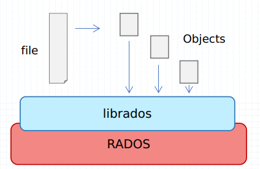

RadosGW、 RBD和CephFS都是RADOS存储服务的客户端， 它们把RADOS的存储服务接口（ librados） 分别从不同的角度做了进一步抽象， 因而各自适用于不同的应用场景；


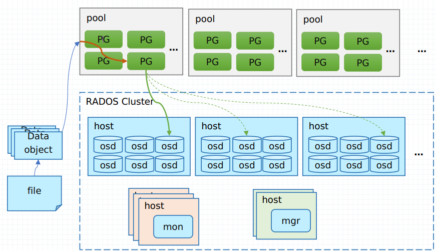


• 无论您想要为云平台提供Ceph对象存储和/或Ceph块设备服务、部署Ceph文件系统或将Ceph用于其他用途，所有Ceph存储集群部署都是从设置每个Ceph节点、您的网络和Ceph存储集群开始的。
• Ceph存储集群至少需要一个Ceph监视器、Ceph管理器和Ceph OSD(对象存储守护进程)。
• 在运行Ceph文件系统客户机时，还需要Ceph元数据服务器。
• 不过， 从严格意义上来说， MDS只能算作是建构于RADOS存储集群之上的文件存取接口， 它同RBD和RadowGW属于同一个级别， 而非Ceph的基础组件；
• 但它却是Ceph的第一个（ 最初也是除librados API之外的惟一一个） 客户端数据存取接口

# RADOS组件
## 1. Monitors
• Ceph Monitor (Ceph -mon)维护集群状态的 map，包括Monitor map、manager map、OSD map和CRUSH map。
•这些map是Ceph守护进程相互协调所需的关键集群状态。
•监视器还负责管理守护进程和客户机之间的身份验证。
•为了冗余和高可用性，通常至少需要三个监视器。

## 2. Managers
• Ceph Manager守护进程(Ceph -mgr)负责跟踪Ceph集群的运行时指标和当前状态，包括存储利用率、当前性能指标和系统负载。
• Ceph Manager守护进程还托管基于python的插件来管理和公开Ceph集群信息，包括基于web的Ceph Manager仪表板和REST API。
• 高可用性通常需要至少两个经理。

## 3. Ceph OSDs
• Ceph OSD(对象存储守护进程，Ceph - OSD)存储数据，处理数据复制、恢复、再平衡，并提供一些监控信息
• Ceph通过检查其他Ceph OSD守护进程来监视和管理心跳。
•至少三个Ceph osd通常需要冗余和高可用性。

## 4. MDSs
• Ceph元数据服务器(MDS, Ceph - MDS)代表Ceph文件系统存储元数据。Ceph块设备和Ceph对象存储不使用MDS。
• Ceph元数据服务器允许POSIX文件系统用户执行基本命令(如ls、find等)，而不会给Ceph存储集群带来巨大的负担。

---
# 数据抽象接口（ 客户端中间层）
• Ceph存储集群提供了基础的对象数据存储服务， 客户端可基于RADOS协议和librados API直接与存储系统交互进行对象数据存取
• LIBRADOS
• librados提供了访问RADOS存储集群支持异步通信的API接口， 支持对集群中对象数据的直接并行访问， 用户可通过支持的编程语言开发自定义客户端程序通过RADOS协议与存储系统进行交互
• 客户端应用程序必须与librados绑定方可连接到RADOS存储集群， 因此， 用户必须事先安装librados及其依赖后才能编写使用librados的应用程序
• librados API本身是用C ++编写的， 它额外支持C、 Python、 Java和PHP等开发接口
• 当然， 并非所有用户都有能力自定义开发接口以接入RADOS存储集群的需要， 为此， Ceph也原生提供了几个较高级别的客户端接口， 它们分别是RADOS GateWay（ RGW） 、 Reliable Block Device（ RBD） 和MDS（ MetaData Server） ， 分别为用户提供RESTful、 块和POSIX文件系统接口

# CEPH FILESYSTEM
• The Ceph Filesystem (CephFS) is a POSIX-compliant filesystem that uses a Ceph Storage Cluster to store its data.
• 不同于传统文件系统的地方是， CephFS MDS在设计的初衷之一即高度可扩展的能力， 其实现机制中， 数据由客户端以分布式方式通过多路OSD直接存储于RADOS系统， 而元数据则由MDS组织管理后仍然存储于RADOS系统之上
• MDS仅是实现了分布式文件系统的控制平面， 数据和元数据的存取依然由RADOS负责
• CephFS依赖于独立运行的守护进程ceph-mds向客户端提供服务
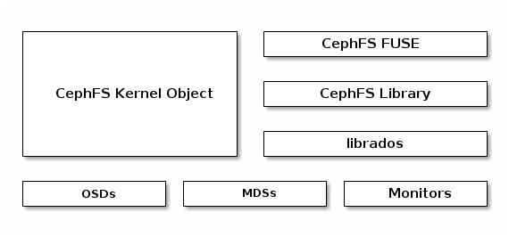

# CEPH BLOCK DEVICE
• 存储领域中， “块（ block） ” 是进行数据存取的主要形式， 块设备也于是成为了主流的设备形式， 因此， RBD虚拟块设备也就成了Ceph之上广为人知及非常受欢迎的访问接口
• Ceph块设备(RBD)是在Ceph集群中跨多个osd的瘦配置、可调整大小和存储数据条带的设备。
• RBD利用RADOS的功能，如快照、复制和一致性，并使用内核模块或librbd库与OSDs交互。
• RBD为内核模块、kvm(如QEMU)和基于云的计算系统(如OpenStack和CloudStack)提供了高性能和无限的可扩展性，这些计算系统依赖于libvirt和QEMU与Ceph块设备集成。
• RBD的服务接口无须依赖于特定的守护进程；
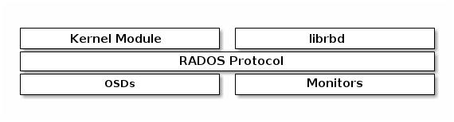

# CEPH OBJECT GATEWAY
• Ceph对象网关是一个对象存储接口，构建在librados的基础上，为应用程序提供一个到Ceph存储集群的RESTful网关。
• Ceph对象存储支持两个接口:s3兼容和Swiftcompatible。
• Ceph对象存储使用Ceph对象网关守护进程(radosgw)，这是一个用于与Ceph存储集群交互的HTTP服务器。
• RGW依赖于在RADOS集群基础上独立运行的守护进程（ ceph-radosgw） 基于http或https协议提供相关的API服务， 不过， 通常仅在需要以REST对象形式存取数据时才部署RGW
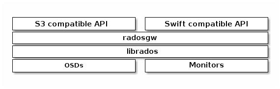

# 管理节点（ Admin Host）
• Ceph的常用管理接口是一组命令行工具程序， 例如rados、 ceph、 rbd等命令， 管理员可以从某个特定的MON节点执行管理操作， 但也有人更倾向于使用专用的管理节点
•事实上， 专用的管理节点有助于在Ceph相关的程序升级或硬件维护期间为管理员提供一个完整的、 独立的并隔离于存储集群之外的操作环境， 从而避免因重启或意外中断而导致维护操作异常中断
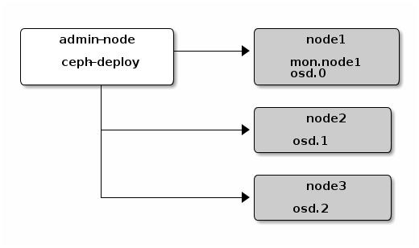

# Ceph Features
• Ceph环境具有以下特点:
    • 可扩展性: Ceph可以扩展到数千个节点，管理pb级的存储。
    • 自我管理：Ceph集群是自我管理的。当节点被添加、删除或失败时，集群会自动重新分布数据。它还知道磁盘超载。
    • 没有单点故障
    • 集群中没有节点单独存储重要信息。可以配置冗余的数量。
    • 开源软件
    • Ceph是一个开源软件解决方案，独立于特定的硬件或供应商。


# FileStore and BlueStore
• BlueStore is a new storage backend for Ceph.
• It boasts better performance (roughly 2x for writes), full data checksumming, and built-in compression.
• It is the new default storage backend for Ceph OSDs in Luminous v12.2.z and will be used by default when provisioning new OSDs with ceph-disk, ceph-deploy, and/or ceph-ansible
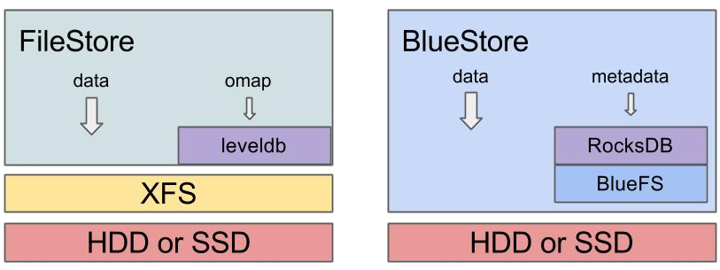

## FILESTORE
• FileStore是Ceph中存储对象的传统方法。它依赖于一个标准的文件系统(通常是XFS)和一个键/值数据库(传统上是LevelDB，现在是RocksDB)来获取一些元数据。
• FileStore经过了良好的测试，在生产环境中得到了广泛的应用，但由于其总体设计和依赖于传统的文件系统来存储对象数据，因此存在很多性能缺陷。
• 尽管FileStore通常能够在大多数POSIXcompatible文件系统(包括btrfs和ext4)上运行，但我们只建议使用XFS。
• btrfs和ext4都知道bug和缺陷，使用它们可能会导致数据丢失。默认情况下，所有Ceph配置工具都将使用XFS。

## BLUESTORE
• BlueStore是专门为Ceph OSD工作负载管理磁盘数据而设计的专用存储后端。
• 其动机来自过去十年使用FileStore支持和管理osd的经验。
• BlueStore特性
• 直接管理存储设备
• BlueStore使用原始块设备或分区。这避免了任何可能限制性能或增加复杂性的抽象层(如XFS之类的本地文件系统)。
• 使用RocksDB管理元数据
• 它嵌入RocksDB的键/值数据库，以便管理内部元数据，例如从对象名称到磁盘上块位置的映射。
• 完整的数据和元数据校验和
• 默认情况下，写入BlueStore的所有数据和元数据都受到一个或多个校验和的保护。
• 未经验证，不会从磁盘读取数据或元数据，也不会返回给用户

### BlueStore Features
• 内联压缩: 写入的数据在写入磁盘之前可能被压缩。
• 多设备元数据分层
• BlueStore允许将其内部日志(提前写日志)写入单独的高速设备(如SSD、NVMe或NVDIMM)以提高性能。
• 如果有大量更快的存储可用，内部元数据也可以存储在更快的设备上。
• 有效即写即拷: RBD和CephFS快照依赖于在BlueStore中有效实现的写时复制克隆机制。
• 这为常规快照和擦除编码池(依赖克隆来实现高效的两阶段提交)带来了高效的IO。


----
# Ceph的基础
## 版本命令规则
x.0.z - 开发版（给早期测试者和勇士们）
x.1.z - 候选版（用于测试集群、高手们）
x.2.z - 稳定、修正版（给用户们）
LTS –长期支持版（企业使用）

## Ceph 推荐的最低配置
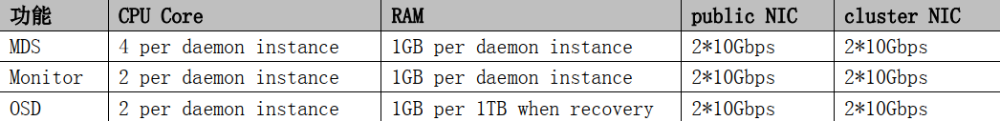
https://docs.ceph.com/docs/master/start/hardware-recommendations/

## OSD 的 data 与 journal 配比
**对 HDD 作为日志磁盘**
osd journal size = {2 * (expected throughput * filestore max sync interval)}
这里以 7200 转的硬盘+万兆网卡为例：硬盘的最大吞吐量为 100MB/s，万兆网卡是 1000MB/s，这里取小的，即100MB/s； filestore max sync interval=5s； osd journal size = 2 * (100MB/s * 5) = 1GB。
**对 SSD 作为日志磁盘**
journal 空间大小的建议： 10-20GB

当 joournal 使用 SSD 时，不同接口的 SSD 配比不一样， SATA SSD 与 OSD的配比是 1:4； NVMe SSD 与 OSD 的配比是 1:12-1:18
即：4个OSD数据盘可以共享一个SSD


## Ceph 硬件配置的其他要求
1. 每个 OSD 对应一块磁盘/SSD，不要将多个 OSD 放在一块磁盘上（即 OSD 对应磁盘的分区，这个只能测试环境下使用）
2. OS， monitor,MDS 的磁盘最好使用独立的磁盘，不要运行在同一块磁盘上，处于性能的考虑。
3. OSD 的 data 和 OSD 的 journals 分布在两块磁盘上；当前的实际操作： OSD 的 data 在一块独立的磁盘上， OSD的 journals 落在 SSD 的一块分区上，大小不小于 10GB（QCT 厂家，在测试环境下，使用的也是 10GB）。
4. 一台服务器上的 OSD 磁盘总带宽不要超过网卡的总带宽。
5. 单个 OSD 的容量要小于 ceph 集群总容量的 10%。 比如： 在一个 1PB 的 Ceph 集群中，要避免使用 4 个 250TB的 OSD 节点，因为每个节点占了 25%的集群容量。 可以使用 13 个 80TB 的 OSD 节点，每个节点容量小于集群容量的 10%。


# Ceph 概念
## Ceph的对象
下面是一个对象的示意图；对象的默认大小为 4MB。
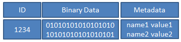

1. ID 是对象的唯一标识
2. Binary Data 是对象的数据，其在本地文件系统中对应一个文件，对象的数据就保存在文件中。
3. Metadata 是对象的元数据， 以 key-value 的形式存在，在 RADOS 中有两种实现： xattrs 和 omap：
• xattrs：是将元数据保存在对象对应文件的扩展属性中，这要求支持对象存储的本地文件系统（一般是 XFS）支持扩展属性。
• omap：是 object map 的简称，是将元数据保存在本地文件系统之外的独立 key-value 存储系统中， 在使用filestore 时是 leveldb，在使用 bluestore 时是 rocksdb。

## Ceph 对象的寻址过程
对象寻址过程可以分为两步：对象到 PG 的映射和 PG 到 OSD 列表的映射。

### 对象到 PG 的映射
**Object_id 的计算**
ceph 客户端按照 Ceph 集群的块大小（默认 4M），对 client 的文件进行条带化，从而获得 N 个唯一的 oid（即Object_id）。它有 file 的元数据、 ceph 条带化产生的 object 序号组合而成。
**pg_id 的计算**
这个过程是静态 hash 映射，通过 object_id，计算出 hash 值，然后用该 pool 的 pg_num 对 hash 值取模，从而获得该对象的 pg_id。
$pg_id = hash(object_id) % pg_num$

### PG 到 OSD 列表的映射
是根据 crush map 中的 bucket instance 和以及 pool 池使用的 crush map rules 来确定 PG 映射到哪些 OSD 上。 也就是 CRUSH(pg_id) → (OSDi,OSDj,OSDk)
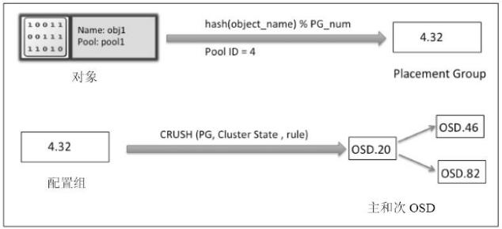

## OSD 相关的概念
### 1. Peering
当 OSD 启动或者某个 OSD 失效时，该 OSD 上的主 PG 会发起一个 peering 的过程。peering 过程是指一个 PG 内的所有副本通过 PG 日志来达成数据一致的过程。在 peering 阶段的 OSD，此 OSD不对外提供读写服务。

### 2. Recovery
Recovery 的过程是根据 PG 日志来推测出不一致的对象加以修复。

### 3. Backfill
1. 当某个 OSD 长时间失效后，重新加入集群，它已无法根据 PG 日志来修复，此时需要执行 backfill。
2. 当新加入一个 OSD 产生的数据迁移，也需要通过 backfill 来完成

### 4. Scrub
scrub 机制是检查数据的一致性。它通过后台定期（默认每天一次）扫描，检查 OSD 副本上的元数据和数据是否与主 OSD 一致。 scrub 只扫描元数据， deep scrub 扫描元数据和实际数据


## 本地对象存储
对象的文件系统
CephOSD 守护进程运行在文件系统的上层，文件系统可以是 XFS、 EXT，甚至是 Btrfs。不过为 CephOSD 选择正确的文件系统是一个重要因素，因为 OSD 守护进程很大程度上依赖于底层文件系统的稳定性和性能。除了稳定性和性能之外，文件系统也提供了供 CephOSD 守护进程使用的扩展属性（XATTR）。 XATTR 在对象状态、快照、元数据（metadata）和访问控制列表（ACL）上提供了内部信息给 CephOSD 进程，它们有助于数据管理。那就是为什么底层文件系统需要为 XATTR 提供足够容量。 Btrfs 提供了更大的 xattr 元数据，它们以文件的形式存储。 XFS具有相对大的上限（64KB），大多数的部署情况都不会遇到超过该上限，但是 ext4 的上限太小导致它不能被使用。如果使用 ext4 文件系统，你需要永远在 ceph.conf 中[OSD]部分的下方添加 filestorexattruseomap=true。文件系统的选择对生产环境的工作负载相当重要。相对于 Ceph 而言，这些文件系统彼此各不相同。

1. **XFS**：一个可靠、稳定、非常成熟的文件系统，建议用在生产环境上。但是 XFS 不如 Btrfs。 XFS 在元数据扩展（metadatascaling）上有些小的性能问题。而且 XFS 是一个日志型文件系统，每次客户端发送数据写到 Ceph集群时，会先写到日志空间，然后写 XFS 文件系统。同一份数据写两次就增加了开销，也就造成了 XFS 性能不如没有日志的 Btrfs。不过基于其可靠性和稳定性， XFS 依然是最受欢迎、被推崇的 Ceph 部署的文件系统。

2. **Btrfs**：使用 Btrfs 的 OSD，与 XFS 和 ext4 相比较，有着更好的性能。使用 Btrfs 的一个主要优势是它支持写时复制和可写快照。而且这种情况下， Ceph 使用并行日志，也就是并行写日志和 OSD 数据，这在写性能上是一个很大提升。它也支持透明压缩（ transparentcompression）和通用校验（pervasivechecksums），在一个文件系统中合并多设备管理。它还有一个非常吸引人的功能——在线文件系统检查（onlineFSCK）。尽管拥有这些新特性， Btrfs 目前仍不适用于生产环境，不过它也算是一个良好测试部署的备选方案。

不要混淆 Ceph 日志（journal） 和文件系统日志（XFS， EXT4）的写日志，它们是不同的。 Ceph 写日志是在写文件系统的时候，而文件系统写日志是写数据到底层磁盘的时候。

## 对象的元数据
它以 key-value 的形式存在，在 RADOS 中有两种实现： xattrs 和 omap：
**xattrs**：是将元数据保存在对象对应文件的扩展属性中，这要求支持对象存储的本地文件系统（一般是 XFS）支持扩展属性。
**omap**：是 object map 的简称，是将元数据保存在本地文件系统之外的独立 key-value 存储系统中，在使用filestore 时是 leveldb，在使用 bluestore 时是 rocksdb。

有些本地文件系统可能不支持扩展属性，有些虽然支持扩展属性，但对 key 或者 value 占用的空间大小有限制。对于 leveldb 或者 rocksdb 则没有空间上的限制，但它的性能有限制。所以一般情况下， xattrs 保存一些比较小而且经常访问的信息。 omap 保存一些大的但不经常访问的数据

## Ceph 事务和日志的概念
引入事务和日志，是为了实现操作的原子性，解决数据因断电等原因而导致的不一致问题。

**filestore 数据写入的过程**
1. 先把要写入的数据全部封装成一个事务，其整理作为一条日志，写入日志磁盘（一般把日志放在 ssd 上提高性能），这个过程叫日志的提交（journal submit）。
2. 把数据写入对象文件的磁盘中（也就是 OSD 的磁盘中），这个过程叫日志的应用(journal apply)。 这个过程不一定写入磁盘，有可能缓存在本地文件系统的 page cache 中。当系统在日志提交的过程中出错，系统重启后， 直接丢弃不完整的日志条目，该条日志对应的实际对象数据并没有修改，数据保证了一致性。 当日志在应用过程中出错，由于日志已写入到磁盘中，系统重启后，重放（replay）日志，这样保证新数据重新完整的写入，保证了数据的一致性。

**filestore 日志的三个阶段**
日志的提交（journal submit）：日志写入日志磁盘。
日志的应用（journal apply）： 日志对应的修改更新到对象的磁盘文件中。这个过程不一定写入磁盘，有可能缓存在本地文件系统的 page cache 中。
日志的同步（journal sync 或者 journal commit）：当确定日志对应的修改操作已经刷到磁盘中，就可以把相应的日志记录删除，释放所占的日志空间。

## Ceph 客户端直接访问 OSD 的原理
Ceph 允许客户端直接访问 OSD 守护进程，这样就可以消除使用集中式网关的需求。 CephOSD 守护进程负责创建对象，以及在其他 Ceph 节点上创建这些对象的副本来保证数据的安全性和高可用性。Ceph 还使用一个 monitor集群来保证系统的高可用性 。 为了去中心化 ， Ceph使用了CRUSH 算法 ， 它的全称为Controlled Replication Under Scalable Hashing。使用 CRUSH 后，客户端根据需要来计算它的数据要被写到哪里，以及从哪里读取它所需要的数据。
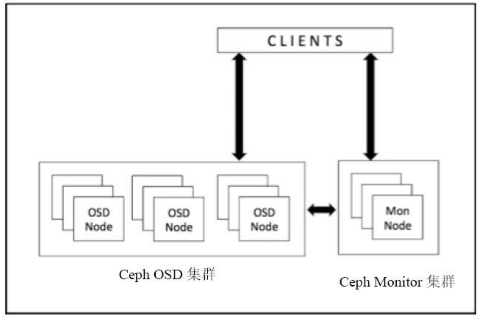

---
# Ceph cluster map
Ceph monitor 负责监控整个集群的健康状态，以及维护集群成员关系状态（cluster membership state）、对等节点（peer nodes）的状态，和集群的配置信息等。 Ceph monitor 通过维护 cluster map 的主复制来实现这些功能。cluster map 是多个 map 的组合，包括 monitor map、 OSD map、 PG map、 CRUSH map 以及 MDS map 等。这些 map 统称为 cluster map。

## 1. monitor map
它包含监视节点端到端的信息，包括 Ceph 集群 ID、 monitor 节点名称（hostname）、 IP 地址和端口号等。它还保存自 Monitor Map 被创建以来的最新版本号（维护着其历史版本，每个版本被称为一个 epoch， epoch 是一个单调递增的序列），以及最后修改时间等。

### 查看 monitor map
**方式一**
```bash
# ceph mon getmap -o /root/1.txt
got latest monmap
# monmaptool --print /root/1.txt
monmaptool: monmap file /root/1.txt
epoch 1
fsid 6d5dcb37-ad3a-4232-b518-cc7302949910
last_changed 0.000000
created 0.000000
0: 172.16.1.11:6789/0 mon.ceph
```

**方式二**
```bash
# ceph mon dump
```

## 2. OSD map
它保存一些常用的信息， 包括集群 ID、 OSD map 自创建以来的最新版本号（epoch）及其最后修改时间，以及存储池相关的信息，包括存储池名称、 ID、类型、副本级别（replication level）和 PG。它还保存着 OSD 的信息，比如数量、状态、权重、最后清理间隔（last clean interval）以及 OSD 节点的信息。

OSDMap 是 Ceph 集群中所有 OSD 的信息，所有 OSD 节点的改变如进程退出，节点的加入和退出或者节点权重的变化都会反映到这张 Map 上。这张 Map 不仅会被 Monitor 掌握， OSD 节点和 Client 也会从 Monitor得到这张表，因此实际上我们需要处理所有“Client” (包括 OSD， Monitor 和 Client)的 OSDMap 持有情况，实际上，每个“Client”可能会具有不同版本的 OSDMap，当 Monitor 所掌握的权威 OSDMap 发生变化时，它并不会发送 OSDMap 给所有“Client”，而是需要了解到变化的“Client”会被 Push，如一个新的 OSD 加入会导致一些 PG 的迁移，那么这些 PG 的 OSD 会得到通知。除此之外， Monitor 也会随机的挑选一些 OSD 发送OSDMap。那么如何让 OSDMap 慢慢传播呢？比如 OSD.a, OSD.b 得到了新的 OSDMap，那么 OSD.c 和OSD.d 可能部分 PG 也会在 OSD.a, OSD.b 上，这时它们的通信就会附带上 OSDMap 的 epoch，如果版本较低， OSD.c 和 OSD.d 会主动向 Monitor pull OSDMap，而部分情况 OSD.a, OSD.b 也会主动向 OSD.c 和OSD.d push 自己的 OSDMap (如果更新)。因此， OSDMap 会在接下来一段时间内慢慢在节点间普及。在集群空闲时，很有可能需要更长的时间完成新 Map 的更新，但是这并不会影响 OSD 之间的状态一致性，因为 OSD 没有得到新的 Map 所有它们不需要知晓新的 OSDMap 变更。
Ceph 通过管理多个版本的 OSDMap 来避免集群状态的同步，这使得 Ceph 丝毫不会畏惧在数千个 OSD规模的节点变更导致集群可能出现的状态同步。
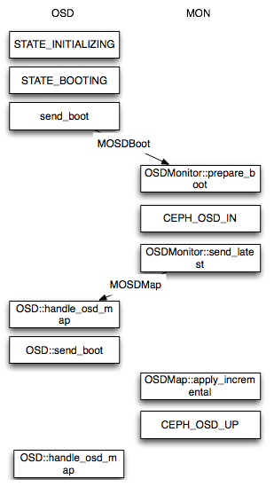
接下来会简单介绍 OSD 在启动时对 OSDMap 进行变更的情况，当一个新的 OSD 启动时，这时 Monitor 所掌握的最新 OSDMap 并没有该 OSD 的情况，因此该 OSD 会向 Monitor 申请加入， Monitor 再验证其信息后会将其加入 OSDMap 并标记为 IN，并且将其放在 Pending Proposal 中会在下一次 Monitor “讨论”中提出，OSD 在得到 Monitor 的回复信息后发现自己仍然没在 OSDMap 中会继续尝试申请加入，接下来 Monitor 会发起一个 Proposal ，申请将这个 OSD 加入 OSDMap 并且标记为 UP 。然后按照 Paxos 的流程，从proposal->accept->commit 到最后达成一致， OSD 最后成功加入 OSDMap 。当新的 OSD 获得最新 OSDMap发现它已经在其中时。 这时， OSD 才真正开始建立与其他 OSD 的连接， Monitor 接下来会开始给他分配 PG。
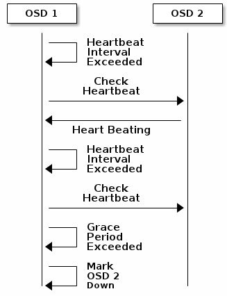
当一个 OSD 因为意外 crash 时，其他与该 OSD 保持 Heartbeat 的 OSD 都会发现该 OSD 无法连接，在汇报给 Monitor 后，该 OSD 会被临时性标记为 OUT，所有位于该 OSD 上的 Primary PG 都会将 Primary角色交给其他 OSD。

### 查看 OSD Map 的命令
```bash
# ceph osd tree
或
# ceph osd dump
```

## 3. PG map
它保存的信息包括 PG 的版本、时间戳、 OSDmap 的最新版本号（epoch）、容量已满百分比（fullratio，是指集群被认为容量已满时的最大使用百分比，此时 Ceph 集群将禁止客户端读写数据）、容量将满百分比（nearfullration，是指集群被认为容量将满时的最大使用百分比，此时 Ceph 集群将发出告警）等。它还记录了每个 PG 的 ID（其格式为{pool-num}.{pg-id}）、对象数量、状态、状态时间戳（statestamp）、 upOSDsets（一个 upOSDset 是指某特定PGmap 版本的 PG 的所有副本所在的 OSD 列表，该列表是有序的，第一个 OSD 为主 OSD，其余为从 OSD）、actingOSDsets（actingOSDset 指该 PG 的所有副本所在的 OSD 的列表），以及清理（scrub）的信息。

PG(Placement Group)可以看成是一致性哈希中的虚拟节点，维护了一部分数据并且是数据迁移和改变的最小单位。它在 Ceph 中承担着非常重要的角色，在一个 Pool 中存在一定数量的 PG(可动态增减)，这些 PG 会被分布在多个 OSD，分布规则可以通过 CRUSHRULE 来定义。 Monitor 维护了每个 Pool 中的所有 PG 信息，比如当副本数是三时，这个PG会分布在3个OSD中，其中有一个OSD角色会是Primary，另外两个OSD的角色会是Replicated。PrimaryPG 负责该 PG 的对象写操作，读操作可以从 ReplicatedPG 获得。而 OSD 则只是 PG 的载体，每个 OSD都会有一部分 PG 角色是 Primary，另一部分是 Replicated，当 OSD 发生故障时(意外 crash 或者存储设备损坏)，Monitor 会将该 OSD 上的所有角色为 Primary 的 PG 的 Replicated 角色的 OSD 提升为 PrimaryPG，这个 OSD 所有的 PG 都会处于 Degraded 状态。然后等待管理员的下一步决策，所有的 Replicated 如果原来的 OSD 无法启动，OSD 会被踢出集群，这些 PG 会被 Monitor 根据 OSD 的情况分配到新的 OSD 上。

### 查看 pg map 的命令
```bash
# ceph pg dump
```

## 4. CRUSH map
决定 OSD 的集合，以及根据 crush 的 rule，决定 pool 分布在哪些 OSD 上。它保存的信息包括集群设备列表、 bucket 列表、故障域（failure domain）分层结构、保存数据时用到的为故障域定义的规则（rules）等。

### 查看 CRUSH map 的命令
```bash
# ceph osd crush dump
```

### 查看编译 CRUSH map
在任意一个 monitor 节点上，导出 CRUSH map
```bash
# ceph osd getcrushmap -o crushmap_compiled_file
```
反编译 CRUSH map,以便可读及编辑
```bash
# crushtool -d crushmap_compiled_file -o crushmap_decompiled_file
```

重新编译已更新的 CRUSH map，当 crush map 编辑完成后，则需要重新编译，以便导入 ceph 中
```bash
# crushtool -c crushmap_decompiled_file -o newcrushmap
```

将新的 CRUSH map 导入 ceph 群集中
```bash
# ceph osd setcrushmap -i newcrushmap
```

最后使用 ceph osd tree 查看
```bash
# ceph osd tree
```

## 5. MDS map
它保存的信息包括 MDSmap 当前版本号（epoch）、 MDSmap 的创建和修改时间、数据和元数据存储池的 ID、集群 MDS 数量以及 MDS 状态。

### 查看 MDSmap 的命令
```bash
# ceph mds dump
```

