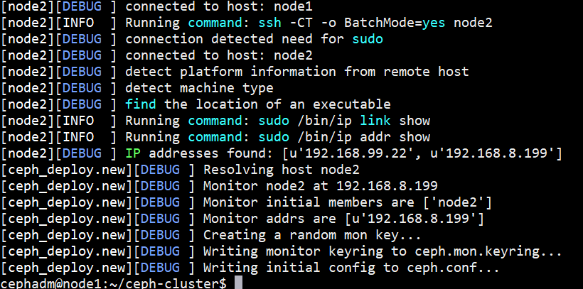

</br>
</br>
</br>
</br>
</br>
</br>
</br>
</br>
</br>
<center> <font size=12> Ceph 集群部署 </font> </br>
<font size=6>（ceph-deploy）</font><br>
</br>
</br>
</br>
陈即彪 </br>
</br>
2019年11月15日 
</center>
</br>
</br>
</br>
</br>
</br>
</br>
</br>
</br>
</br>


# ceph-deploy集群安装
环境：
ip | 主机名
- | -
192.168.99.20 | ceph-adm
192.168.99.21 | node1
192.168.99.22 | node2
192.168.99.23 | node3

## 一、安装ceph官方源
1. Add the release key
```bash
~]# wget -q -O- 'https://download.ceph.com/keys/release.asc' | sudo apt-key add -
```

2. Add the Ceph packages to your repository. 安装最新版
```bash
~]# echo deb https://download.ceph.com/debian-nautilus/ $(lsb_release -sc) main | sudo tee /etc/apt/sources.list.d/ceph.list
```

3. Update your repository and install ceph-deploy:
```bash
~]# sudo apt update
```

## 二、安装 NTP
```bash
~]# sudo apt install ntp
```
设置时区
```bash
~]# cp /usr/share/zoneinfo/Asia/Shanghai  /etc/localtime
```

## 三、域名解析
1. 设置主机名
```bash
node1~]# hostnamectl set-hostname node1
node2~]# hostnamectl set-hostname node2
node3~]# hostnamectl set-hostname node3
```

2. 域名解析(所有节点上)
```bash
~]# cat /etc/hosts
192.168.99.21 node1
192.168.99.22 node2
192.168.99.23 node3
```

## 四、创建特定用户
1. 创建用户
```bash
~]# useradd -m -s /bin/bash cephadm
~]# echo cephadm:123 | chpasswd
```

2. 确保cephadm可以无密码使用sudo命令
```bash
~]# echo "cephadm ALL = (root) NOPASSWD:ALL" | sudo tee /etc/sudoers.d/cephadm
~]# chmod 044 /etc/sudoers.d/cephadm
```

3. 配置基于密钥ssh登录
```bash
node1~]# su - cephadm
node1~]# ssh-keygen -t rsa -P ''
node1~]# ssh-copy-id -i .ssh/id_rsa.pub cephadm@localhost
node1~]# scp -rp .ssh/ cephadm@node2:/home/cephadm
node1~]# scp -rp .ssh/ cephadm@node3:/home/cephadm
```

## 五、安装ceph-deploy
```bash
node1~]# sudo apt install ceph-deploy
```

## 六、初始化RADOS集群
```bash
node1~]# su - cephadm
node1~]# mkdir ceph-cluster
node1~]# cd ceph-cluster
```

1. 初始化MON节点
```bash
node1~]# ceph-deploy new --cluster-network 192.168.99.0/24 --public-network 192.168.88.0/24 node2
```

排错
```bash
[node2][INFO  ] Running command: ssh -CT -o BatchMode=yes node2
bash: python2: command not found
[ceph_deploy][ERROR ] RuntimeError: connecting to host: node2 resulted in errors: IOError cannot send (already closed?)
```
每个节点都需要安装python
```bash
~]# apt install python
```



```bash
~]# ls
cephadm@node2  cephadm@node3  ceph.conf  ceph-deploy-ceph.log  ceph.mon.keyring  python3
```

## 七、安装ceph集群节点
```bash
node1~]# ceph-deploy install node2 node3
```


> 若需要在集群各节点独立安装程序包，其方法如下
将apt源改成阿里源，要不会很慢
```bash
~]# vim /etc/apt/sources.list.d/ceph.list
deb https://mirrors.aliyun.com/ceph/debian-nautilus/ bionic main

~]# apt install ceph radosgw

回到管理节点执行
node1~]# ceph-deploy install --no-adjust-repos node2 node3
```

## 八、初始化MON节点
```bash
node1~]# ceph-deploy mon create-initial
```

1. 把配置文件和admin密钥拷贝Ceph集群各节点，以免得每次执行”ceph“命令行时不得不明确指定MON节点地址和ceph.client.admin.keyring：
```bash
node1~]# ceph-deploy admin node1 node2 node3
```

2. 而后在Ceph集群中需要运行ceph命令的的节点上（或所有节点上）以root用户的身份设定用户cephadm能够读取/etc/ceph/ceph.client.admin.keyring文件：
```bash
~]# setfacl -m u:cephadm:r /etc/ceph/ceph.client.admin.keyring
```

3. 配置Manager节点，启动ceph-mgr进程（仅Luminious+版本）：
```bash
node1~]# ceph-deploy mgr create node3
```

4. 在Ceph集群内的节点上以cephadm用户的身份运行如下命令，测试集群的健康状态：
```bash
node1~]# apt install ceph-common

node1~]# ceph health
HEALTH_OK

node1~]# ceph -s
  cluster:
    id:     fc5b806d-3b43-41f1-974a-c07468b9d9ff
    health: HEALTH_OK
 
  services:
    mon: 1 daemons, quorum node1
    mgr: node1(active)
    osd: 0 osds: 0 up, 0 in
 
  data:
    pools:   0 pools, 0 pgs
    objects: 0  objects, 0 B
    usage:   0 B used, 0 B / 0 B avail
    pgs:     
```

## 九、向RADOS集群添加OSD
1. “ceph-deploy disk”命令可以检查并列出OSD节点上所有可用的磁盘的相关信息：
```bash
node1~]# ceph-deploy disk list node2 node3
```

2. 而后，在管理节点上使用ceph-deploy命令擦除计划专用于OSD磁盘上的所有分区表和数据以便用于OSD，命令格式为”ceph-deploy disk zap {osd-server-name} {disk-name}“，需要注意的是此步会清除目标设备上的所有数据。下面分别擦净node1、node2和node3上用于OSD的一个磁盘设备vdb：
```bash
node1~]# ceph-deploy disk zap node2 /dev/sdb
node1~]# ceph-deploy disk zap node3 /dev/sdb
```

*提示：若设备上此前有数据，则可能需要在相应节点上以root用户使用“ceph-volume lvm zap --destroy {DEVICE}”命令进行；*

### 添加OSD
早期版本的ceph-deploy命令支持在将添加OSD的过程分为两个步骤：准备OSD和激活OSD，但新版本中，此种操作方式已经被废除，添加OSD的步骤只能由命令”ceph-deploy osd create {node} --data {data-disk}“一次完成，默认使用的存储引擎为bluestore。

如下命令即可分别把node1、node2和node3上的设备vdb添加为OSD：
```bash
node1~]# ceph-deploy osd create node2 --data /dev/sdb
node1~]# ceph-deploy osd create node3 --data /dev/sdb
```

### 列出指定节点上的OSD：
```bash
node1~]# ceph-deploy osd list node2 node3
```

事实上，管理员也可以使用ceph命令查看OSD的相关信息：

```bash
node1~]# ceph osd stat
3 osds: 3 up, 3 in; epoch: e15
```

或者使用如下命令了解相关的信息：
```bash
node1~]# ceph osd dump
node1~]# ceph osd ls
```

## 十、从RADOS集群中移除OSD的方法

Ceph集群中的一个OSD通常对应于一个设备，且运行于专用的守护进程。在某OSD设备出现故障，或管理员出于管理之需确实要移除特定的OSD设备时，需要先停止相关的守护进程，而后再进行移除操作。对于Luminous及其之后的版本来说，停止和移除命令的格式分别如下所示：

1. 停用设备：ceph osd out {osd-num}
2. 停止进程：sudo systemctl stop ceph-osd@{osd-num}
3. 移除设备：ceph osd purge {id} --yes-i-really-mean-it

若类似如下的OSD的配置信息存在于ceph.conf配置文件中，管理员在删除OSD之后手动将其删除。

> [osd.1]
> ​        host = {hostname}

不过，对于Luminous之前的版本来说，管理员需要依次手动执行如下步骤删除OSD设备：

1. 于CRUSH运行图中移除设备：ceph osd crush remove {name}
2. 移除OSD的认证key：ceph auth del osd.{osd-num}
3. 最后移除OSD设备：ceph osd rm {osd-num}


## 十一、测试上传/下载数据对象

存取数据时，客户端必须首先连接至RADOS集群上某存储池，而后根据对象名称由相关的CRUSH规则完成数据对象寻址。于是，为了测试集群的数据存取功能，这里首先创建一个用于测试的存储池mypool，并设定其PG数量为16个。
```bash
node1~]# ceph osd pool create mypool 256
pool 'mypool' created
``` 
建议每个OSD上配置50~100个PG

而后即可将测试文件上传至存储池中，例如下面的“rados put”命令将/etc/issue文件上传至mypool存储池，对象名称依然保留为文件名issue，而“rados ls”命令则可以列出指定存储池中的数据对象。
```bash
node1~]# rados put issue /etc/issue --pool=mypool
node1~]# rados ls --pool=mypool
issue
```

而“ceph osd map”命令可以获取到存储池中数据对象的具体位置信息：
```bash
node1~]# ceph osd map mypool issue
osdmap e26 pool 'mypool' (1) object 'issue' -> pg 1.651f88da (1.a) -> up ([2,1,0], p2) acting ([2,1,0], p2)
```

删除数据对象，“rados rm”命令是较为常用的一种方式：
```bash
node1~]# rados rm issue --pool=mypool 
```

删除存储池命令存在数据丢失的风险，Ceph于是默认禁止此类操作。管理员需要在ceph.conf配置文件中启用支持删除存储池的操作后，方可使用类似如下命令删除存储池。
```bash
node1~]# ceph osd pool rm mypool mypool --yes-i-really-really-mean-it
```

## 十二、扩展Ceph集群

### 扩展监视器节点

Ceph存储集群需要至少运行一个Ceph Monitor和一个Ceph Manager，生产环境中，为了实现高可用性，Ceph存储集群通常运行多个监视器，以免单监视器整个存储集群崩溃。Ceph使用Paxos算法，该算法需要半数以上的监视器（大于n/2，其中n为总监视器数量）才能形成法定人数。尽管此非必需，但奇数个监视器往往更好。

“ceph-deploy mon add {ceph-nodes}”命令可以一次添加一个监视器节点到集群中。例如，下面的命令可以将集群中的node2和node3也运行为监视器节点：
```bash
node1~]# ceph-deploy mon add node2
node1~]# ceph-deploy mon add node3
```

设置完成后，可以在ceph客户端上查看监视器及法定人数的相关状态：
```bash
node1~]# ceph quorum_status --format json-pretty

{
​    "election_epoch": 12,
​    "quorum": [
​        0,
​        1,
​        2
​    ],
​    "quorum_names": [
​        "node1",
​        "node2",
​        "node3"
​    ],
​    "quorum_leader_name": "node1",
​    "monmap": {
​        "epoch": 3,
​        ……
​        },
​        "mons": [
​            {
​                "rank": 0,
​                "name": "node1",
​                "addr": "172.20.0.55:6789/0",
​                "public_addr": "172.20.0.55:6789/0"
​            },
​            {
​                "rank": 1,
​                "name": "node2",
​                "addr": "172.20.0.56:6789/0",
​                "public_addr": "172.20.0.56:6789/0"
​            },
​            {
​                "rank": 2,
​                "name": "node3",
​                "addr": "172.20.0.57:6789/0",
​                "public_addr": "172.20.0.57:6789/0"
​            }
​        ]
​    }
}
```

### 扩展Manager节点

Ceph Manager守护进程以“Active/Standby”模式运行，部署其它ceph-mgr守护程序可确保在Active节点或其上的ceph-mgr守护进程故障时，其中的一个Standby实例可以在不中断服务的情况下接管其任务。

“ceph-deploy mgr create {new-manager-nodes}”命令可以一次添加多个Manager节点。下面的命令可以将node2节点作为备用的Manager运行：
```bash
node1~]# ceph-deploy mgr create node2
```

添加完成后，“ceph -s”命令的services一段中会输出相关信息：
```bash
node1~]# ceph -s
  cluster:
​    id:     fc5b806d-3b43-41f1-974a-c07468b9d9ff
​    health: HEALTH_OK

  services:
​    mon: 3 daemons, quorum node1,node2,node3
​    **mgr: node1(active), standbys: node2**
​    osd: 3 osds: 3 up, 3 in
```


## 十三、Ceph存储集群的访问接口

### 1. Ceph块设备接口（RBD）

Ceph块设备，也称为RADOS块设备（简称RBD），是一种基于RADOS存储系统支持超配（thin-provisioned）、可伸缩的条带化数据存储系统，它通过librbd库与OSD进行交互。RBD为KVM等虚拟化技术和云OS（如OpenStack和CloudStack）提供高性能和无限可扩展性的存储后端，这些系统依赖于libvirt和QEMU实用程序与RBD进行集成。 

客户端基于librbd库即可将RADOS存储集群用作块设备，不过，用于rbd的存储池需要事先启用rbd功能并进行初始化。例如，下面的命令创建一个名为rbddata的存储池，在启用rbd功能后对其进行初始化：
```bash
node1~]# ceph osd pool create rbddata 64
node1~]# ceph osd pool application enable rbddata rbd
node1~]# rbd pool init -p rbddata
```

不过，rbd存储池并不能直接用于块设备，而是需要事先在其中按需创建映像（image），并把映像文件作为块设备使用。rbd命令可用于创建、查看及删除块设备相在的映像（image），以及克隆映像、创建快照、将映像回滚到快照和查看快照等管理操作。例如，下面的命令能够创建一个名为img1的映像：

```bash
node1~]# rbd create img1 --size 1024 --pool rbddata
```

映像的相关的信息则可以使用“rbd info”命令获取：

```bash
node1~]# rbd --image img1 --pool rbddata info
rbd image 'img1':
        size 1 GiB in 256 objects
        order 22 (4 MiB objects)
        id: 11616b8b4567
        block_name_prefix: rbd_data.11616b8b4567
        format: 2
        features: layering, exclusive-lock, object-map, fast-diff, deep-flatten
        op_features: 
        flags: 
        create_timestamp: Tue Dec 11 17:20:23 2018
```

在客户端主机上，用户通过内核级的rbd驱动识别相关的设备，即可对其进行分区、创建文件系统并挂载使用。

### 2. 启用radosgw接口

RGW并非必须的接口，仅在需要用到与S3和Swift兼容的RESTful接口时才需要部署RGW实例，相关的命令为“ceph-deploy rgw create {gateway-node}”。例如，下面的命令用于把node3部署为rgw主机：

```bash
node1~]# ceph-deploy rgw create node3
```

添加完成后，“ceph -s”命令的services一段中会输出相关信息：
```bash
node1~]# ceph -s
  cluster:
​    id:     fc5b806d-3b43-41f1-974a-c07468b9d9ff
​    health: HEALTH_OK

  services:
​    mon: 3 daemons, quorum node1,node2,node3
​    mgr: node1(active), standbys: node2
​    osd: 3 osds: 3 up, 3 in
​    **rgw: 1 daemon active**
```

默认情况下，RGW实例监听于TCP协议的7480端口7480，需要算定时，可以通过在运行RGW的节点上编辑其主配置文件ceph.conf进行修改，相关参数如下所示：
```
[client]
rgw_frontends = "civetweb port=8080"
```

而后需要重启相关的服务，命令格式为“systemctl restart ceph-radosgw@rgw.{node-name}”，例如重启node3上的RGW，可以以root用户运行如下命令：
```bash
node1~]# systemctl status ceph-radosgw@rgw.node3 
```

RGW会在rados集群上生成包括如下存储池的一系列存储池：
```bash
node1~]# ceph osd pool ls
.rgw.root
default.rgw.control
default.rgw.meta
default.rgw.log
```

RGW提供的是REST接口，客户端通过http与其进行交互，完成数据的增删改查等管理操作。

### 3. 启用文件系统（CephFS）接口

1. CephFS需要至少运行一个元数据服务器（MDS）守护进程（ceph-mds），此进程管理与CephFS上存储的文件相关的元数据，并协调对Ceph存储集群的访问。因此，若要使用CephFS接口，需要在存储集群中至少部署一个MDS实例。“ceph-deploy mds create {ceph-node}”命令可以完成此功能，例如，在node1上启用MDS：
```bash
node1~]# ceph-deploy mds create node2
```

2. 查看MDS的相关状态可以发现，刚添加的MDS处于Standby模式：
```bash
node1~]# ceph mds stat
 1 up:standby
```

3. 使用CephFS之前需要事先于集群中创建一个文件系统，并为其分别指定元数据和数据相关的存储池。下面创建一个名为cephfs的文件系统用于测试，它使用cephfs-metadata为元数据存储池，使用cephfs-data为数据存储池：
```bash
node1~]# ceph osd pool create cephfs-metadata 64
node1~]# ceph osd pool create cephfs-data 64
node1~]# ceph fs new cephfs cephfs-metadata cephfs-data
```

4. 而后即可使用如下命令“ceph fs status <fsname>”查看文件系统的相关状态，例如：
```bash
node1~]# ceph fs status cephfs
```

5. 此时，MDS的状态已经发生了改变：
```bash
node1~]# ceph mds stat
cephfs-1/1/1 up  {0=node1=up:active}
```

6. 随后，客户端通过内核中的cephfs文件系统接口即可挂载使用cephfs文件系统，或者通过FUSE接口与文件系统进行交互。
```bash
node1~]# cat /etc/ceph/ceph.client.admin.keyring
```

7. 挂载
```bash
client~]# mkdir /mycephfs
client~]# sudo mount -t ceph 192.168.99.24:6789:/ /mycephfs -o name=admin,secret=AQCXlsNdCSr4KBAAOcma//ZPNCD1I+k5PwnUrg==
```

8. 查看磁盘状态
```bash
client~]# df -h
```
