Linux `ACL`_ 权限
======================================================================

1. ACL 是什么
------------------------------------------------------------

ACL的全称是 Access Control List (访问控制列表) ,
一个针对文件/目录的访问控制列表.
它在UGO权限管理的基础上为文件系统提供一个额外的, 更灵活的权限管理机制.
它被设计为UNIX文件权限管理的一个补充.
ACL允许你给任何的用户或用户组设置任何文件/目录的访问权限.

本文的演示环境为 ubuntu 16.04.

2. ACL有什么用
------------------------------------------------------------

既然是作为UGO权限管理的补充, ACL自然要有UGO办不到或者很难办到的本事.
例如:

    #. 可以针对用户来设置权限
    #. 可以针对用户组来设置权限
    #. 子文件/目录继承父目录的权限

3. 检查是否支持ACL
------------------------------------------------------------

ACL需要Linux内核和文件系统的配合才能工作,
当前我们能见到的大多数Linux发行版本默认都是支持的.
但最好还是能够先检查一下:

::

   sudo tune2fs -l /dev/sda1 |grep "Default mount options:"
   Default mount options:                 user_xattr    acl

我们能够看到默认情况下(Default mount options:)已经加入 acl 支持了.

4. 如何设置ACL
------------------------------------------------------------

我们可以使用setfacl和getfacl命令来设置或观察文件/目录的acl权限.

- setfacl

  ::

     setfacl [-bkRd] [{-m|-x} acl参数] 文件/目录名
     -m :配置后面的 acl 参数给文件/目录使用,不可与 -x 合用;
     -x :删除后续的 acl 参数,不可与 -m 合用;
     -b :移除所有的 ACL 配置参数;
     -k :移除默认的 ACL 参数;
     -R :递归配置 acl;
     -d :配置“默认 acl 参数”,只对目录有效,在该目录新建的数据会引用此默认值;

- getfacl

  ``getfacl 文件/目录名``

5. 针对用户来设置权限
------------------------------------------------------------

笔者系统中的当前用户是 nick,再创建两个用户 tester 和 tester1 用来进行测试:

::

   $ sudo adduser tester
   $ sudo adduser tester1

创建文件 aclfile, 检查其默认的权限信息:

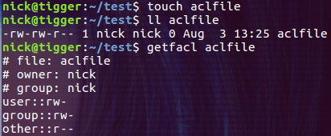

把用户切换为 tester, 发现没有写文件的权限:

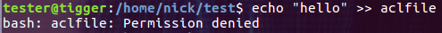

这是因为 other 没有写 aclfile 文件的权限.

下面我们为 tester 用户赋予读写 aclfile 文件的权限:

``$ setfacl -m u:tester:rw aclfile``

修改成功后再次以 tester 用户的身份向 aclfile 文件写入数据,这次已经可以正常写入了.
查看 aclfile 文件的权限:

``$ ll aclfile``

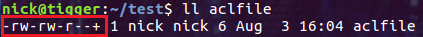

貌似并没有发生什么变化, 只是在描述权限的地方多出了一个 "+" 号. 下面再看看 acl 权限:

``$ getfacl aclfile``

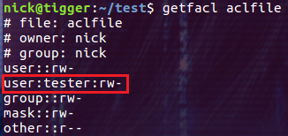

多出了一些信息, 其中比较重要的是 user:tester:rw-,
就是它让用户 tester 具有了读写 aclfile 的权限.

6. 针对用户组来设置权限
------------------------------------------------------------

和针对用户的设置几乎一样,只是把小写的 u 换成小写的 g 就行了.

7. 子文件/目录继承父目录的权限
------------------------------------------------------------

这是一个很棒的例子, 它能让我们创建的子文件或者子文件夹继承父文件夹的权限设置!

::

   $ mkdir mydir
   $ ll -d mydir
   $ setfacl -m d:u:tester:rwx mydir
   $ getfacl mydir

注意参数 d 在这里起到了决定性的作用. 下面是设置后的 mydir 目录的权限属性:

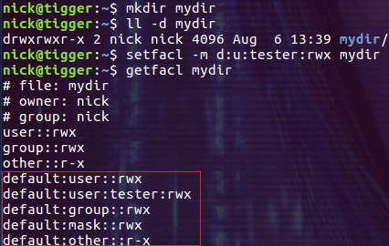

这次多出了一些以 default 开头的行, 这些 default 权限信息只能在目录上设置,
然后会被目录中创建的文件和目录继承.
下面分别在 mydir 目录下创建文件 testfile 和目录 testdir, 并查看它们的 acl 权限:

::

   $ touch testfile
   $ mkdir testdir
   $ getfacl testfile
   $ getfacl testdir

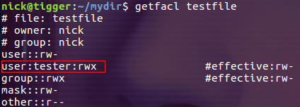

从上图可以看到文件 testfile 继承了父目录的 acl 权限,
因此用户 tester 对它有读写权限. 下面再看看 testdir 目录:

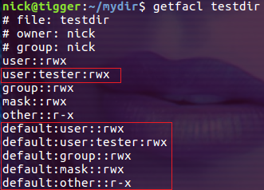

从图中可以看出, testdir 目录不仅继承了 tester 的访问权限,
还继承了父目录上的 default 权限.
也就是说我们通过这种方式设置在目录上的权限可以被子目录递归的继承下去.

8. 更改 ACL 权限
------------------------------------------------------------

- **-m 选项其实是在更改文件和目录的 ACL 权限**

    #. 当一个用户或组的 ACL 权限不存在时,-m 选项执行的是添加操作.

    #. 如果一个用户或组的 ACL 权限已经存在时,-m 选项执行的是更新操作.

  我们重新创建一个 aclfile 文件, 通过下面的命令设置 tester 用户对它的访问权限:

  ``$ setfacl -m u:tester:rwx aclfile``

  .. image:: pic_linux_acl/8_1_set_acl.png

  这时 -m 选项是在添加 ACL 权限. 然后我们修改 tester 用户的权限,
  移除其对 aclfile 的执行权限:

  ``$ setfacl -m u:tester:rw aclfile``

  .. image:: pic_linux_acl/8_2_rm_acl.png

  这时 -m 选项是在更改现有的 ACL 权限.
  接下来再让我们试一下为不同的用户或组设置 ACL 权限:

  ``$ setfacl -m g:tester1:rwx aclfile``

  .. image:: pic_linux_acl/8_3_modify_acl.png

  这次是新添加了 group tester1 的权限, 并且没有影响 tester 用户的权限.

- **--set 选项会先清除掉原有的 ACL 权限,然后添加新的权限**

  我们接着设置 aclfile 文件的 ACL 权限:

  ``$ setfacl --set u::rw,u:tester2:rwx,g::r,o::- aclfile``

  .. image:: pic_linux_acl/8_4_rm_add.png

  需要注意的是一定要包含 UGO 权限的设置, 不能象 -m 一样只包含 ACL 权限.
  **o::-** 是另一个需要注意的地方, 其完整的写法是 ``other::-``,
  就像 **u::rw** 的完整写法是 ``user::rw-`` 一样.
  通常我们可以把 "-" 省略, 但是当权限位只包含 "-" 时, 就 **至少要保留一个** .
  如果写成了 **o::**, 就会报错.

9. 删除 ACL 权限
------------------------------------------------------------

有添加就有删除, 我们可以通过 setfacl 命令的 **-x** 选项来删除指定用户或组的 ACL 权限,
还可以通过 **-b** 选项来清除文件和目录上所有的 ACL 权限.
我们创建一个新的测试文件 aclfile, 并设置下面的 ACL 权限:

``$ setfacl -m u:tester:rwx,u:tester1:rw,g:tester2:rwx aclfile``

下面通过 -x 选项删除 group tester2 的 ACL 权限
(注意命令中只指定了组的名称而没有指定权限信息):

``$ setfacl -x g:tester2 aclfile``

查看一下结果,发现下图中已经没有 group:tester2 的权限信息了:

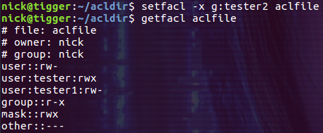

下面通过 -b 选项一次性删除 aclfile 上所有的 ACL 权限:

``$ setfacl -b aclfile``

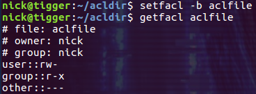

-b 选项直接清除了文件上的所有 ACL 权限.
这个行为对于目录来说也是一样的, 这里就不再演示了.

10. 备份和恢复 ACL 权限
------------------------------------------------------------

常见的文件操作命令 cp 和 mv 等都支持 ACL 权限,只是 cp 命令需要加上 -p 参数.
但是 tar 等常见的备份工具不会保留目录和文件的 ACL 权限信息.
如果希望备份和恢复带有 ACL 权限的文件和目录,可以先把 ACL 权限信息备份到一个文件里,
然后再用 **-restore** 选项来恢复这些信息.
下面演示 ACL 权限的保存和恢复.我们先创建下面的目录结构:

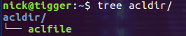

并分别为 acldir 目录和 aclfile 文件设置 ACL 权限:

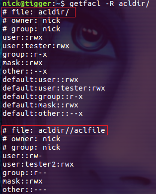

然后使用下面的命令导出 acldir 目录的 ACL 权限信息并保存到文件 acldir.acl 文件中:

``$ getfacl -R acldir > acldir.acl``

接下来删除掉 acldir 目录的 ACL 权限:

``$ setfacl -R -b acldir``

现在 acldir 目录及其子文件上的 ACL 权限都被删除掉了.
最后我们再通过下面的命令把它们的 ACL 权限都恢复回来:

``$ setfacl --restore acldir.acl``

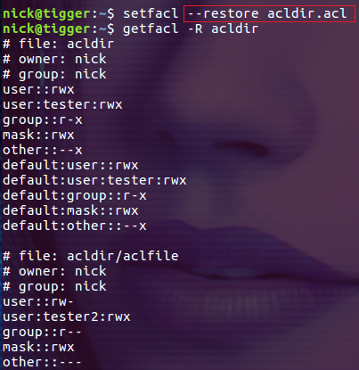

之前删除的 ACL 权限全都恢复回来了！

.. rubric:: 备注
.. _ACL: http://www.cnblogs.com/sparkdev/p/5536868.html
