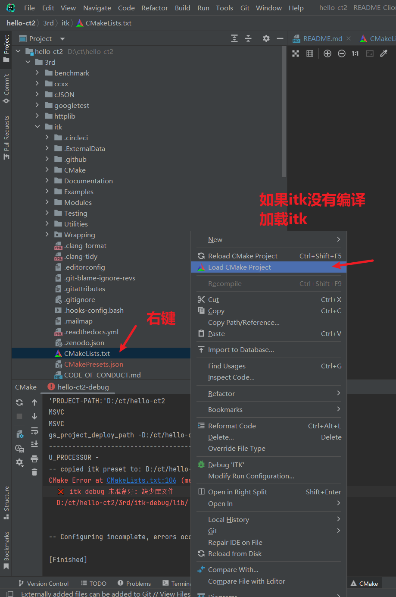
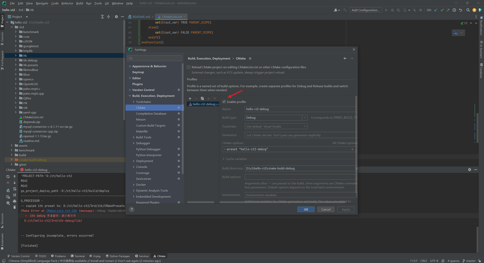

### 0、预先要备好
- Cuda 版本应该没要求，但使用这版编译过：\\192.168.130.32\cyg\14-长园创新研究院\软件\NVIDIA-cuda-cudnn\cuda_12.6.3_561.17_windows.exe
- VisualStudio：\\192.168.130.32\cyg\14-长园创新研究院\工控机必装-全复制到D盘\安装软件-安装才用\VisualStudioSetup.exe
- Clion，要配置好编译工具链：\\192.168.130.32\cyg\14-长园创新研究院\软件\日常软件\Jetbrains-Clion-Idea\CLion-2023.3.4.exe


### 1、下载代码
```shell
git clone http://iagit.cygia.com/CYGIA/Research-Institute/Software/hello-ct2.git
cd hello-ct2
### 注意、注意、注意 以下需要访问 github，所以要有科学上网。不行就去某工控机整取
git submodule update --init --recursive
```


### 2、配置 CMakePresets.json 中相关路径


### 3、首次使用 clion 打开时，需要手动编译 ITK




### 4、ITK编译后，可以在 clion 中加载 hello-ct2/CMakeLists.txt
- 注意：clion 的 preset 启用如果没用，需要重启 clion的


### Google 开源项目风格指南——中文版
> https://github.com/zh-google-styleguide/zh-google-styleguide
- C++ 风格指南
> https://zh-google-styleguide.readthedocs.io/en/latest/google-cpp-styleguide/
- Go 语言编码规范中文版 - Uber
> https://github.com/xxjwxc/uber_go_guide_cn


### VTK build with qt
- https://github.com/Kitware/VTK/blob/master/Documentation/docs/build_instructions/build.md
```shell
#生成项目
cmake -S D:/ct/VTK -B D:/ct/VTK/build-qt ^
 -G "Visual Studio 17 2022" -A x64 -T v143 ^
 -DVTK_BUILD_TESTING=OFF -DVTK_BUILD_EXAMPLES=OFF ^
 -DVTK_GROUP_ENABLE_Qt=YES ^
 -DVTK_MODULE_ENABLE_VTK_GUISupportQt=YES ^
 -DVTK_MODULE_ENABLE_VTK_ViewsQt=YES ^
 -DCMAKE_PREFIX_PATH="D:/Software/Qt5.15/5.15.2/msvc2019_64/lib/cmake"

#编译并安装 Debug
cmake --build D:/ct/VTK/build-qt --config Debug --target ALL_BUILD

cmake --install D:/ct/VTK/build-qt --config Debug --prefix D:/ct/VTK/install-qt


certutil -hashfile v2.7.0.tar.gz SHA512
```
