# docker
> 官网：docker.io

容器，是一种工具，如同箱子，可以放入想要的东西、物品，方便我们运输、存储。IT技术中的容器也是如此。

容器技术是虚拟化、云计算、大数据后的一门新兴的新技术，容器技术提高了硬件资源利用率、 方便了企业的业务快速横向扩容、 实现了业务宕机自愈功能，因此未来数年会是一个容器愈发流行的时代， 这是一个对于IT 行业来说非常有影响和价值的技术，而对于 IT 行业的从业者来说， 熟练掌握容器技术无疑是一个很有前景的行业工作机会。

容器技术最早出现在 freebsd 叫做 jail。

## 什么是docker

首先 Docker 是一个在 2013 年开源的应用程序并且是一个基于 go 语言编写是一个开源的 PAAS 服务(Platform as a Service， 平台即服务的缩写)， go 语言是由google 开发， docker 公司最早叫 dotCloud 后由于 Docker 开源后大受欢迎就将公司改名为 Docker Inc， 总部位于美国加州的旧金山。

Docker 是基于 linux 内核实现， Docker 最早采用 LXC 技术(LinuX Container 的简写， LXC 是 Linux 原生支持的容器技术， 可以提供轻量级的虚拟化， 可以说 docker 就是基于 LXC 发展起来的，提供 LXC 的高级封装，发展标准的配置方法)， 而虚拟化技术 KVM(Kernelbased Virtual Machine) 基于模块实现， Docker 后改为自己研发并开源的 runc 技术运行容器。

Docker 相比虚拟机的交付速度更快， 资源消耗更低， Docker 采用客户端/服务端架构，使用远程 API 来管理和创建 Docker 容器，其可以轻松的创建一个轻量级的、 可移植的、自给自足的容器， docker 的三大理念是 build(构建)、ship(运输)、 run(运行)， Docker 遵从 apache 2.0 协议，并通过（namespace 及cgroup 等）来提供容器的资源隔离与安全保障等，所以 Docke 容器在运行时不需要类似虚拟机（空运行的虚拟机占用物理机 6-8%性能）的额外资源开销，因此可以大幅提高资源利用率,总而言之 Docker 是一种用了新颖方式实现的轻量级虚拟机.类似于 VM 但是在原理和应用上和 VM 的差别还是很大的，并且 docker的专业叫法是应用容器(Application Container)

## Docker 的组成：
Docker 主机(Host)： 一个物理机或虚拟机，用于运行 Docker 服务进程和容器。
Docker 服务端(Server)： Docker 守护进程， 运行 docker 容器。
Docker 客户端(Client)： 客户端使用 docker 命令或其他工具调用 docker API。
Docker 仓库(Registry): 保存镜像的仓库，类似于 git 或 svn 这样的版本控制系
Docker 镜像(Images)： 镜像可以理解为创建实例使用的模板。
Docker 容器(Container): 容器是从镜像生成对外提供服务的一个或一组服务。

> 官方仓库: https://hub.docker.com/

**Docker组成**
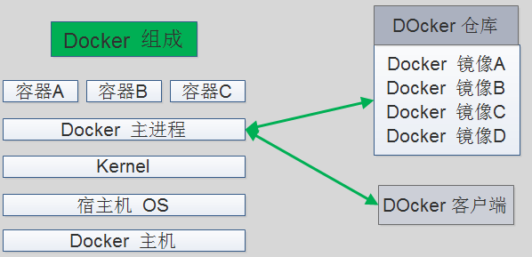

## Docker 对比虚拟机：
资源利用率更高： 一台物理机可以运行数百个容器，但是一般只能运行数十个虚拟机。

开销更小： 不需要启动单独的虚拟机占用硬件资源。
启动速度更快： 可以在数秒内完成启动。

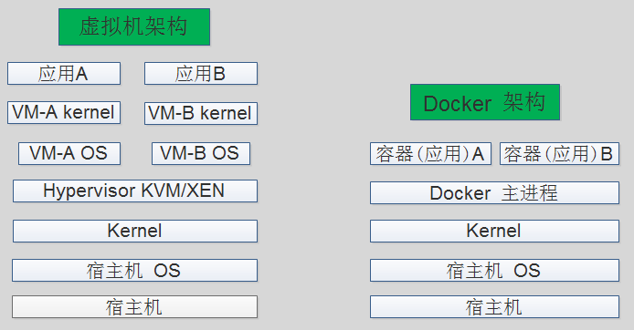

使用虚拟机是为了更好的实现服务运行环境隔离， 每个虚拟机都有独立的内核，虚拟化可以实现不同操作系统的虚拟机， 但是通常一个虚拟机只运行一个服务， 很明显资源利用率比较低且造成不必要的性能损耗， 我们创建虚拟机的目的是为了运行应用程序，比如 Nginx、 PHP、 Tomcat 等 web 程序， 使用虚拟机无疑带来了一些不必要的资源开销，但是容器技术则基于减少中间运行环节带来较大的性能提升。

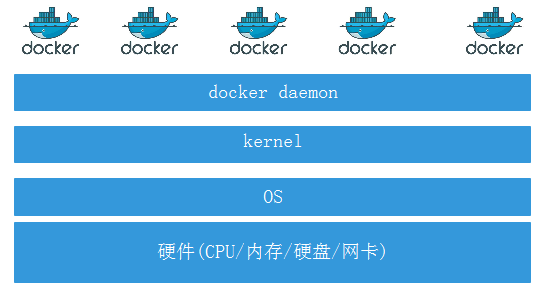

但是，如上图一个宿主机运行了 N 个容器， 多个容器带来的以下问题怎么解决:
1.怎么样保证每个容器都有不同的文件系统并且能互不影响？
2.一个 docker 主进程内的各个容器都是其子进程，那么实现同一个主进程下不同类型的子进程？ 各个进程间通信能相互访问(内存数据)吗？
3.每个容器怎么解决 IP 及端口分配的问题？
4.多个容器的主机名能一样吗？
5.每个容器都要不要有 root 用户？怎么解决账户重名问题？

# Linux Namespace 技术：
namespace 是 Linux 系统的底层概念， 在内核层实现，即有一些不同类型的命名空间被部署在核内， 各个 docker 容器运行在同一个 docker 主进程并且共用同一个宿主机系统内核，各 docker 容器运行在宿主机的用户空间， 每个容器都要有类似于虚拟机一样的相互隔离的运行空间， 但是容器技术是在一个进程内实现运行指定服务的运行环境， 并且还可以保护宿主机内核不受其他进程的干扰和影响， 如文件系统空间、网络空间、进程空间等，目前主要通过以下技术实现容器运行空间的相互隔离：

|隔离类型|功能|系统调用参数|内核版本|
|-------|----|-----------|-------|
|MNT Namespace</br>(mount)| 提供磁盘挂载点和文件系统的隔离能力 |CLONE_NEWNS| Linux 2.4.19
IPC Namespace</br>(Inter-Process Communication)  | 提供进程间通信的隔离能力  | CLONE_NEWIPC |  Linux 2.6.19
UTS Namespace</br>(UNIX Timesharing System)  | 提供主机名隔离能力  | CLONE_NEWUTS |  Linux 2.6.19
PID Namespace</br>(Process Identification)  | 提供进程隔离能力 |  CLONE_NEWPID  | Linux 2.6.24
Net Namespace</br>(network)  | 提供网络隔离能力  | CLONE_NEWNET |  Linux 2.6.29
User Namespace</br>(user)  | 提供用户隔离能力 |  CLONE_NEWUSER |  Linux 3.8

## MNT Namespace技术
每个容器都要有独立的根文件系统有独立的用户空间， 以实现在容器里面启动服务并且使用容器的运行环境，即一个宿主机是 ubuntu 的服务器，可以在里面启动一个 centos 运行环境的容器并且在容器里面启动一个 Nginx 服务，此 Nginx运行时使用的运行环境就是 centos 系统目录的运行环境， 但是在容器里面是不能访问宿主机的资源， 宿主机是使用了 chroot 技术把容器锁定到一个指定的运行目录里面。

例如： /var/lib/containerd/io.containerd.runtime.v1.linux/moby/容器 ID

## IPC Namespace：
一个容器内的进程间通信， 允许一个容器内的不同进程的(内存、 缓存等)数据访问，但是不能夸容器访问其他容器的数据。

## UTS Namespace：
UTS namespace（ UNIX Timesharing System 包含了运行内核的名称、版本、底层体系结构类型等信息）用于系统标识， 其中包含了 hostname 和域名domainname ， 它使得一个容器拥有属于自己 hostname 标识，这个主机名标识独立于宿主机系统和其上的其他容器。

## PID Namespace：
Linux 系统中，有一个 PID 为 1 的进程(init/systemd)是其他所有进程的父进程， 那么在每个容器内也要有一个父进程来管理其下属的子进程，那么多个容器的进程通 PID namespace 进程隔离(比如 PID 编号重复、 器内的主进程生成与回收子进程等)

## Net Namespace：
每一个容器都类似于虚拟机一样有自己的网卡、 监听端口、 TCP/IP 协议栈等，Docker 使用 network namespace 启动一个 vethX 接口，这样你的容器将拥有它自己的桥接 ip 地址，通常是 docker0，而 docker0 实质就是 Linux 的虚拟网桥,网桥是在 OSI 七层模型的数据链路层的网络设备，通过 mac 地址对网络进行划分，并且在不同网络直接传递数据。

## User Namespace：
各个容器内可能会出现重名的用户和用户组名称， 或重复的用户 UID 或者GID， 那么怎么隔离各个容器内的用户空间呢？User Namespace 允许在各个宿主机的各个容器空间内创建相同的用户名以及相同的用户 UID 和 GID， 只是会把用户的作用范围限制在每个容器内，即 A 容器和 B 容器可以有相同的用户名称和 ID 的账户，但是此用户的有效范围仅是当前容器内， 不能访问另外一个容器内的文件系统，即相互隔离、互补影响、 永不相见。

---
# Linux控制组
Linux control groups：
在一个容器，如果不对其做任何资源限制，则宿主机会允许其占用无限大的内存空间， 有时候会因为代码 bug 程序会一直申请内存，直到把宿主机内存占完， 为了避免此类的问题出现， 宿主机有必要对容器进行资源分配限制，比如CPU、内存等， Linux Cgroups 的全称是 Linux Control Groups， 它最主要的作用，就是限制一个进程组能够使用的资源上限，包括 CPU、内存、磁盘、网络带宽等等。此外，还能够对进程进行优先级设置，以及将进程挂起和恢复等操作。

## cgroups 具体实现
**blkio**：块设备 IO 限制。
**cpu**：使用调度程序为 cgroup 任务提供 cpu 的访问。
**cpuacct**：产生 cgroup 任务的 cpu 资源报告。
**cpuset**：如果是多核心的 cpu，这个子系统会为 cgroup 任务分配单独的 cpu 和内存。
**devices**：允许或拒绝 cgroup 任务对设备的访问。
**freezer**：暂停和恢复 cgroup 任务。
**memory**：设置每个 cgroup 的内存限制以及产生内存资源报告。
**net_cls**：标记每个网络包以供 cgroup 方便使用。
**ns**：命名空间子系统。
**perf_event**：增加了对每 group 的监测跟踪的能力，可以监测属于某个特定的 group 的所有线程以及运行在特定 CPU 上的线程

查看系统 cgroups：
```bash
ll /sys/fs/cgroup/
```
有了以上的 chroot、 namespace、 cgroups 就具备了基础的容器运行环境，但是还需要有相应的容器创建与删除的管理工具、 以及怎么样把容器运行起来、容器数据怎么处理、怎么进行启动与关闭等问题需要解决， 于是容器管理技术出现了

# 容器管理工具：
目前主要是使用 docker， 早期有使用 lxc。

## LXC
**LXC**： LXC 为 Linux Container 的简写。可以提供轻量级的虚拟化，以便隔离进程和资源， 官方网站： https://linuxcontainers.org/

1. Ubuntu 安装 lxc:
```bash
# apt install lxc lxd
Reading package lists... Done
Building dependency tree
Reading state information... Done
lxd is already the newest version (3.0.3-0ubuntu1~18.04.3).
lxc is already the newest version (3.0.3-0ubuntu1~18.04.1).
```
2. 检查内核对 lcx 的支持状况，必须全部为 lcx
```bash
# lxc-checkconfig 
# lxc-create -t 模板名称 -n lcx-test
# lxc-create -t download --name alpine12 -- --dist alpine --release 3.9 --arch amd64
Setting up the GPG keyring
Downloading the image index
Downloading the rootfs
Downloading the metadata
The image cache is now ready
Unpacking the rootfs
---
You just created an Alpinelinux 3.9 x86_64 (20190630_13:00) container.
```
> 命令备注：
> -t 模板: -t 选项后面跟的是模板，模式可以认为是一个原型，用来说明我们需要一个什么样的容器(比如容器里面需不需要有 vim, apache 等软件)．模板实际上就是一个脚本文件(位于/usr/share/lxc/templates 目录)，我们这里指定 download 模板(lxc-create 会调用 lxcdownload 脚本，该脚本位于刚说的模板目录中)是说明我们目前没有自己模板，需要下载官方的模板
> --name 容器名称： 为创建的容器命名
> -- : --用来说明后面的参数是传递给 download 脚本的，告诉脚本需要下载什么样的模板
> --dist 操作系统名称：指定操作系统
> --release 操作系统: 指定操作系统，可以是各种 Linux 的变种
> --arch 架构： 指定架构，是 x86 还是 arm，是 32 位还是 64 位

3. 启动 lxc 容器
```bash
# lxc-start alpine12 
```
4. 进入 lxc 容器
```bash
# lxc-attach alpine12 
```
容器内查看网络
```bash
~ # ifconfig
eth0    Link encap:Ethernet HWaddr 00:16:3E:DF:54:94
        inet addr:10.0.3.115 Bcast:10.0.3.255 Mask:255.255.255.0
        inet6 addr: fe80::216:3eff:fedf:5494/64 Scope:Link
        UP BROADCAST RUNNING MULTICAST MTU:1500 Metric:1
        RX packets:18 errors:0 dropped:0 overruns:0 frame:0
        TX packets:13 errors:0 dropped:0 overruns:0 carrier:0
        collisions:0 txqueuelen:1000
        RX bytes:2102 (2.0 KiB) TX bytes:1796 (1.7 KiB)
lo      Link encap:Local Loopback
        inet addr:127.0.0.1 Mask:255.0.0.0
        inet6 addr: ::1/128 Scope:Host
        UP LOOPBACK RUNNING MTU:65536 Metric:1
        RX packets:0 errors:0 dropped:0 overruns:0 frame:0
        TX packets:0 errors:0 dropped:0 overruns:0 carrier:0
        collisions:0 txqueuelen:1000
        RX bytes:0 (0.0 B) TX bytes:0 (0.0 B)
```
容器内查看内核
```bash
~ # uname -a
Linux alpine12 4.15.0-20-generic #21-Ubuntu SMP Tue Apr 24 06:16:15 UTC 2018
x86_64 Linux
```

lxc 启动容器依赖于模板， 清华模板源：https://mirrors.tuna.tsinghua.edu.cn/help/lxc-images/

但是做模板相对较难， 需要手动一步步创构建文件系统、准备基础目录及可执行程序等，而且在大规模使用容器的场景很难横向扩展， 另外后期代码升级也需要重新从头构建模板，基于以上种种原因便有了 docker。

## docker：
Docker 启动一个容器也需要一个外部模板但是较多镜像， docke 的镜像可以保存在一个公共的地方共享使用， 只要把镜像下载下来就可以使用，最主要的是可以在镜像基础之上做自定义配置并且可以再把其提交为一个镜像，一个镜像可以被启动为多个容器。

Docker 的镜像是分层的， 镜像底层为库文件且只读层即不能写入也不能删除数据，从镜像加载启动为一个容器后会生成一个可写层，其写入的数据会复制到容器目录， 但是容器内的数据在删除容器后也会被随之删除。
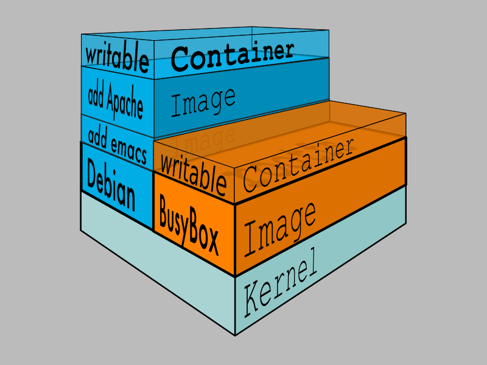

## pouch：
> https://www.infoq.cn/article/alibaba-pouch
> https://github.com/alibaba/pouch

## Docker 的优势：
**快速部署**： 短时间内可以部署成百上千个应用，更快速交付到线上。高效虚拟化：不需要额外的 hypervisor 支持，直接基于 linux 实现应用虚拟化，相比虚拟机大幅提高性能和效率。

**节省开支**： 提高服务器利用率，降低 IT 支出。

**简化配置**： 将运行环境打包保存至容器，使用时直接启动即可。快速迁移和扩展： 可夸平台运行在物理机、虚拟机、公有云等环境， 良好的兼容性可以方便将应用从 A 宿主机迁移到 B 宿主机， 甚至是 A 平台迁移到 B 平台。

## Docker 的缺点：
**隔离性**： 各应用之间的隔离不如虚拟机彻底

---
# docker 核心技术
## 容器规范：
容器技术除了的 docker 之外，还有 coreOS 的 rkt， 还有阿里的 Pouch， 为了保证容器生态的标准性和健康可持续发展， 包括 Linux 基金会、 Docker、微软、红帽谷歌和、 IBM、 等公司在 2015 年 6 月共同成立了一个叫 open container（ OCI）的组织，其目的就是制定开放的标准的容器规范，目前 OCI 一共发布了两个规范，

分别是 runtime spec 和 image format spec，有了这两个规范， 不同的容器公司开发的容器只要兼容这两个规范，就可以保证容器的可移植性和相互可操作性。

## 容器 runtime：
runtime 是真正运行容器的地方，因此为了运行不同的容器 runtime 需要和操作系统内核紧密合作相互在支持，以便为容器提供相应的运行环境。

目前主流的三种 runtime：
**Lxc：** linux 上早期的 runtime， Docker 早期就是采用 lxc 作为 runtime。
**runc：**目前 Docker 默认的 runtime， runc 遵守 OCI 规范，因此可以兼容 lxc。
**rkt：** 是 CoreOS 开发的容器 runtime，也符合 OCI 规范，所以使用 rktruntime 也可以运行 Docker 容器。

## 容器管理工具：
管理工具连接 runtime 与用户，对用户提供图形或命令方式操作，然后管理工具将用户操作传递给 runtime 执行。
lxc 是 lxd 的管理工具。
Runc 的管理工具是 docker engine， docker engine 包含后台 deamon 和 cli 两部分，大家经常提到的 Docker 就是指的 docker engine。
Rkt 的管理工具是 rkt cli。

## 容器定义工具：
容器定义工具允许用户定义容器的属性和内容，以方便容器能够被保存、共享和重建。
**Docker image**：是 docker 容器的模板， runtime 依据 docker image 创建容器。
**Dockerfile**：包含 N 个命令的文本文件，通过 dockerfile 创建出 docker image。
**ACI(App container image)**： 与 docker image 类似， 是 CoreOS 开发的 rkt 容器的镜像格式。

**Registry：**
统一保存镜像而且是多个不同镜像版本的地方， 叫做镜像仓库。
Image registry： docker 官方提供的私有仓库部署工具。
Docker hub： docker 官方的公共仓库， 已经保存了大量的常用镜像，可以方便大家直接使用。
Harbor： vmware 提供的自带 web 界面自带认证功能的镜像仓库，目前有很多公司使用。

## 编排工具：
当多个容器在多个主机运行的时候， 单独管理容器是相当复杂而且很容易出错，而且也无法实现某一台主机宕机后容器自动迁移到其他主机从而实现高可用的目的， 也无法实现动态伸缩的功能，因此需要有一种工具可以实现统一管理、动态伸缩、故障自愈、 批量执行等功能， 这就是容器编排引擎。

容器编排通常包括容器管理、调度、集群定义和服务发现等功能。
Docker swarm： docker 开发的容器编排引擎。
Kubernetes： google 领导开发的容器编排引擎，内部项目为 Borg， 且其同时支持docker 和 CoreOS。
Mesos+Marathon： 通用的集群组员调度平台， mesos(资源分配)与 marathon(容器编排平台)一起提供容器编排引擎功能。

---
# docker 依赖技术：
**容器网络：**
docker 自带的网络 docker network 仅支持管理单机上的容器网络， 当多主机运行的时候需要使用第三方开源网络，例如 calico、 flannel 等。

**服务发现：**
容器的动态扩容特性决定了容器 IP 也会随之变化， 因此需要有一种机制开源自动识别并将用户请求动态转发到新创建的容器上， kubernetes 自带服务发现功能，需要结合 kube-dns 服务解析内部域名。

**容器监控：**
可以通过原生命令 docker ps/top/stats 查看容器运行状态，另外也可以使heapster/ Prometheus 等第三方监控工具监控容器的运行状态。

**数据管理：**
容器的动态迁移会导致其在不同的 Host 之间迁移，因此如何保证与容器相关的数据也能随之迁移或随时访问，可以使用逻辑卷/存储挂载等方式解决。

**日志收集：**
docker 原生的日志查看工具 docker logs， 但是容器内部的日志需要通过 ELK 等专门的日志收集分析和展示工具进行处理。

---


## docker 存储引擎：
目前 docker 的默认存储引擎为 overlay2， 需要磁盘分区支持 d-type 文件分层功能，因此需要系统磁盘的额外支持。

官方文档关于存储引擎的选择文档：
> https://docs.docker.com/storage/storagedriver/select-storage-driver/

Docker 官方推荐首选存储引擎为 **overlay2** 其次为 devicemapper， 但是devicemapper 存在使用空间方面的一些限制， 虽然可以通过后期配置解决，但是官方依然推荐使用 overlay2，以下是网上查到的部分资料：https://www.cnblogs.com/youruncloud/p/5736718.html

> 如果 docker 数据目录是一块单独的磁盘分区而且是 xfs 格式的， 那么需要在格式化的时候加上参数-n ftype=1， 否则后期在启动容器的时候会报错不支持 dtype。
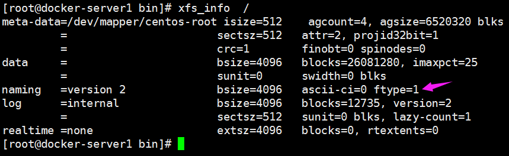
报错界面：
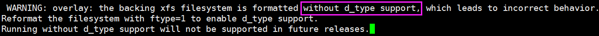

## docker 服务进程：
通过查看 docker 进程，了解 docker 的运行及工作方式
1. 查看宿主机进程树
```bash
pstree -p 1
```
2. 查看 containerd 进程关系
有四个进程：
**dockerd：** 被 client 直接访问，其父进程为宿主机的 systemd 守护进程。
**docker-proxy：** 实现容器通信， 其父进程为 dockerd
**containerd：** 被 dockerd 进程调用以实现与 runc 交互。
**containerd-shim：** 真正运行容器的载体， 其父进程为 containerd。

3. containerd-shim 命令使用
```bash
# containerd-shim -h
Usage of containerd-shim:
  -address string
        grpc address back to main containerd
  -containerd-binary containerd publish
        path to containerd binary (used for containerd publish) (default "containerd")
  -criu string
        path to criu binary
  -debug
        enable debug output in logs
  -namespace string
        namespace that owns the shim
  -runtime-root string
        root directory for the runtime (default "/run/containerd/runc")
  -socket string
        abstract socket path to serve
  -systemd-cgroup
        set runtime to use systemd-cgroup
  -workdir string
        path used to storge large temporary data
```

### 容器的创建与管理过程
**通信流程：**
1. dockerd 通过 grpc 和 containerd 模块通信， dockerd 由 libcontainerd 负责和 containerd 进行交换， dockerd 和 containerd 通信 socket 文件： /run/containerd/containerd.sock。
2. containerd 在 dockerd 启动时被启动， 然后 containerd 启动 grpc 请求监听， containerd 处理 grpc 请求，根据请求做相应动作。
3. 若是 start 或是 exec 容器， containerd 拉起一个 container-shim , 并进行相应的操作。
4. container-shim 别拉起后， start/exec/create 拉起 runC 进程，通过 exit、 control 文件和containerd 通信，通过父子进程关系和 SIGCHLD 监控容器中进程状态。
5. 在整个容器生命周期中， containerd 通过 epoll 监控容器文件，监控容器事件。

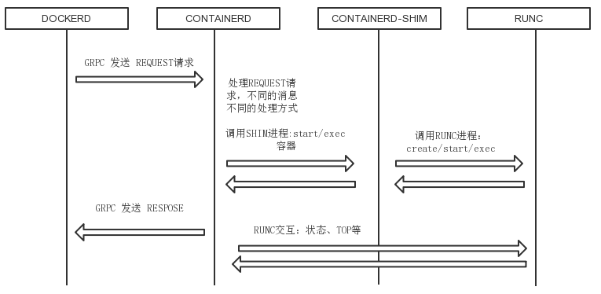

### grpc 简介：
gRPC 是 Google 开发的一款高性能、开源和通用的 RPC 框架，支持众多语言客户端。

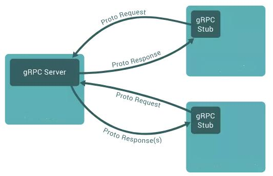

---
# Docker 安装及基础命令介绍：
> 官方网址： https://www.docker.com/

**系统版本选择：**
> Docker 目前已经支持多种操作系统的安装运行， 比如 **Ubuntu**、 **CentOS**、**Redhat**、 **Debian**、 **Fedora**，甚至是还支持了 Mac 和 Windows，在 linux 系统上需要内核版本在 3.10 或以上， docker 版本号之前一直是 0.X 版本或 1.X 版本，但是从 2017 年 3 月 1 号开始改为每个季度发布一次稳版，其版本号规则也统一变更为 YY.MM， 例如 17.09 表示是 2017 年 9 月份发布的， 本次演示的操作系统使用 Centos 7.5 为例。

**Docker 版本选择：**
> Docker 之前没有区分版本，但是 2017 年推出(将 docker 更名为)新的项目Moby， github 地址： https://github.com/moby/moby， Moby 项目属于 Docker 项目的全新上游， Docker 将是一个隶属于的 Moby 的子产品，而且之后的版本之后开始区分为 CE 版本（社区版本） 和 EE（企业收费版）， CE 社区版本和 EE 企业版本都是每个季度发布一个新版本，但是 EE 版本提供后期安全维护 1 年， 而CE 版本是 4 个月， 本次演示的 Docker 版本为 18.03，

---
## Docker安装
### 下载 rpm 包安装：
> 官方 rpm 包下载地址:
https://download.docker.com/linux/centos/7/x86_64/stable/Packages/

> 阿里镜像下载地址：
https://mirrors.aliyun.com/docker-ce/linux/centos/7/x86_64/stable/Packages/

### Centos yum 源安装：
1. 下载docker源
```bash
rm -rf /etc/yum.repos.d/*
wget -O /etc/yum.repos.d/CentOS-Base.repo http://mirrors.aliyun.com/repo/Centos-7.repo
wget -O /etc/yum.repos.d/epel.repo http://mirrors.aliyun.com/repo/epel-7.repo
wget -O /etc/yum.repos.d/docker-ce.repo https://mirrors.aliyun.com/docker-ce/linux/centos/docker-ce.repo
```
2. 安装
```bash
yum install docker-ce
```
3. 启动
```bash
systemctl start docker
systemctl enable docker
```

### Ubuntu 安装
> 版本： Ubuntu 18.04.3
> 参考： https://yq.aliyun.com/articles/110806

> * <b><font color=red> 阿里脚本安装最新版 </font></b>
1. 使用官方安装脚本自动安装 （仅适用于公网环境）
```bash
curl -fsSL https://get.docker.com | bash -s docker --mirror Aliyun
```

> * <b><font color=red> 自定义版本下载 </font></b>
0. 配置阿里yum源
```bash
sudo vim /etc/apt/sources.list
```
```bash
deb http://mirrors.aliyun.com/ubuntu/ bionic main restricted universe multiverse
deb-src http://mirrors.aliyun.com/ubuntu/ bionic main restricted universe multiverse

deb http://mirrors.aliyun.com/ubuntu/ bionic-security main restricted universe multiverse
deb-src http://mirrors.aliyun.com/ubuntu/ bionic-security main restricted universe multiverse

deb http://mirrors.aliyun.com/ubuntu/ bionic-updates main restricted universe multiverse
deb-src http://mirrors.aliyun.com/ubuntu/ bionic-updates main restricted universe multiverse

deb http://mirrors.aliyun.com/ubuntu/ bionic-proposed main restricted universe multiverse
deb-src http://mirrors.aliyun.com/ubuntu/ bionic-proposed main restricted universe multiverse

deb http://mirrors.aliyun.com/ubuntu/ bionic-backports main restricted universe multiverse
deb-src http://mirrors.aliyun.com/ubuntu/ bionic-backports main restricted universe multiverse
```
1. 安装必要的一些系统工具
```bash
sudo apt-get update
sudo apt-get -y install apt-transport-https ca-certificates curl software-properties-common
```
2. 安装GPG证书
```bash
curl -fsSL http://mirrors.aliyun.com/docker-ce/linux/ubuntu/gpg | sudo apt-key add -
```
3. 写入软件源信息
```bash
sudo add-apt-repository "deb [arch=amd64] http://mirrors.aliyun.com/docker-ce/linux/ubuntu $(lsb_release -cs) stable"
```
4. 更新
```bash
sudo apt-get -y update
```
5. 查找Docker-CE的版本:
```bash
# apt-cache madison docker-ce
docker-ce | 5:19.03.2~3-0~ubuntu-bionic | http://mirrors.aliyun.com/docker-ce/linux/ubuntu bionic/stable amd64 Packages
docker-ce | 5:19.03.1~3-0~ubuntu-bionic | http://mirrors.aliyun.com/docker-ce/linux/ubuntu bionic/stable amd64 Packages
...
```
6. 安装指定版本的Docker-CE: (VERSION 例如上面的 17.03.1~ce-0~ubuntu-xenial)
```bash
sudo apt install docker-ce-cli=5:18.09.9~3-0~ubuntu-bionic
sudo apt install docker-ce=5:18.09.9~3-0~ubuntu-bionic
```

7. 验证版本
```bash
# docker version
Client:
 Version:           18.09.9
 API version:       1.39
 Go version:        go1.11.13
 Git commit:        039a7df9ba
 Built:             Wed Sep  4 16:57:28 2019
 OS/Arch:           linux/amd64
 Experimental:      false

Server: Docker Engine - Community
 Engine:
  Version:          18.09.9
  API version:      1.39 (minimum version 1.12)
  Go version:       go1.11.13
  Git commit:       039a7df
  Built:            Wed Sep  4 16:19:38 2019
  OS/Arch:          linux/amd64
  Experimental:     false
```

8. 验证docker信息
```bash
# docker info
Containers: 0
 Running: 0
 Paused: 0
 Stopped: 0
Images: 0
Server Version: 18.09.9
Storage Driver: overlay2
 Backing Filesystem: extfs
 Supports d_type: true
 Native Overlay Diff: true
Logging Driver: json-file
Cgroup Driver: cgroupfs
Plugins:
 Volume: local
 Network: bridge host macvlan null overlay
 Log: awslogs fluentd gcplogs gelf journald json-file local logentries splunk syslog
Swarm: inactive
Runtimes: runc
Default Runtime: runc
Init Binary: docker-init
containerd version: 894b81a4b802e4eb2a91d1ce216b8817763c29fb
runc version: 425e105d5a03fabd737a126ad93d62a9eeede87f
init version: fec3683
Security Options:
 apparmor
 seccomp
  Profile: default
Kernel Version: 4.15.0-62-generic
Operating System: Ubuntu 18.04.3 LTS
OSType: linux
Architecture: x86_64
CPUs: 2
Total Memory: 1.861GiB
Name: ubuntu
ID: 2C5Z:IASC:G3GK:325R:RDGI:GDJ4:23EE:O76B:Z2RY:HY5U:RSLC:J7OO
Docker Root Dir: /var/lib/docker
Debug Mode (client): false
Debug Mode (server): false
Registry: https://index.docker.io/v1/
Labels:
Experimental: false
Insecure Registries:
 127.0.0.0/8
Live Restore Enabled: false
Product License: Community Engine

WARNING: No swap limit support
```
最后一行有个WARNING: <b><font color=red> WARNING: No swap limit support </font></b>
解决方法：
```bash
sudo vim /etc/default/grub
```
在`GRUB_CMDLINE_LINUX=""`这行加上
```ini
GRUB_CMDLINE_LINUX="cgroup_enable=memory swapaccount=1"
```
更新下grub，然后重启
```bash
sudo update-grub
reboot
```


---
## Docker命令
1. 查看信息
```bash
docker info
```
2. 查看版本
```bash
docker version
```
3. 查看当前容器状态
```bash
docker ps 
```
4. 查询镜像
```bash
docker search nginx
```
5. 获取镜像
```bash
docker pull nginx
```
6. 查看已有镜像
```bash
docker images
```
7. 进入容器后，安装基础命令：
```bash
apt update
apt install procps
apt install iputils-ping
apt install net-tools
```

### 启动容器
```bash
# 启动一个在后台运行的 docker 容器
docker run -it -d --name 'test-nginx' nginx

# -p指定端口映射，
-p 80:80

# 指定 ip 地址和传输协议 udp 或者 tcp:  
-p 192.168.7.108:80:80/tcp

# 也可以在创建时手动指定容器的 dns
--dns 223.6.6.6 

# 指定名称
--name "centos3"
```

```bash
vi docker-enter.sh
chmod +x docker-enter.sh 
```

### 进入容器

1. 使用执行命令方式进入容器
```bash
docker exec -it 32ffb5ac7566 bash
```
2. 使用使用容器 pid 方式进入容器
```bash
docker inspect  -f  "{{.State.Pid}}"  02a1907e7c89
    19080 
nsenter -t 19080 -m -u -i -n -p
```
3. 脚本方式进入容器
```bash
#!/bin/bash
docker_in(){

    NAME_ID=$1
    PID=$(docker inspect -f "{{.State.Pid}}" ${NAME_ID})
    nsenter -t ${PID} -m -u -i -n -p 

}

docker_in $1
```
启动
```bash
./docker-enter.sh centos-test
```

### 更多命令
以镜像名：nginx为例子

1. 删除 docker 镜像
```bash
docker rmi nginx
```
2. 手动导出 docker 镜像
```bash
docker save nginx -o /root/nginx.tar.gz
docker save nginx > /root/nginx.tar.gz
```
3. 手动导入 docker 镜像
```bash
docker load -i nginx.tar.gz 
docker load < nginx.tar.gz 
```
4. 停止和启动一个容器
```bash
# d5ab2595f09a是CONTAINER ID
docker stop d5ab2595f09a
docker start d5ab2595f09a
```
5. 删除一个已经停止的容器
```bash
docker rm d5ab2595f09a
```
6. 强制关闭一个运行中的容器
```bash
docker kill d1ad4fa0b74c
```

---
## docker 镜像加速配置：
国内下载国外的镜像有时候会很慢，因此可以更改 docker 配置文件添加一个加速器， 可以通过加速器达到加速下载镜像的目的。

### 获取加速地址：
浏览器打开 http://cr.console.aliyun.com， 注册或登录阿里云账号，点击左侧的镜像加速器， 将会得到一个专属的加速地址， 而且下面有使用配置说明：
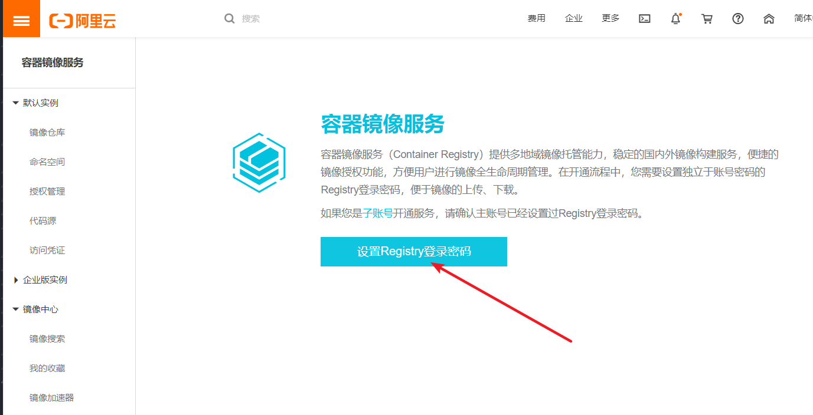
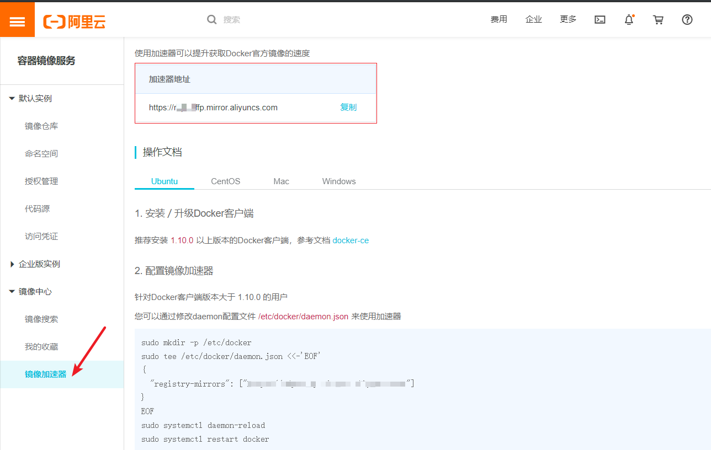

1. 可以通过修改daemon配置文件/etc/docker/daemon.json来使用加速器
```bash
sudo mkdir -p /etc/docker
sudo tee /etc/docker/daemon.json <<-'EOF'
{
  "registry-mirrors": ["你的加速地址"]
}
EOF
```
2. 重启服务
```bash
sudo systemctl daemon-reload
sudo systemctl restart docker
```

---
# Docker 命令与镜像管理：
Docker 镜像含有启动容器所需要的文件系统及所需要的内容， 因此镜像主要用于创建并启动 docker 容器。

Docker 镜像含里面是一层层文件系统,叫做 Union FS（联合文件系统） ,联合文件系统，可以将几层目录挂载到一起，形成一个虚拟文件系统,虚拟文件系统的目录结构就像普通 linux 的目录结构一样， docker 通过这些文件再加上宿主机的内核提供了一个 linux 的虚拟环境,每一层文件系统我们叫做一层 layer，联合文件系统可以对每一层文件系统设置三种权限，只读（ readonly）、读写（ readwrite）和写出（ whiteout-able），但是 docker 镜像中每一层文件系统都是只读的,构建镜像的时候,从一个最基本的操作系统开始,每个构建的操作都相当于做一层的修改,增加了一层文件系统,一层层往上叠加,上层的修改会覆盖底层该位置的可见性，这也很容易理解，就像上层把底层遮住了一样,当使用镜像的时候，我们只会看到一个完全的整体，不知道里面有几层也不需要知道里面有几层，结构如下：


一个典型的 Linux 文件系统由 bootfs 和 rootfs 两部分组成， bootfs(boot filesystem) 主要包含 bootloader 和 kernel， bootloader 主要用于引导加载 kernel，

当 kernel 被加载到内存中后 bootfs 会被 umount 掉， rootfs (root file system) 包含的就是典型 Linux 系统中的/dev， /proc， /bin， /etc 等标准目录和文件， 下图就是 docker image 中最基础的两层结构，不同的 linux 发行版（如 ubuntu和 CentOS ) 在 rootfs 这一层会有所区别。但是对于 docker 镜像通常都比较小， 官方提供的 centos 基础镜像在 200MB 左右，一些其他版本的镜像甚至只有几 MB， docker 镜像直接调用宿主机的内核，镜像中只提供 rootfs，也就是只需要包括最基本的命令、工具和程序库就可以了， 比如 alpine 镜像，在 5M 左右。

下图就是有两个不同的镜像在一个宿主机内核上实现不同的 rootfs。


容器、 镜像父镜像：
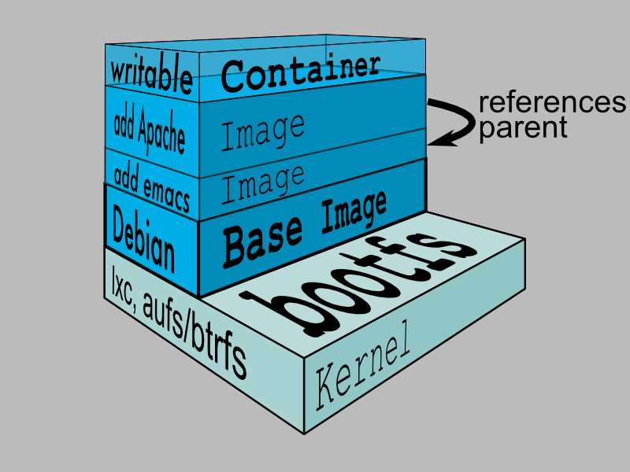

## docker常用命令示例

1. **搜索官方镜像**
```bash
# 带指定版本号
docker search centos:7.2.1511 
# 不带版本号默认 latest
docker search centos 
```

2. **下载镜像**
```bash
docker pull 仓库服务器:端口/项目名称/镜像名称:版本号
```

3. **查看本地镜像**
```bash
docker images
```
> REPOSITORY #镜像所属的仓库名称
TAG #镜像版本号（标识符）， 默认为 latest
IMAGE ID #镜像唯一 ID 标示
CREATED #镜像创建时间
VIRTUAL SIZE #镜像的大小

4. **镜像导出**:可以将镜像从本地导出问为一个压缩文件，然后复制到其他服务器进行导入使用
```bash
# 方法1
docker save centos -o /opt/centos.tar.gz
# 方法2
docker save centos > /opt/centos-1.tar.gz
```

5. **查看镜像内容**：包含了镜像的相关配置， 配置文件、分层
```bash
tar xvf centos.tar.gz
cat manifest.json
```

6. **镜像导入**：将镜像导入到 docker
```bash
docker load < /opt/centos.tar.gz
```

7. 删除镜像
```bash
docker rmi centos
```

8. 删除容器(-f 强制)
```bash
docker rm 容器 ID/容器名称
```

## docker命令：
1. 命令格式
```bash
docker [OPTIONS] COMMAND
```

2. 常用的`COMMAND`
```bash
[COMMAND]
attach      此方式进入容器的操作都是同步显示的且 exit 后容器将被关闭
build       从Dockerfile构建一个镜像
commit      从容器的更改中创建一个新镜像
cp          在容器和本地文件系统之间复制文件/文件夹
create      创建新容器
diff        检查容器文件系统上文件或目录的更改
events      从服务器获取实时事件
exec        在运行的容器中运行命令
export      将容器的文件系统导出为tar包
history     显示镜像的历史
images      列出镜像
import      从tarball导入内容以创建文件系统镜像
info        显示整个系统的信息
inspect     返回Docker对象的底层信息
kill        停止一个或多个正在运行的容器
load        从tar包或标准输出加载镜像
login       Log in to a Docker registry
logout      Log out from a Docker registry
logs        获取容器的日志
pause       暂停一个或多个容器中的所有进程
port        列出容器的端口映射或特定映射
ps          列出正在运行的容器
pull        下载镜像
push        上传镜像
rename      重命令一个容器
restart     重启容器
rm          移除一个或多个容器
rmi         移除一个或多个镜像
run         在新容器中运行命令
save        将一个或多个图像保存到tar存档文件(默认情况下流到STDOUT)
search      在Docker仓库中搜索镜像
start       启动一个或多个处在停止状态的容器
stats       显示容器资源使用统计数据的实时流
stop        停止一个或多个正在运行的容器
tag         Create a tag TARGET_IMAGE that refers to SOURCE_IMAGE
top         显示容器的运行进程
unpause     Unpause all processes within one or more containers
update      Update configuration of one or more containers
version     查看版本
wait        阻塞直到一个或多个容器停止，然后打印它们的退出代码
```

### 子命令帮助
```bash
docker COMMAND --help
```
退出容器不注销：<kbd>Ctrl</kbd> + <kbd>P</kbd> + <kbd>Q</kbd>

### run
在新容器中运行命令
> * **命令格式**
```bash
docker run [选项] 镜像名 [shell 命令] [参数...]
```

> * **常用选项**
```bash
-p list           指定容器的端口发布到主机
-P                将所有公开的端口发布到随机端口
--name string     为容器分配一个名称
-d                在后台运行容器并打印容器ID
-it               创建并进入容器
--rm              当容器退出时自动删除它
```

> * **例：**
1. 启动的容器在执行完 shel 命令就退出了
```bash
#docker run [镜像名] [shell 命令]
docker run centos /bin/echo 'hello wold' 
```

2. 从镜像启动一个容器：会直接进入到容器， 并随机生成容器 ID 和名称
```bash
docker run -it docker.io/centos bash
```

3. 随机映射端口：
前台启动并随机映射本地端口到容器的 80
```bash
docker run -P docker.io/nginx 
```
> 前台启动的会话窗口无法进行其他操作，除非退出， 但是退出后容器也会退出随机端口映射， 其实是默认从 32768 开始

4. 指定端口映射：

方式 1：本地端口 81 映射到容器 80 端口：
```bash
docker run -p 81:80 --name "nginx-test" nginx
```
方式 2：本地 IP:本地端口:容器端口
```bash
docker run -p 192.168.10.205:82:80 --name "nginx-test" docker.io/nginx
```
方式 3：本地 IP:本地随机端口:容器端口
```bash
docker run -p 192.168.10.205::80 --name "nginx-test" docker.io/nginx
```
方式 4：本机 ip:本地端口:容器端口/协议，默认为 tcp 协议
```bash
docker run -p 192.168.10.205:83:80/udp --name "nginx-test" docker.io/nginx
```
方式 5：一次性映射多个端口+协议：
```bash
docker run -p 86:80/tcp -p 443:443/tcp -p 53:53/udp --name "nginx-test" docker.io/nginx
```

5. 后台启动容器
```bash
docker run -d -P --name "nginx-test" docker.io/nginx
```

6. 容器退出后自动删除
```bash
docker run -it --rm --name nginx-test docker.io/nginx
```

7. 指定容器 DNS：
Dns 服务，默认采用宿主机的 dns 地址
一是将 dns 地址配置在宿主机
二是将参数配置在 docker 启动脚本里面 –dns=1.1.1.1
```bash
docker run -it --rm --dns 223.6.6.6 centos bash
```
> --rm 容器退出后会删除容器

---
### ps
列出正在运行的容器
> * **命令格式**
```bash
docker ps [OPTIONS]
```

> * **常用选项**
```bash
-a              显示所有容器(默认显示正在运行)
-f              根据提供的条件过滤输出
-n int          显示最后创建的n个容器(包括所有状态)(默认值-1)
-l              显示最新创建的容器(包括所有状态)
--no-trunc      不截断输出
-q              只显示数字id
-s              显示总文件大小
```

> * **例：**
1. 显示正在运行的容器：
```bash
docker ps
```

2. 显示所有容器
```bash
docker ps -a
```

---
### rm
移除一个或多个容器
> * **命令格式**
```bash
docker rm [OPTIONS] CONTAINER [CONTAINER...]
```
> * **常用选项**
```bash
-f        强制移除正在运行的容器(使用SIGKILL)
-l        删除指定链接
-v        删除与容器关联的卷
```
> * **例：**

1. 删除运行中的容器：即使容正在运行当中， 也会被强制删除掉
```bash
docker rm -f 11445b3a84d3
```
> 11445b3a84d3是CONTAINER ID，通过docker ps 查询

2. 批量删除已退出容器
```bash
docker rm -f `docker ps -aq -f status=exited`
```
3. 批量删除所有容器
```bash
docker rm -f $(docker ps -a -q)
```

---
### logs
获取容器的日志
> * **命令格式**
```bash
docker logs [OPTIONS] CONTAINER
```
> * **常用选项**
```bash
--details         显示提供给日志的额外细节
-f                跟踪日志输出
--since string    显示从时间戳开始的日志(如：42m表示42 分钟)
--tail string     从日志末尾显示的行数(默认为“all”)
-t                显示时间戳
--until string    在时间戳前显示日志(如：42m表示42 分钟)
```
> * **例：**

1. 查看 Nginx 容器访问日志
```bash
docker logs nginx-test-port3 #一次查看
docker logs -f nginx-test-port3 #持续查看
```
---
### load
从tar存档或STDIN加载镜像
> * **命令格式**
```bash
docker load [OPTIONS]
```
> * **常用选项**
```bash
-i string   从tar存档文件中读取，而不是从STDIN中读取
-q          不输出
```
> * **例：**
1. 导入镜像
```bash
docker load -i nginx.tar.gz
```
---

### port
列出容器的端口映射或特定映射
> * **命令格式**
```bash
docker port CONTAINER [PRIVATE_PORT[/PROTO]]
```
> * **例：**

1. 查看容器已经映射的端口
```bash
docker port nginx-test
```

---
### stop
停止一个或多个正在运行的容器
> * **命令格式**
```bash
docker stop [OPTIONS] CONTAINER [CONTAINER...]
```
> * **常用选项**
```bash
-t  int   等待stop几秒钟后再杀死它(默认为10)
```
> * **例：**
1. 容器的关闭
```bash
docker stop f821d0cd5a99
```
2. 批量关闭正在运行的容器
```bash
docker stop $(docker ps -a -q) 
```

---
### kill 
杀死一个或多个正在运行的容器
> * **命令格式**
```bash
docker kill [OPTIONS] CONTAINER [CONTAINER...]
```
> * **常用选项**
```bash
-s  string   发送到容器的信号(默认为“KILL”)
```
> * **例：**
1. 批量强制关闭正在运行的容器
```bash
docker kill $(docker ps -a -q)
```

---
### start
启动一个或多个停止的容器
> * **命令格式**
```bash
docker start [OPTIONS] CONTAINER [CONTAINER...]
```
> * **常用选项**
```bash
-a                      附加STDOUT/STDERR和转发信号
--detach-keys string    覆盖用于分离容器的键序列
-i                      将容器的STDIN
```
> * **例：**
1. 容器的启动
```bash
docker start f821d0cd5a99
```

---
### attach
此方式进入容器的操作都是同步显示的且 exit 后容器将被关闭
> * **命令格式**
```bash
docker attach [OPTIONS] CONTAINER
```
> * **常用选项**
```bash
--detach-keys string   覆盖用于分离容器的键序列
--no-stdin             不附加STDIN
--sig-proxy            代理所有接收到的进程信号(默认为true)
```
> * **例：**
1. 
```bash
docker attach 63fbc2d5a3ec
```

---
### exec
执行单次命令与进入容器，不是很推荐此方式， 虽然 exit 退出容器还在运行
> * **命令格式**
```bash
docker exec [OPTIONS] CONTAINER COMMAND [ARG...]
```
> * **常用选项**
```bash
-d                        分离模式:在后台运行命令
--detach-keys string      覆盖用于分离容器的键序列
-e list                   设置环境变量
-i                        保持STDIN打开，即使没有连接
--privileged              为该命令授予扩展特权
-t                        分配一个pseudo-TTY
-u  string                用户名或UID(格式:< name| UID >[:<group|gid>])
-w  string                容器内的工作目录
```
> * **例：**
1. 进入容器
```bash
docker exec -it centos-test /bin/bash
```

---
### inspect
返回Docker对象的底层信息
> * **命令格式**
```bash
docker inspect [OPTIONS] NAME|ID ...
```
> * **常用选项**
```bash
-f  string   使用给定的Go模板格式化输出
```
> * **例：**
1. 可以获取到容器的 PID
```bash
# docker inspect -f "{{.State.Pid}}" centos-test3
5892
```

---
### commit
从容器的更改中创建一个新镜像
> * **命令格式**
```bash
docker commit [OPTIONS] CONTAINER [REPOSITORY[:TAG]]
```
> * **常用选项**
```bash
-a  string      作者
-c  list        对创建的映像应用Dockerfile指令
-m  string      提交消息
-p              提交期间暂停容器(默认为true)
```
> * **例：**
1. 在宿主机基于容器 ID 提交为镜像
```bash
docker commit -a "chen" -m "nginx_yum_v1" --change="EXPOSE_80_443" f5f8c13d0f9f centos-nginx:v1
```
2. 提交的时候标记 tag 号：
> 标记 tag 号，生产当中比较常用，后期可以根据 tag 标记创建不同版本的镜像以及创建不同版本的容器。
```bash
docker commit -m "nginx image" f5f8c13d0f9f jack/centos-nginx:v1
```

----
# Docker 镜像与制作
**Docker 镜像有没有内核？**
从镜像大小上面来说，一个比较小的镜像只有十几 MB，而内核文件需要一百多兆， 因此镜像里面是没有内核的， 镜像在被启动为容器后将直接使用宿主机的内核， 而镜像本身则只提供相应的 rootfs， 即系统正常运行所必须的用户空间的文件系统，比如/dev/， /proc， /bin， /etc 等目录， 所以容器当中基本是没有/boot目录的，而/boot 当中保存的就是与内核相关的文件和目录。

**为什么没有内核？**
由于容器启动和运行过程中是直接使用了宿主机的内核，所以没有直接调用过物理硬件， 所以也不会涉及到硬件驱动， 因此也用不上内核和驱动，另外有内核的那是虚拟机。

## 手动制作nginx镜像
Docker 制作类似于虚拟机的镜像制作，即按照公司的实际业务务求将需要安装的软件、相关配置等基础环境配置完成，然后将其做成镜像，最后再批量从镜像批量生产实例，这样可以极大的简化相同环境的部署工作， Docker 的镜像制作分为手动制作和自动制作(基于 DockerFile)， 企业通常都是基于 Dockerfile 制作精细， 其中手动制作镜像步骤具体如下：

**下载镜像并初始化系统：**
基于某个基础镜像之上重新制作， 因此需要先有一个基础镜像，本次使用官方提供的 centos 镜像为基础：
1. docker下载centos镜像，并运行进入
```bash
docker pull centos
docker run -it docker.io/centos /bin/bash
```

> * <font color=red> 进入容器 </font>
1. 进入容器后，更改yun源
```bash
yum install wget -y
cd /etc/yum.repos.d/
rm -rf ./*
wget -O /etc/yum.repos.d/CentOS-Base.repo http://mirrors.aliyun.com/repo/Centos-7.repo
wget -O /etc/yum.repos.d/epel.repo http://mirrors.aliyun.com/repo/epel-7.repo
```
2. yum安装nginx与常用工具
```bash
yum install nginx –y 
yum install -y vim wget pcre pcre-devel zlib zlib-devel openssl openssl-devel iproute net-tools iotop
```
3. 修改nginx配置，关闭后台运行
```bash
vim /etc/nginx/nginx.conf
```
```ini
user nginx;
worker_processes auto;
error_log /var/log/nginx/error.log;
pid /run/nginx.pid;
daemon off; 
```

4. 自定义 web 页面
```bash
echo "my docker Nginx" > /usr/share/nginx/html/index.html
```

> * <font color=red> 退出容器 </font>

1. 提交为镜像:在宿主机基于容器 ID 提交为镜像
```bash
docker commit -a "chen" -m "nginx_yum_v1" --change="EXPOSE 80 443" 06b28abe9c04 centos-nginx:v1
```
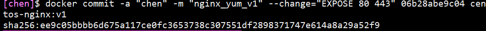
> 带 tag 的镜像提交：
> 提交的时候标记 tag 号：
> 标记 tag 号，生产当中比较常用，后期可以根据 tag 标记创建不同版本的镜像以及创建不同版本的容器。
```bash
docker commit -m "nginx image" f5f8c13d0f9f jack/centos-nginx:v1
```

2. 查看创建的镜像
```bash
docker image ls
```
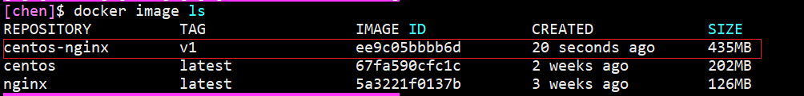

2. 从自己镜像启动容器
```bash
docker run -d -p 80:80 --name my-centos-nginx ee9c05bbbb6d /usr/sbin/nginx
```
> ee9c05bbbb6d是IMAGE ID

7. 访问测试
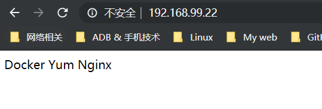

---

## Dockerfile介绍
DockerFile 可以说是一种可以被 Docker 程序解释的脚本， DockerFile 是由一条条的命令组成的，每条命令对应 linux 下面的一条命令， Docker 程序将这些DockerFile 指令再翻译成真正的 linux 命令，其有自己的书写方式和支持的命令， Docker 程序读取 DockerFile 并根据指令生成 Docker 镜像，相比手动制作镜像的方式， DockerFile 更能直观的展示镜像是怎么产生的，有了 DockerFile，当后期有额外的需求时，只要在之前的 DockerFile 添加或者修改响应的命令即可重新生成新的 Docke 镜像，避免了重复手动制作镜像的麻烦。

### FROM 指定基础镜像
定制镜像，需要先有一个基础镜像，在这个基础镜像上进行定制。**FROM** 就是指定基础镜像，必需放在有效指令的第一行。

怎么选择合适的镜像呢？官方有nginx、redis、mysql、httpd、tomcat等服务类的镜像，也有操作系统类，如：centos、ubuntu、debian等。

例：
```bash
FROM centos:latest
```

### MAINTAINER 指定维护者信息
格式
```bash
MAINTAINER <name>
```

### RUN 执行命令
> **RUN** 指令是用来执行命令的。shell命令功能丰富，所以RUN 指令经常用来调用shell指令。

格式
```bash
RUN <command> 
# 或 
RUN ["executable", "param1", "param2"]
```
> 第一种不用多说，第二种方式：`RUN ["/bin/bash", "-c", "echo hello world"]`
Dockerfile中，每一个指令都会创建一层镜像，RUN写多了，创建的镜像层数就会增多，所以一般RUN 指令的写法为
```bash
RUN yum -y install epel-release \
      && yum -y install nginx \
      && rm -rf /usr/share/nginx/html/*
      && echo "<h1> docker test nginx </h1>" > /usr/share/nginx/html/index.html
```

### CMD 启动容器时执行的命令
> 指定启动容器时执行的命令，每个 Dockerfile 只能有一条 CMD 命令。如果指定了多条命令，只有最后一条会被执行。

支持三种格式
```bash
# 使用 exec 执行，推荐方式；
CMD ["executable","param1","param2"] 

# 在 /bin/sh 中执行，提供给需要交互的应用；
CMD command param1 param2 

# 提供给 ENTRYPOINT 的默认参数；
CMD ["param1","param2"] 
```
如果用户启动容器时候指定了运行的命令，则会覆盖掉 CMD 指定的命令。

### EXPOSE 分配端口号
> 告诉 Docker 服务端容器暴露的端口号，供互联系统使用。在启动容器时需要通过 -P，Docker 主机会自动分配一个端口转发到指定的端口

格式
```bash
EXPOSE <port> [<port>...]
```

### ENV 环境变量
> 指定一个环境变量，会被后续 RUN 指令使用，并在容器运行时保持。

格式
```bash
ENV <key> <value>
```

例如
```bash
ENV PG_MAJOR 9.3
ENV PG_VERSION 9.3.4
RUN curl -SL http://example.com/postgres-$PG_VERSION.tar.xz | tar -xJC /usr/src/postgress && …
ENV PATH /usr/local/postgres-$PG_MAJOR/bin:$PATH
```

### ADD 复制/解压
> 该命令将复制指定的 `<src>` 到容器中的 `<dest>`。 其中` <src>` 可以是Dockerfile所在目录的一个相对路径；也可以是一个 URL；还可以是一个 tar 文件（自动解压为目录）。

格式
```bash
ADD <src> <dest>
```

### COPY 复制
> 复制本地主机的 `<src>`（为 Dockerfile 所在目录的相对路径）到容器中的 `<dest>`。

格式
```bash
COPY <src> <dest>
```
当使用本地目录为源目录时，推荐使用 `COPY`

### ENTRYPOINT 容器启动后执行的命令
> 配置容器启动后执行的命令，并且不可被 docker run 提供的参数覆盖。

两种格式：
```bash
ENTRYPOINT ["executable", "param1", "param2"]

# shell中执行
ENTRYPOINT command param1 param2
```
每个 Dockerfile 中只能有一个 ENTRYPOINT，当指定多个时，只有最后一个起效

###  VOLUME 挂载点
> 创建一个可以从本地主机或其他容器挂载的挂载点，一般用来存放数据库和需要保持的数据等

格式
```bash
VOLUME ["/data"]。
```

### USER 指定用户名
> 指定运行容器时的用户名或 UID，后续的 RUN 也会使用指定用户。

格式
```bash
USER daemon。
```
当服务不需要管理员权限时，可以通过该命令指定运行用户。并且可以在之前创建所需要的用户，
例如：
```bash
RUN groupadd -r postgres && useradd -r -g postgres postgres
```
要临时获取管理员权限可以使用 gosu，而不推荐 sudo。

### WORKDIR 工作目录
> 为后续的 RUN、CMD、ENTRYPOINT 指令配置工作目录。

格式
```bash
WORKDIR /path/to/workdir。
```
可以使用多个 WORKDIR 指令，后续命令如果参数是相对路径，则会基于之前命令指定的路径。例如
```bash
WORKDIR /a
WORKDIR b
WORKDIR c
RUN pwd
```
则最终路径为 /a/b/c。

### ONBUILD
> 配置当所创建的镜像作为其它新创建镜像的基础镜像时，所执行的操作指令。

格式
```bash
ONBUILD [INSTRUCTION]。
```
例如，Dockerfile 使用如下的内容创建了镜像 image-A。
```bash
...
ONBUILD ADD . /app/src
ONBUILD RUN /usr/local/bin/python-build --dir /app/src
...
```

如果基于 image-A 创建新的镜像时，新的Dockerfile中使用 FROM image-A指定基础镜像时，会自动执行ONBUILD 指令内容，等价于在后面添加了两条指令。
```bash
FROM image-A

#Automatically run the following
ADD . /app/src
RUN /usr/local/bin/python-build --dir /app/src
```

使用 `ONBUILD` 指令的镜像，推荐在标签中注明，例如 `ruby:1.9-onbuild`

### 构建镜像
格式
```bash
docker build [选项] 路径
```
`-t`选项，指定镜像的标签信息
```bash
docker build -t nginx:v1 /usr/local/src/
```
> 构建时，目录除了构建所需要的文件，不要有其它文件

---
## 制作yum版 nginx 镜像：
1. 准备目录
```bash
mkdir -pv /opt/dockerfile/web/nginx
```

2. 编写dockerfile文件
```bash
vim /opt/dockerfile/web/nginx/Dockerfile
```
```bash
#Nginx web image

FROM centos:latest

RUN yum install epel-release -y
RUN yum install nginx -y && rm -rf /usr/share/nginx/html/*
ADD html.tar.gz /usr/share/nginx/html/
#copy 

EXPOSE 80 443 8080

CMD ["/usr/sbin/nginx","-g","daemon off;"]
```
> RUN就是运行shell命令
> ADD

3. 创建网页测试文件
```bash
vi /opt/dockerfile/web/nginx/index.html
```
```html
<h1> docker nginx test, nginx container by dockerfile</h1>
```

4. 打包网页测试文件
```bash
tar czvf html.tar.gz index.html 
```

5. 构建镜像
```bash
docker build -t chenjb/centos-nginx /opt/dockerfile/web/nginx/
```
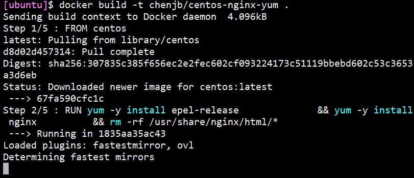

6. 查看镜像
```bash
docker images
```

7. 启动容器
```bash
docker run -it -d -p 80:80 --name "nginx-test" chenjb/centos-nginx 
```
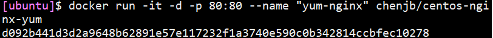

8. 查看进程
```bash
docker ps
```

9. 测试网页
```bash
# curl localhost
<h1> docker ginx test, nginx container by dockerfile</h1>
```

---
## 制作编译版 nginx 镜像：

### 下载镜像并初始化系统：
```bash
docker pull centos
mkdir -pv /opt/dockerfile/web/nginx
```
> #目录结构按照业务类型或系统类型等方式划分，方便后期镜像比较多的时候进行分类。

### 编写 Dockerfile：
```bash
vim /opt/dockerfile/web/nginx/Dockerfile
```
> 生成的镜像的时候会在执行命令的当前目录查找 Dockerfile 文件， 所以名称不可写错， 而且 D 必须大写
> My Dockerfile
> "#"为注释，等于 shell 脚本的中#
> 除了注释行之外的第一行，必须是 From xxx (xxx 是基础镜像)
```bash
# 第一行先定义基础镜像，后面的本地有效的镜像名，如果本地没有会从远程仓库下载，第一行很重要
From centos:latest

# 镜像维护者的信息: 
MAINTAINER chen 123456@qq.com

#自动解压压缩包
ADD nginx-1.10.3.tar.gz /usr/local/src/ 
#执行的命令，将编译安装 nginx 的步骤执行一遍
RUN rpm -ivh http://mirrors.aliyun.com/epel/epel-release-latest-7.noarch.rpm
RUN yum install -y vim wget tree lrzsz gcc gcc-c++ automake pcre pcre-devel zlib zlib-devel openssl openssl-devel iproute net-tools iotop

RUN cd /usr/local/src/nginx-1.10.3 && ./configure --prefix=/usr/local/nginx --with-http_sub_module && make && make install
RUN cd /usr/local/nginx/
ADD nginx.conf /usr/local/nginx/conf/nginx.conf
RUN useradd nginx -s /sbin/nologin
RUN ln -sv /usr/local/nginx/sbin/nginx /usr/sbin/nginx
RUN echo "test nginx page" > /usr/local/nginx/html/index.html

# 向外开放的端口，多个端口用空格做间隔，启动容器时候-p 需要使用此端向外映射，如： -p 8081:80，则 80 就是这里的 80
EXPOSE 80 443 

# 运行的命令，每个 Dockerfile 只能有一条，如果有多条则只有最后一条被执行
CMD ["nginx","-g","daemon off;"] 

#如果在从该镜像启动容器的时候也指定了命令，那么指定的命令会覆盖Dockerfile 构建的镜像里面的 CMD 命令，即指定的命令优先级更高， Dockerfile 的优先级较低一些
```

### 准备源码包与配置文件：
1. 配置文件关闭后台运行
```bash
cp /usr/local/nginx/conf/nginx.conf /opt/dockerfile/web/nginx
```

2. nginx 源码包
```bash
cp /usr/local/src/nginx-1.10.3.tar.gz /opt/dockerfile/web/nginx 
```

3. 执行镜像构建
```bash
docker build –t jack/nginx-1.10.3:v1 /opt/dockerfile/web/nginx/
```

4. 构建完成：
可以清晰看到各个步骤执行的具体操作

5. 查看是否生成本地镜像
```bash
docker images
```

6. 从镜像启动容器
```bash
docker run -d -p 80:80 --name yum-nginx jack/nginx-1.10.3:v1 /usr/sbin/nginx
```

7. 访问 web 界面
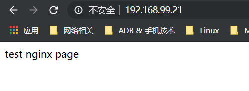

---
## 制作 tomcat 镜像：
基于官方提供的 centos 7.2.1511 基础镜像构建 JDK 和 tomcat 镜像，先构建 JDK 镜像，然后再基于 JDK 镜像构建 tomcat 镜像。

### 构建 JDK 镜像
1. 下载基础镜像 Centos：
```bash
docker pull centos
```

2. 执行构建 JDK 镜像：
```bash
mkdir /opt/dockerfile/{web/{nginx,tomcat,jdk,apache},system/{centos,ubuntu,redhat}} -pv
cd /opt/dockerfile/web/jdk/
```

3. 编辑Dockerfile
```bash
vim Dockerfile
```
```bash
#JDK Base Image
FROM centos-7.5-base:latest

MAINTAINER zhangshijie "zhangshijie@300.cn"

ADD jdk-8u162-linux-x64.tar.gz /usr/local/src/
RUN ln -sv /usr/local/src/jdk1.8.0_162 /usr/local/jdk
ADD profile /etc/profile
ENV JAVA_HOME /usr/local/jdk
ENV JRE_HOME $JAVA_HOME/jre
ENV CLASSPATH $JAVA_HOME/lib/:$JRE_HOME/lib/
ENV PATH $PATH:$JAVA_HOME/bin

RUN rm -rf /etc/localtime \
      && ln -snf /usr/share/zoneinfo/Asia/Shanghai/etc/localtime \
      && echo "Asia/Shanghai" > /etc/timezone
```

4. 上传 JDK 压缩包和 profile 文件：
将 JDK 压缩包上传到 Dockerfile 当前目录，然后执行构建：
```bash
docker build -t centos-7.5-jdk:v1 .
```

5. 启动容器
```bash
docker run -it centos-jdk:v2 bash
```

6. 将镜像上传到 harbor （下面有讲）
```bash
docker push 192.168.10.205/centos/centos-7.2.1511-jdk1.7.0.79
```

### 从 JDK 镜像构建 tomcat-8 镜像

1. 进入tomcat目录：
```bash
cd /opt/dockerfile/web/tomcat
```

2. 编辑Dockerfile文件
```bash
vim Dockerfile
```
```ini
FROM centos-jdk:v2
RUN useradd www -u 2019

ENV TZ "Asia/Shanghai"
ENV LANG en_US.UTF-8
ENV TERM xterm
ENV TOMCAT_MAJOR_VERSION 8
ENV TOMCAT_MINOR_VERSION 8.0.49
ENV CATALINA_HOME /apps/tomcat
ENV APP_DIR ${CATALINA_HOME}/webapps

RUN mkdir /apps
ADD apache-tomcat-8.5.42.tar.gz /apps
RUN ln -sv /apps/apache-tomcat-8.5.42 /apps/tomcat
```

3. 上传 tomcat 压缩包：`apache-tomcat-8.5.42.tar.gz`

4. 通过脚本构建 tomcat 基础镜像
```bash
docker build -t tomcat:v1 .
```

5. 验证镜像构建完成
```bash
docker images
```

6. 构建业务镜像 1：
```bash
mkdir -pv /opt/dockerfile/app/tomcat-app1
cd /opt/dockerfile/app/tomcat-app1
```

7. 准备 Dockerfile：
```bash
vim Dockerfile
```
```ini
FROM tomcat:v1
ADD run_tomcat.sh /apps/tomcat/bin/run_tomcat.sh
ADD myapp/* /apps/tomcat/webapps/myapp/
RUN chown www.www /apps/ -R
RUN chmod +x /apps/tomcat/bin/run_tomcat.sh
EXPOSE 8080 8009
CMD ["/apps/tomcat/bin/run_tomcat.sh"]
```

8. 准备自定义 myapp 页面：
```bash
mkdir myapp
echo "Tomcat Web Page1" > myapp/index.html
```

9. 准备容器启动执行脚本：
```bash
vim run_tomcat.sh
```
```bash
#!/bin/bash
echo "1.1.1.1 abc.test.com" >> /etc/hosts
echo "nameserver 223.5.5.5" > /etc/resolv.conf
su - www -c "/apps/tomcat/bin/catalina.sh start"
su - www -c "tail -f /etc/hosts"
```

10. 构建
```bash
docker build -t tomcat-app1:v1 .
```

11. 查看镜像
```bash
docker images
```

12. 从镜像启动容器测试：
```bash
docker run -it -d -p 8888:8080 tomcat-app1:v1
```

12. 访问测试
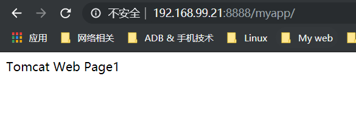

---
## 制作 haproxy 镜像：
1. 进入目录
```bash
mkdir -pv /opt/dockerfile/app/haproxy
cd /opt/dockerfile/app/haproxy
```

2. 准备 Dockerfile：
```bash
vim Dockerfile
```
```bash
#Haproxy Base Image
FROM centos
ADD haproxy-2.0.5.tar.gz /usr/local/src/

RUN yum install gcc gcc-c++ glibc glibc-devel pcre \
                pcre-devel openssl openssl-devel systemd-devel \
                net-tools vim iotop bc zip unzip zlib-devel lrzsz \
                tree screen lsof tcpdump wget ntpdate –y \
      && cd /usr/local/src/haproxy-2.0.5 \
      && make ARCH=x86_64 TARGET=linux-glibc \
              USE_PCRE=1 USE_OPENSSL=1 USE_ZLIB=1 \
              USE_SYSTEMD=1 USE_CPU_AFFINITY=1 \
              PREFIX=/usr/local/haproxy \
      && make install PREFIX=/usr/local/haproxy \
      && cp haproxy /usr/sbin/ \
      && mkdir /usr/local/haproxy/run
ADD haproxy.cfg /etc/haproxy/
ADD run_haproxy.sh /usr/bin
RUN chmod +x /usr/bin/run_haproxy.sh
EXPOSE 80 9999
CMD ["/usr/bin/run_haproxy.sh"]
```

3. 准备 haproxy 源码文件:`haproxy-2.0.5.tar.gz`

4. 准备`run_haproxy.sh`脚本
```bash
vim run_haproxy.sh
```
```bash
#!/bin/bash
haproxy -f /etc/haproxy/haproxy.cfg
tail -f /etc/hosts
```

5. 准备 haproxy 配置文件：
```bash
vim haproxy.cfg
```
```bash
global
chroot /usr/local/haproxy
#stats socket /var/lib/haproxy/haproxy.sock mode 600 level admin
uid 99
gid 99
daemon
nbproc 1
pidfile /usr/local/haproxy/run/haproxy.pid
log 127.0.0.1 local3 info

defaults
option http-keep-alive
option forwardfor
mode http
timeout connect 300000ms
timeout client 300000ms
timeout server 300000ms

listen stats
mode http
bind 0.0.0.0:9999
stats enable
log global
stats uri /haproxy-status
stats auth haadmin:q1w2e3r4ys

listen web_port
bind 0.0.0.0:80
mode http
log global
balance roundrobin
server web1 192.168.99.21:8888 check inter 3000 fall 2 rise 5
server web2 192.168.99.22:8889 check inter 3000 fall 2 rise 5
```

5. 准备构建脚本：
```bash
docker build -t haproxy:v1 .
```

6. 从镜像启动容器：
```bash
docker run -it -d -p 80:80 -p 9999:9999 haproxy:v1
```

7. web 访问验证
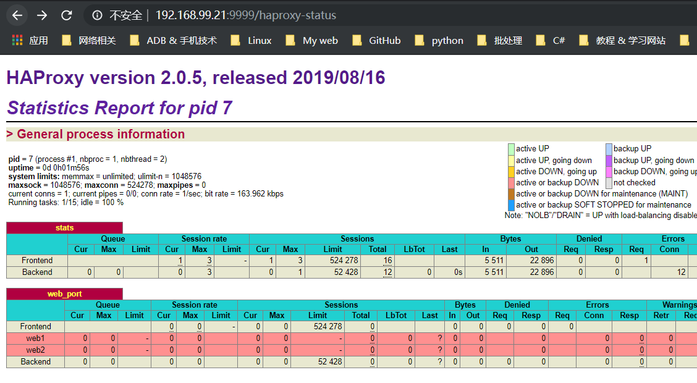

8. 访问tomcat业务app1
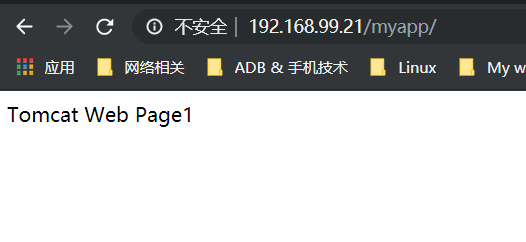

---
## 本地镜像上传至官方 docker 仓库：
> 将自制的镜像上传至 docker 仓库； https://hub.docker.com/

1. 准备账户：
登录到 docker hub 创建官网创建账户， 登录后点击 settings 完善账户信息,填写账户基本信息

2. 在虚拟机使用自己的账号登录
```bash
docker login docker.io
```


3. 查看认证信息：
#登录成功之后会在当前目录生成一个隐藏文件用于保存登录认证信息
```bash
# cat /root/.docker/config.json
{
      "auths": {
            "https://index.docker.io/v1/": {
            "auth": "emhhbmdzaGlqaWU6emhhbmdAMTIz"
      }
      },
            "HttpHeaders": {
            "User-Agent": "Docker-Client/18.09.9 (linux)"
      }
}
```

4. 查看镜像 ID
```bash
docker images
```

5. 给镜像做 tag 并开始上传
```bash
docker tag alpine:latest docker.io/jibill/alpine:latest
docker push docker.io/jibill/alpine:latest
```

6. 上传完成
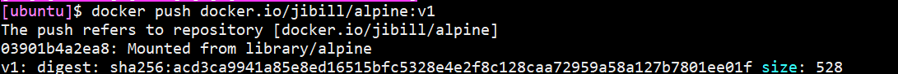

7. 到 docker 官网验证
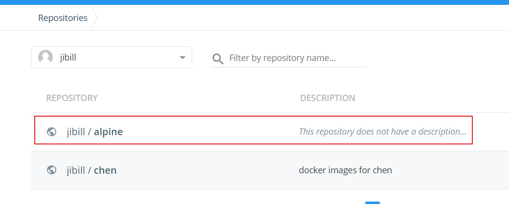

8. 更换到其他 docker 服务器下载镜像
```bash
# 登录 
docker login docker.io
# 下载 
docker pull jibill/alpine:v1
# 查看 
docker images
```

9. 从镜像启动一个容器
```bash
docker run -it docker.io/jibill/alpine:v1 bash
```


---
## 本地镜像上传到阿里云
将本地镜像上传至阿里云， 实现镜像备份与统一分发的功能。
https://cr.console.aliyun.com

将镜像推送到 Registry
```bash
docker login --username=rooroot@aliyun.com registry.cn-hangzhou.aliyuncs.com
docker tag [ImageId] registry.cn-hangzhou.aliyuncs.com/chen/nginx:[镜像版本号]
docker push registry.cn-hangzhou.aliyuncs.com/ chen /nginx:[镜像版本号]
```

---
# docker 仓库之分布式 Harbor
Harbor 是一个用于存储和分发 Docker 镜像的企业级 Registry 服务器,由vmware 开源，其通过添加一些企业必需的功能特性，例如安全、标识和管理等，扩展了开源 Docker Distribution。作为一个企业级私有 Registry 服务器，Harbor 提供了更好的性能和安全。提升用户使用 Registry 构建和运行环境传输镜像的效率。 Harbor 支持安装在多个 Registry 节点的镜像资源复制，镜像全部保存在私有 Registry 中， 确保数据和知识产权在公司内部网络中管控， 另外，Harbor 也提供了高级的安全特性，诸如用户管理，访问控制和活动审计等。

> 官网地址： https://vmware.github.io/harbor/cn/， 
> 官方 github 地址：https://github.com/vmware/harbor

## Harbor 功能官方介绍：
基于角色的访问控制：用户与 Docker 镜像仓库通过“项目”进行组织管理，一个用户可以对多个镜像仓库在同一命名空间（project）里有不同的权限。镜像复制：镜像可以在多个 Registry 实例中复制（同步）。尤其适合于负载均衡，高可用，混合云和多云的场景。图形化用户界面：用户可以通过浏览器来浏览，检索当前 Docker 镜像仓库，管理项目和命名空间。

AD/LDAP： Harbor 可以集成企业内部已有的 AD/LDAP，用于鉴权认证管理。

审计管理：所有针对镜像仓库的操作都可以被记录追溯，用于审计管理。国际化：已拥有英文、中文、德文、日文和俄文的本地化版本。更多的语言将会添加进来。RESTful API - RESTful API ：提供给管理员对于 Harbor 更多的操控, 使得与其它管理软件集成变得更容易。

部署简单：提供在线和离线两种安装工具， 也可以安装到 vSphere 平台(OVA 方式)虚拟设备。

## 安装 Harbor：
> 下载地址： 
https://github.com/goharbor/harbor/releases

> 安装文档：
https://github.com/vmware/harbor/blob/master/docs/installation_guide.md

本次使用 harbor 版本 1.2.2 离线安装包，具体名称为 `harbor-offline-installer-v1.7.5.tgz` 


### 下载 Harbor 安装包：
方式1：下载离线安装包：https://github.com/goharbor/harbor/releases
```bash
cd /usr/local/src/
wget https://storage.googleapis.com/harbor-releases/release-1.7.0/harbor-offline-installer-v1.7.5.tgz
```

方式2：下载在线安装包
```bash
cd /usr/local/src/
wget https://storage.googleapis.com/harbor-releases/release-1.7.0/harbor-online-installer-v1.7.5.tgz
```

## 配置安装 Harbor：
1. 解压
```bash
tar xf harbor-offline-installer-v1.7.5.tgz
ln -sv /usr/local/src/harbor /usr/local/
```

2. 下载docker-compose
```bash
cd /usr/local/harbor/
apt -y install python-pip 
pip  install docker-compose
```

3. 修改配置文件，最终配置如下
```bash
# vim harbor.cfg
...
hostname = 192.168.99.22
...
harbor_admin_password = root123
...
```
其它配置说明
```ini
# 写本机ip，不要写localhost或127.0.0.1
hostname = 192.168.99.22

# 访问UI和令牌/通知服务的协议
ui_url_protocol = http

# harbor DB的根用户的密码
db_password = root123

# 最大进程数
max_job_workers = 3

# 确定是否为注册表的令牌生成证书
customize_crt = on

# 证书路径
ssl_cert = /data/cert/server.crt
ssl_cert_key = /data/cert/server.key

# 密钥存储的路径
secretkey_path = /data

# Admiral的url，注释此属性，或在Harbor独立时将其值设置为NA
admiral_url = NA

# Clair的postgres数据库的密码
clair_db_password = root123

# 电子邮件服务器
email_identity = harbor
email_server = smtp.qq.com
email_server_port = 25
email_username = jibiao@foxmail.com
email_password = 123
email_from = admin <jibiao@foxmail.com>
email_ssl = false
email_insecure = false

# 启动后从UI更改管理密码。
harbor_admin_password = root123

# 如果希望根据LDAP服务器验证用户的凭证，请将其设置为ldap_auth。
auth_mode = db_auth
ldap_url = ldaps://ldap.mydomain.com
ldap_basedn = ou=people,dc=mydomain,dc=com
ldap_uid = uid
ldap_scope = 3
ldap_timeout = 5
# 打开或关闭自注册功能
self_registration = on

# 令牌服务创建的令牌的过期时间
token_expiration = 30

# 设置为“adminonly”，以便只有管理员用户才能创建项目
# 默认值“everyone”允许每个人创建一个项目
project_creation_restriction = everyone

# 
verify_remote_cert = on
```

4. 准备
```bash
./prepare
```

4. 安装
```bash
./install.sh
```
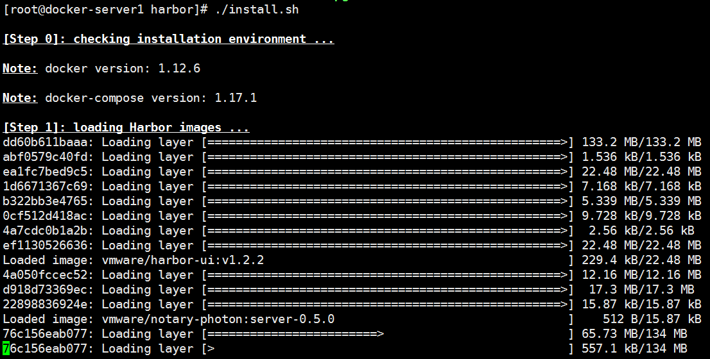

> 执行完毕后会在当前目录生成一个 docker-compose.yml 文件，用于配置数据目录等配置信息：
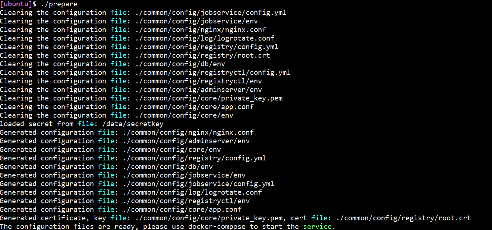

### 后期修改配置：
如果 harbor 运行一段时间之后需要更改配置，则步骤如下：
1. 停止 harbor：
```bash
cd /usr/local/harbor
docker-compose stop
```
2. 编辑 harbor.cfg 进行相关配置：
```bash
vim harbor.cfg
```
3. prepare
```bash
./prepare
```
3. 启动 harbor 服务：
```bash
docker-compose start
```
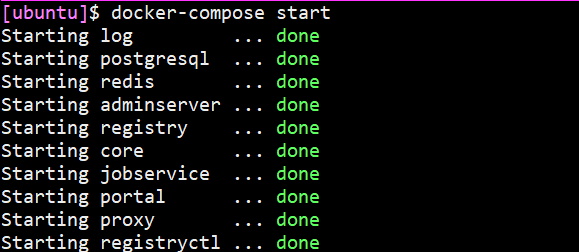

### 继续
1. 查看本地的镜像
```bash
docker images
```


2. 查看本地端口
```bash
ss -tnl
```
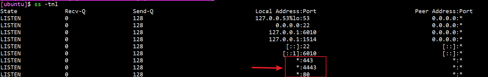

3. web 访问 Harbor 管理界面
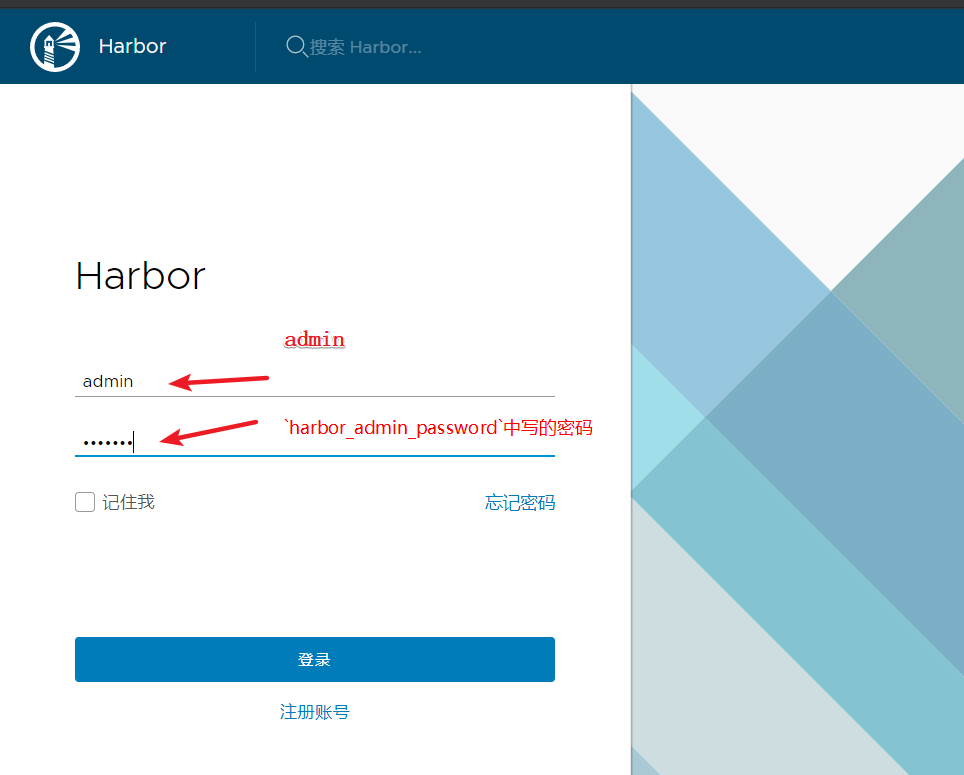

---
## 配置 docker 使用 harbor 仓库上传下载镜像：
1. 编辑 docker 配置文件：
注意：如果我们配置的是 https 的话，本地 docker 就不需要有任何操作就可以访问 harbor 了
```bash
vim /lib/systemd/system/docker.service
```
在`ExecStart`追加
```ini
ExecStart=/usr/bin/dockerd -H fd:// --containerd=/run/containerd/containerd.sock --insecure-registry 192.168.99.22
```
> 其中 192.168.99.22 是我们部署 Harbor 的地址，即 hostname 配置项值。配置完后需要重启 docker 服务。
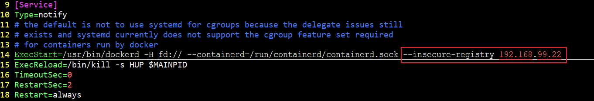

2. 重启 docker 服务：
```bash
systemctl daemon-reload
systemctl restart docker
```

3. 验证能否登录 harbor：
```bash
docker login 192.168.99.22
```
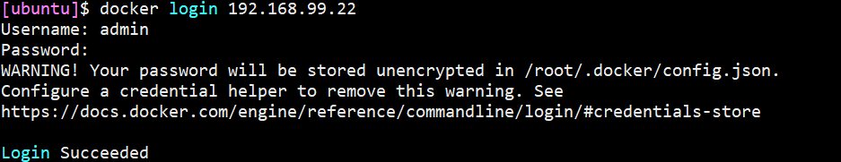

4. 导入镜像(可选)
```bash
docker load < /root/alpine.tar.gz
```

5. 验证镜像导入成功（至少要有个镜像，没有的话按照上面导入）
```bash
docker images
```

6. 镜像打 tag：
> 修改 images 的名称，不修改成指定格式无法将镜像上传到 harbor 仓库，格式为: HarborIP/项目名/image 名字:版本号：
```bash
docker tag alpine:latest 192.168.99.22/alpine/alpine:v1
```

7. 查看镜像
```bash
docker images
```
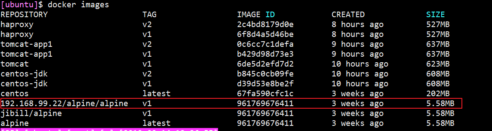

8. 在 harbor 管理界面创建项目(需要先创建项目再上传镜像)


9. 将镜像 push 到 harbor：
> 格式为： docker push 镜像名:版本

```bash
docker push 192.168.99.22/alpine/alpine:v1
```

9. push 完成
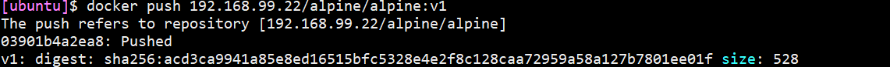

10. harbor 界面验证镜像上传成功
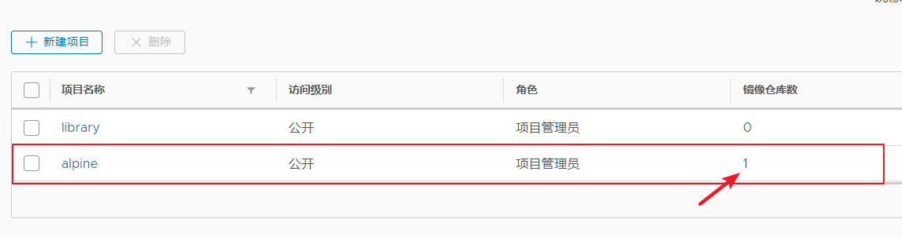

11. 验证镜像信息
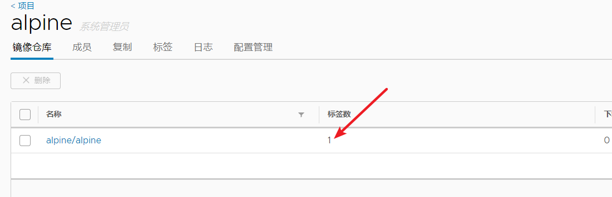
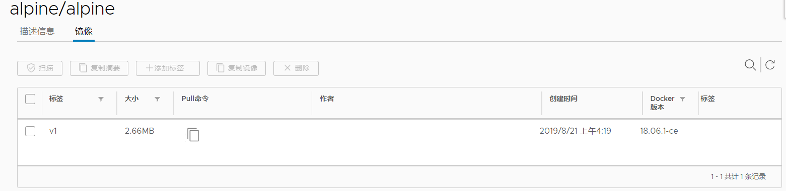

### 从 harbor 下载镜像并启动容器：
1. 更改 docker 配置文件：
目前凡是需要从 harbor 镜像服务器下载 image 的 docker 服务都要更改，不更改的话无法下载：
```bash
sudo vim /lib/systemd/system/docker.service
```
在`ExecStart`追加
```ini
ExecStart=/usr/bin/dockerd -H fd:// --containerd=/run/containerd/containerd.sock --insecure-registry 192.168.99.22
```
> 其中 192.168.99.22 是我们部署 Harbor 的地址，即 hostname 配置项值。配置完后需要重启 docker 服务。


2. 重启 docker：
```bash
systemctl daemon-reload
systemctl restart docker
```

3. 查看下载命令：
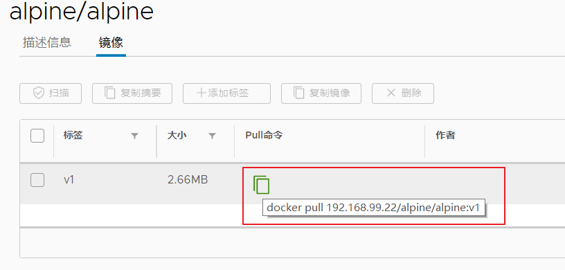

4. 执行下载：
```bash
docker pull 192.168.99.22/alpine/alpine:v1
```
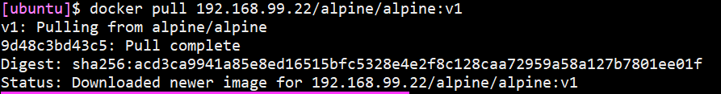

5. 验证镜像下载完成
```bash
docker images
```
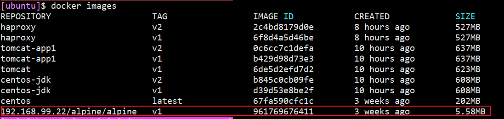

6. 启动容器：
```bash
docker run -it 192.168.99.22/alpine/alpine:v1 sh
```

7. 成功启动
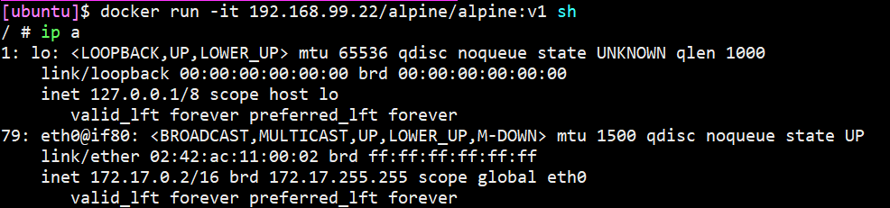

---
## 实现 harbor 高可用：
Harbor 支持基于策略的 Docker 镜像复制功能， 这类似于 MySQL 的主从同步， 其可以实现不同的数据中心、 不同的运行环境之间同步镜像， 并提供友好的管理界面，大大简化了实际运维中的镜像管理工作，已经有用很多互联网公司使用harbor 搭建内网 docker 仓库的案例，并且还有实现了双向复制的案列，本文将实现单向复制的部署：
1. 新部署一台 harbor 服务器192.168.99.23
**过程见前一节**

2. 验证从 harbor 登录
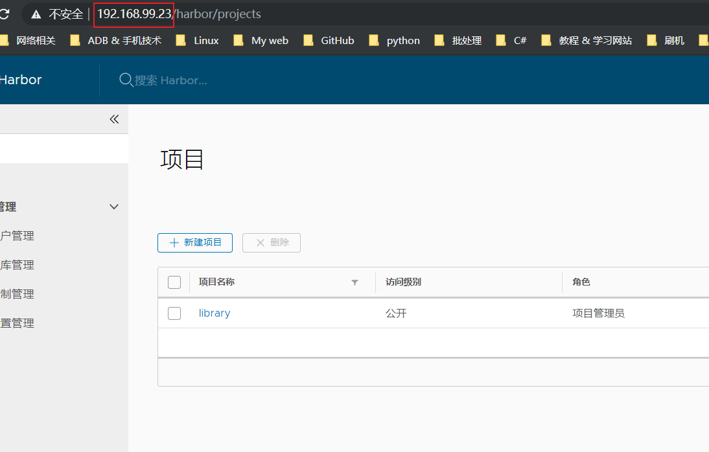

> * <b><font color=red> 主 harbor :192.168.99.22 </font></b>

复制的原理是从源harbor上推到目标harbor，所以下面的配置是要在之前创建的harbor上配置。
主harbor：192.168.99.22
从harbor：192.168.99.23

1. <b><font color=blue>主</font></b> harbor:创建目标
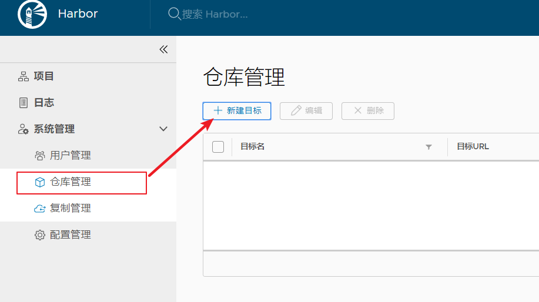

4. <b><font color=blue>主</font></b> harbor:测试连接成功后，确定
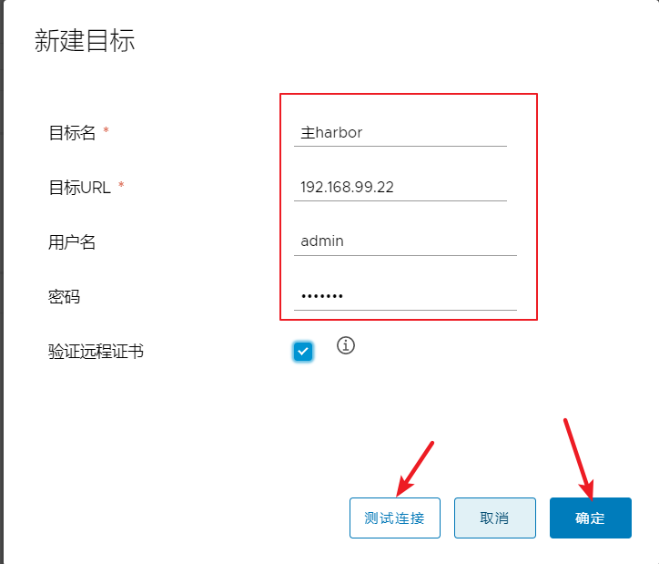

---
5. <b><font color=red>从</font></b> harbor:创建一个 alpine 项目：
与主 harbor 项目名称保持一致：
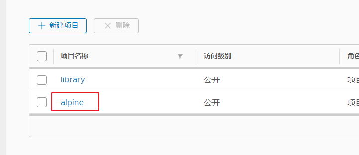

6. <b><font color=blue>主</font></b> harbor:配置复制
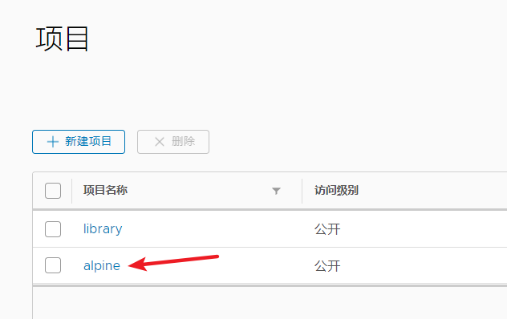

7. <b><font color=blue>主</font></b> harbor:点击复制,新建规则：
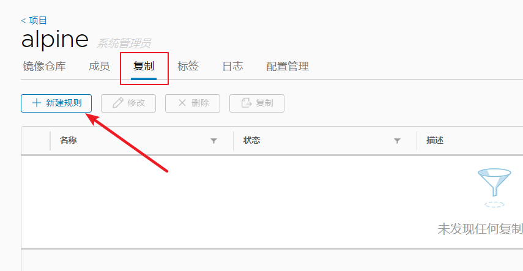

8. <b><font color=blue>主</font></b> harbor:编辑同步策略
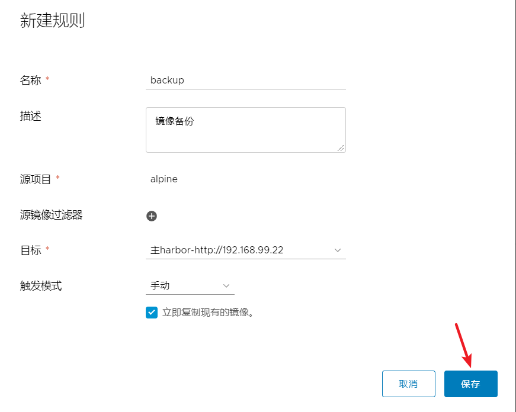

9. <b><font color=blue>主</font></b> harbor:查看镜像同步状态
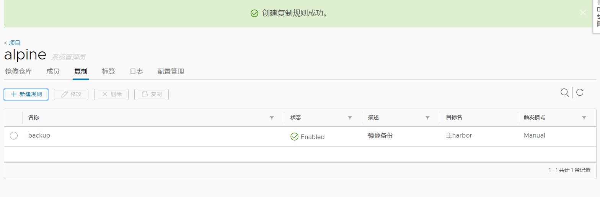

9. <b><font color=red>从</font></b> harbor:查看镜像是否同步成功


---
### 测试从 harbor 镜像下载和容器启动：
1. 编辑 docker 配置文件：
```bash
vim /lib/systemd/system/docker.service
```
在`ExecStart`追加
```ini
ExecStart=/usr/bin/dockerd -H fd:// --containerd=/run/containerd/containerd.sock --insecure-registry 192.168.99.22 --insecure-registry 192.168.99.23
```
> 其中 192.168.99.22/23 是我们部署 Harbor 的地址，即 hostname 配置项值。配置完后需要重启 docker 服务。
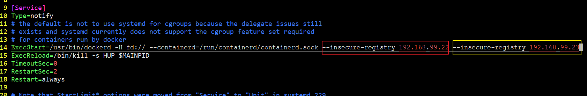

2. 重启 docker 服务：
```bash
systemctl daemon-reload
systemctl restart docker
```

3. 从 harbor 项目设置为公开：


4. docker 客户端下载镜像
```bash
docker pull 192.168.99.23/alpine/alpine:v1
```
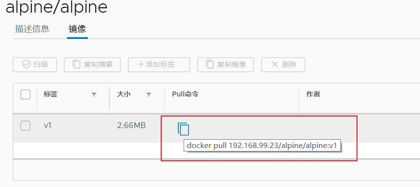

5. 查看镜像
```bash
docker images
```
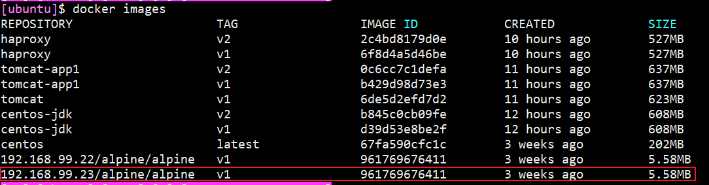

6. docker 客户端从镜像启动容器：
```bash
docker run -it 192.168.99.23/alpine/alpine:v1 sh
```
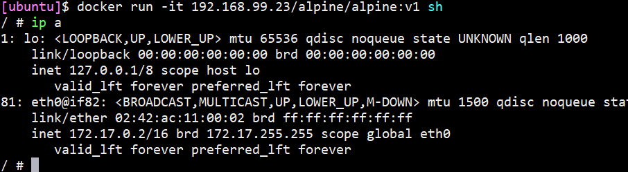


> 至此，高可用模式的 harbor 仓库部署完毕

### docker 镜像端测试：
1. 下载 centos 基础镜像：
```bash
docker pull 192.168.10.205/nginx/centos_base
```

2. 查看镜像
```bash
docker images
```

3. 从镜像启动容器：
```bash
docker run -it --name centos_base 192.168.10.205/nginx/centos_base bash
```

## harbor https 配置：
1. 生成密钥
```bash
openssl genrsa -out /usr/local/src/harbor/certs/harbor-ca.key 2048
openssl req -x509 -new -nodes \
      -key /usr/local/src/harbor/certs/harbor-ca.key \
      -subj "/CN=harbor.chen.net" -days 7120 \
      -out /usr/local/src/harbor/certs/harborca.crt
```

2. 编辑配置文件
```bash
vim harbor.cfg
```
```ini
hostname = harbor.chen.net
ui_url_protocol = https
ssl_cert = /usr/local/src/harbor/certs/harbor-ca.crt
ssl_cert_key = /usr/local/src/harbor/certs/harbor-ca.key
harbor_admin_password = 123456
```

3. 安装
```bash
./install.sh
yum install docker-ce-18.06.3.ce-3.el7.x86_64.rpm
yum install docker-compose
mkdir /etc/docker/certs.d/harbor.chen.net -p
cp certs/harbor-ca.crt /etc/docker/certs.d/harbor.chen.net/
docker login harbor.chen.net
```

4. 登录测试

---
# Docker 数据管理
如果运行中的容器修如果生成了新的数据或者修改了现有的一个已经存在的文件内容，那么新产生的数据将会被复制到读写层进行持久化保存，这个读写层也就是容器的工作目录，此即“写时复制(COW) copy on write”机制
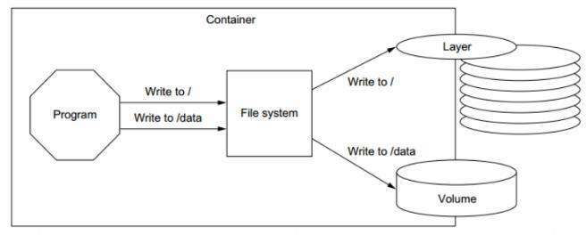

## 数据类型：
Docker 的镜像是分层设计的，底层是只读的，通过镜像启动的容器添加了一层可读写的文件系统，用户写入的数据都保存在这一层当中，如果要将写入的数据永久生效，需要将其提交为一个镜像然后通过这个镜像在启动实例，然后就会给这个启动的实例添加一层可读写的文件系统，目前 Docker 的数据类型分为两种， 一是数据卷， 二是数据容器，数据卷类似于挂载的一块磁盘，数据容器是将数据保存在一个容器上


1. 查看指定 PID 的容器信息
```bash
docker inspect f55c55544e05 
```
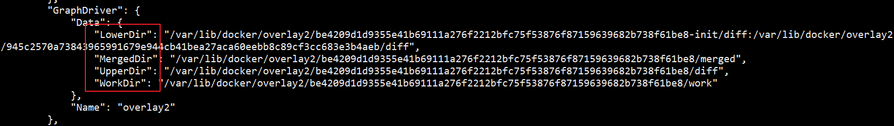
> LowerDir： image 镜像层(镜像本身，只读)
UpperDir：容器的上层(读写)
MergedDir：容器的文件系统，使用 Union FS（联合文件系统）将 lowerdir 和
WorkDir：容器在 宿主机的工作目录

## 什么是数据卷(data volume)：
数据卷实际上就是宿主机上的目录或者是文件，可以被直接 mount 到容器当中使用。

实际生成环境中，需要针对不同类型的服务、 不同类型的数据存储要求做相应的规划， 最终保证服务的可扩展性、 稳定性以及数据的安全性。

如下图：
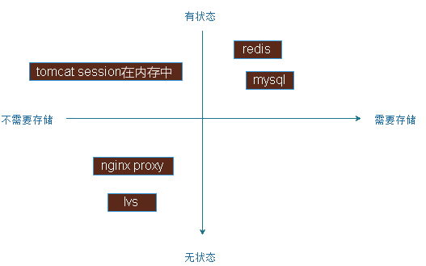

左侧是无状态的 http 请求服务， 右侧为有状态。
下层为不需要存储的服务，上层为需要存储的部分服务

### 创建 APP 目录并生成 web 页面：
此 app 以数据卷的方式，提供给容器使用， 比如容器可以直接宿主机本地的 web_app，而需要将代码提前添加到容器中，此方式适用于小型 web 站点。
```bash
mkdir /data/testapp –p
echo "testapp page" > /data/testapp/index.html
```

### 启动容器并验证数据：
启动两个容器， web1 容器和 web2 容器， 分别测试能否在宿主机访问到宿主机的数据。
注意使用 `-v` 参数， 将宿主机目录映射到容器内部， web2 的 ro 标示在容器内对该目录只读，默认是可读写的：
```bash
docker run -d --name web1 \
      -v /data/app/:/usr/share/nginx/html \
      -p 81:80 nginx
```
```bash
docker run -d --name web2 \
      -v /data/app/:/usr/share/nginx/html:ro \
      -p 82:80 nginx
```

### 在宿主机或容器修改数据

1. 给目录下添加index文件
```bash
mkdir /data/app
echo "test nginx 111" > /data/app/index.html
```

2. web 界面访问
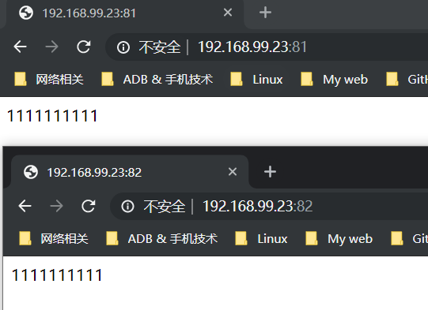

3. 删除容器
删除容器的时候指定参数-v， 可以删除/var/lib/docker/containers/的容器数据目录，但是不会删除数据卷的内容
```bash
docker rm -fv 28b93efa0881
```

### 数据卷的特点及使用：
1、数据卷是宿主机的目录或者文件，并且可以在多个容器之间共同使用。
2、 在宿主机对数据卷更改数据后会在所有容器里面会立即更新。
3、数据卷的数据可以持久保存，即使删除使用使用该容器卷的容器也不影响。
4、 在容器里面的写入数据不会影响到镜像本身。

**文件挂载：**
文件挂载用于很少更改文件内容的场景， 比如 nginx 的配置文件、 tomcat 的配置文件等。

### 创建容器并挂载配置文件：
1. 自定义 web 页面：
```bash
mkdir /data/nginx
echo "zi ding yi page" > /data/nginx/index.html
```

2. 创建容器
```bash
docker run -it -d --name web3 -p 83:80 \
      -v /data/nginx/index.html:/usr/share/nginx/html/index.html \
      nginx
```

3. 验证参数生效


### 如何一次挂载多个目录
1. 多个目录可以位于不同的目录下
```bash
mkdir /data/chen
echo "chen" > /data/chen/index.html
```

2. 启动容器
```bash
docker run -ti -d --name web1 -p 81:80 \
      -v /data/app/nginx.conf:/etc/nginx/nginx.conf:ro \
      -v /data/nginx/:/usr/share/nginx/html \
      nginx
```

3. 验证 web 访问
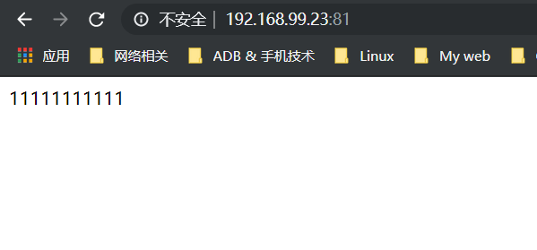

**数据卷使用场景：**
1、 日志输出
2、 静态 web 页面
3、 应用配置文件
4、 多容器间目录或文件共享

## 数据卷容器：
数据卷容器功能是可以让数据在多个 docker 容器之间共享，即可以让 B 容器访问 A 容器的内容，而容器 C 也可以访问 A 容器的内容， 即先要创建一个后台运行的容器作为 Server，用于卷提供， 这个卷可以为其他容器提供数据存储服务，其他使用此卷的容器作为 client 端：

### 启动一个卷容器 Server：
先启动一个容器， 并挂载宿主机的数据目录：
将宿主机的 catalina.sh 启动脚本和 chen 的 web 页面，分别挂载到卷容器 server端，然后通过 server 端共享给 client 端使用。

```bash
docker run -d --name volume-server \
      -v /data/app/nginx.conf:/etc/nginx/nginx.conf:ro \
      -v /data/nginx:/usr/share/nginx/html \
      nginx
```

2. 启动两个端容器 Client
```bash
docker run -d --name web1 -p 81:80 \
      --volumes-from volume-server nginx

docker run -d --name web2 -p 82:80 \
      --volumes-from volume-server nginx
```

2. 其实实质就是把挂载在其它容器的卷，再挂到其它容器上
```bash
docker run -d --name web3 -p 83:80 \
      --volumes-from web2 ngin
```
3. 测试访问 web 页面
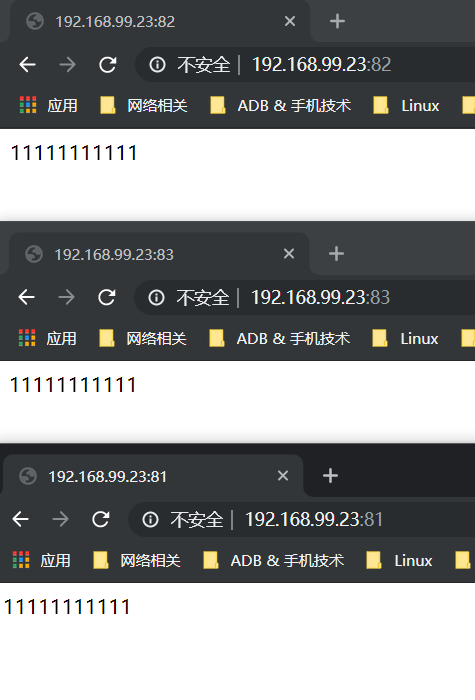

4. 进入其它一个容器，修改页面
```bash
docker exec -it 85466a0c2fda bash
```
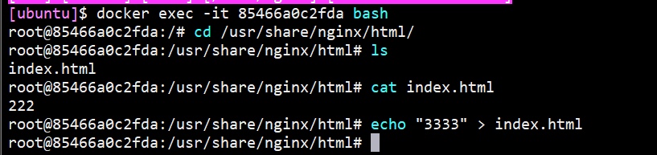

5. 验证宿主机数据
```bash
#  cat /data/nginx/index.html
3333
```

6. 关闭卷容器 Server 测试能否启动新容器：
```bash
docker stop volume-server
```
```bash
docker run -d --name web6 -p 86:80 \
      --volumes-from volume-server nginx
```
停止了卷服务的容器，还可以从这个卷服务容器启动新的容器
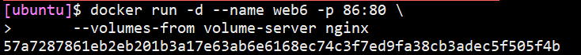

7. 测试删除源卷容器 Server 创建容器
```bash
docker rm -fv volume-server
```
```bash
docker run -d --name web7 -p 87:80 \
      --volumes-from volume-server nginx
```
**这里就不行了**
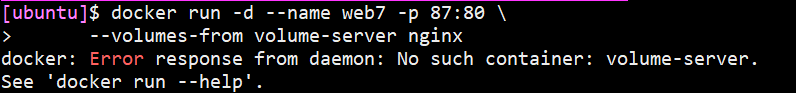

8. 测试之前的容器是否正常——已经运行的容器不受任何影响
<font color=red>之前已启动的容器不受影响</font>

### 重新创建容器卷 Server
```bash
docker run -d --name volume-server \
      -v /data/app/nginx.conf:/etc/nginx/nginx.conf:ro \
      -v /data/nginx:/usr/share/nginx/html \
      nginx
```
创建出 volume server 之后， 就可以创建基于 volume server 的新容器。
```bash
docker run -d --name web8 -p 88:80 \
      --volumes-from volume-server nginx
```

在当前环境下， 即使把提供卷的容器 Server 删除， 已经运行的容器 Client 依然可以使用挂载的卷， 因为容器是通过挂载访问数据的， 但是无法创建新的卷容器客户端， 但是再把卷容器 Server 创建后即可正常创建卷容器 Client，此方式可以用于线上共享数据目录等环境， 因为即使数据卷容器被删除了，其他已经运行的容器依然可以挂载使用

数据卷容器可以作为共享的方式为其他容器提供文件共享，类似于 NFS 共享，可以在生产中启动一个实例挂载本地的目录，然后其他的容器分别挂载此容器的目录，即可保证各容器之间的数据一致性。

---
# docker网络：
主要介绍 docker 网络相关知识。
Docker 服务安装完成之后，默认在每个宿主机会生成一个名称为 docker0 的网卡
其 IP 地址都是 172.17.0.1/16，并且会生成三种不能类型的网络，如下图： 
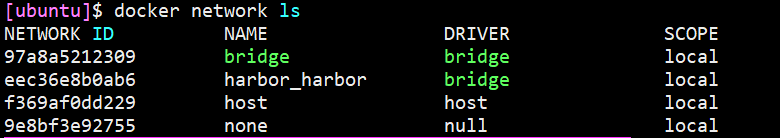

## docker 结合负载实现网站高可用：
整体规划图：
下图为一个小型的网络架构图，其中 nginx 使用 docker 运行
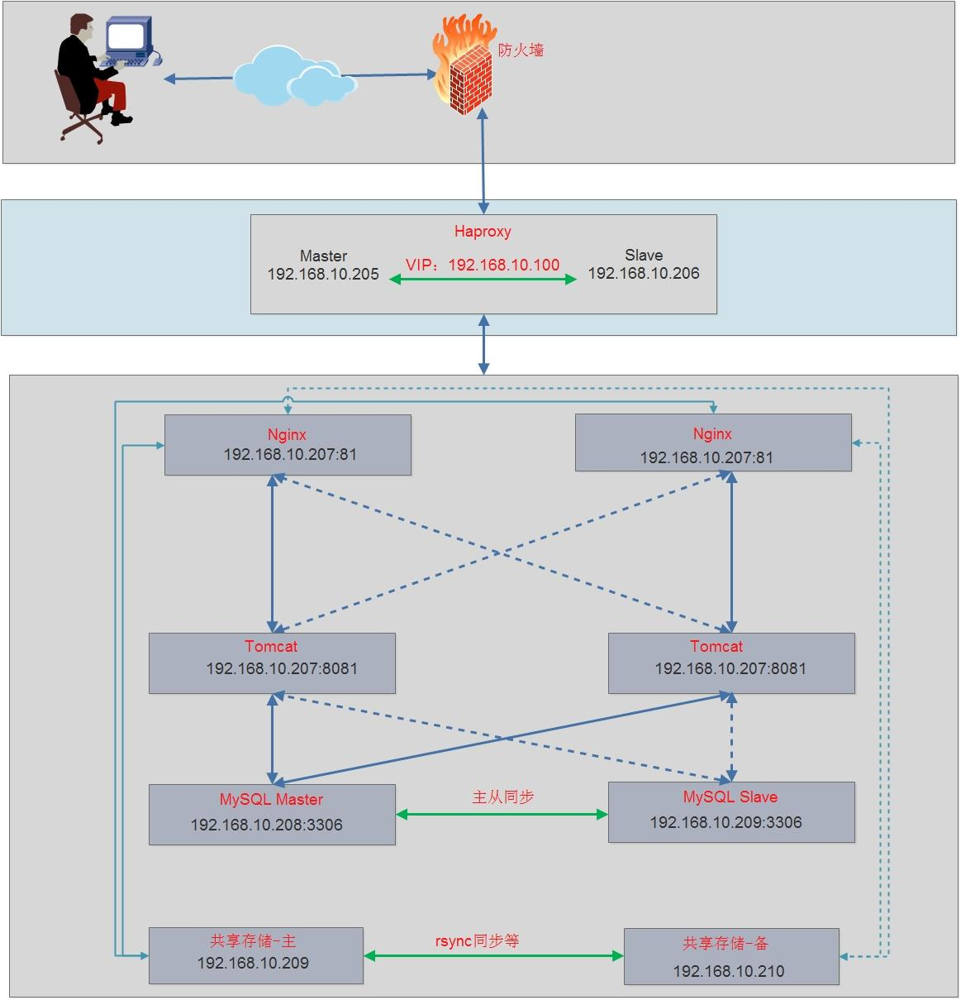

服务器名 | 系统 | ip
- | - 
server1 |centos 7.6 | 192.168.99.101
server2 | centos 7.6 | 192.168.99.102
docker1 | ubuntu 18.04 | 192.168.99.22
docker2 | ubuntu 18.04 | 192.168.99.23

### 1. 安装并配置 keepalived

1. Server1 安装
```bash
yum install keepalived haproxy -y
```
配置
```bash
vim /etc/keepalived/keepalived.conf
```
```ini
...
! Configuration File for keepalived

global_defs {
   notification_email {
           root@localhost
   }
   notification_email_from root@localhost
   smtp_server localhost
   smtp_connect_timeout 30
   router_id LVS_DEVEL1
   vrrp_skip_check_adv_addr
#vrrp_strict
   vrrp_iptables
   vrrp_garp_interval 0
   vrrp_gna_interval 0
}
vrrp_instance MAKE_VIP_INT {
      state MASTER
      interface eth0
      virtual_router_id 1
      priority 100
      authentication {
            auth_type PASS
            auth_pass 1111
      }
      virtual_ipaddress {
            192.168.99.10 dev eth0 label eth0:1
      }
}

```
启动
```bash
systemctl restart keepalived 
systemctl enable keepalived
```

2. Server2 安装
```bash
yum install keepalived haproxy –y
```
配置
```bash
vim /etc/keepalived/keepalived.conf
```
```ini
! Configuration File for keepalived

global_defs {
   notification_email {
           root@localhost
   }
   notification_email_from root@localhost
   smtp_server localhost
   smtp_connect_timeout 30
   router_id LVS_DEVEL2
   vrrp_skip_check_adv_addr
#vrrp_strict
   vrrp_iptables
   vrrp_garp_interval 0
   vrrp_gna_interval 0
}
vrrp_instance MAKE_VIP_INT {
      state BACKUP
      interface eth0
      virtual_router_id 1
      priority 50
      authentication {
            auth_type PASS
            auth_pass 1111
      }
      virtual_ipaddress {
            192.168.99.10 dev eth0 label eth0:1
      }
}

```
启动
```bash
systemctl restart keepalived 
systemctl enable keepalived
```

### 2. 安装并配置 haproxy
1. 各服务器配置内核参数
```bash
echo "net.ipv4.ip_nonlocal_bind=1" >> /etc/sysctl.conf
sysctl -p 
```

2. Server1 配置 haproxy
```bash
vim /etc/haproxy/haproxy.cfg
```
```bash
global
      maxconn 100000
      uid 99
      gid 99
      daemon
      nbproc 1
      log 127.0.0.1 local0 info
defaults
      option http-keep-alive
      #option forwardfor
      maxconn 100000
      mode tcp
      timeout connect 500000ms
      timeout client 500000ms
      timeout server 500000ms

listen stats
      mode http
      bind 0.0.0.0:9999
      stats enable
      log global
      stats uri /haproxy-status
      stats auth haadmin:q1w2e3r4ys
#================================================================
frontend docker_nginx_web
      bind 0.0.0.0:80
      mode http
      default_backend docker_nginx_hosts

backend docker_nginx_hosts
      mode http
      balance roundrobin
      server 192.168.99.22 192.168.99.22:81 check inter 2000 fall 3 rise 5
      server 192.168.99.23 192.168.99.23:81 check inter 2000 fall 3 rise 5
```
启动 haproxy
```bash
systemctl enable haproxy
systemctl restart haproxy
```

3. Server2 配置 haproxy
```bash
vim /etc/haproxy/haproxy.cfg
```
```bash
global
      maxconn 100000
      uid 99
      gid 99
      daemon
      nbproc 1
      log 127.0.0.1 local0 info
defaults
      option http-keep-alive
      #option forwardfor
      maxconn 100000
      mode tcp
      timeout connect 500000ms
      timeout client 500000ms
      timeout server 500000ms

listen stats
      mode http
      bind 0.0.0.0:9999
      stats enable
      log global
      stats uri /haproxy-status
      stats auth haadmin:q1w2e3r4ys
#================================================================
frontend docker_nginx_web
      bind 0.0.0.0:80
      mode http
      default_backend docker_nginx_hosts

backend docker_nginx_hosts
      mode http
      balance roundrobin
      server 192.168.99.22 192.168.99.22:81 check inter 2000 fall 3 rise 5
      server 192.168.99.23 192.168.99.23:81 check inter 2000 fall 3 rise 5
```
启动 haproxy
```bash
systemctl enable haproxy
systemctl restart haproxy
```

### 3. docker服务器启动 nginx 容器并验证

1. dcoekr1 启动 Nginx 容器
docker1:192.168.99.22
```bash
# 先下载nginx镜像
docker pull nginx
docker run --name nginx-web1 -d -p 81:80 nginx
```
验证 web 访问


2. docker2 启动 nginx 容器
docker2:192.168.99.23
```bash
# 先下载nginx镜像
docker pull nginx
docker run --name nginx-web1 -d -p 81:80 nginx
```
验证 web 访问
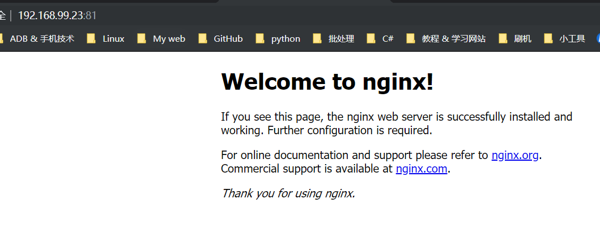

3. 访问 VIP
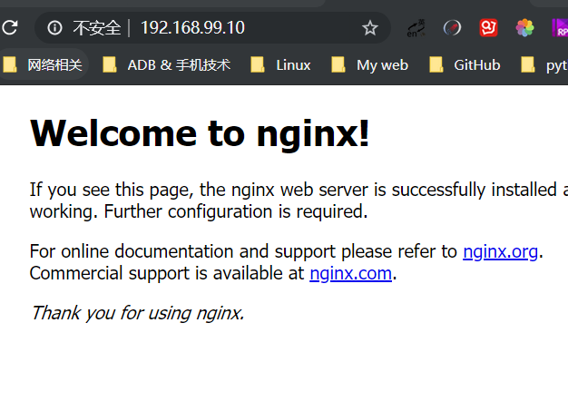

4. Server1 haproxy 状态页面：192.168.99.101:9999/haproxy-status
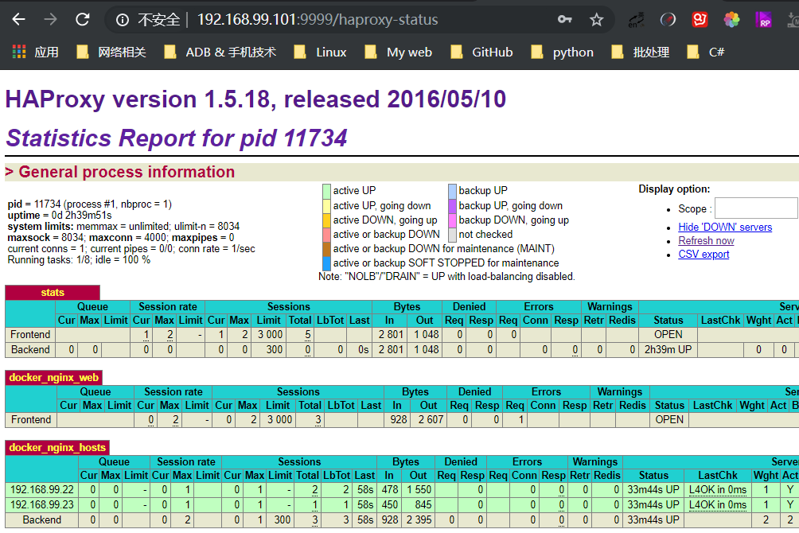

5. Server2 haproxy 状态页面：192.168.99.102:9999/haproxy-status
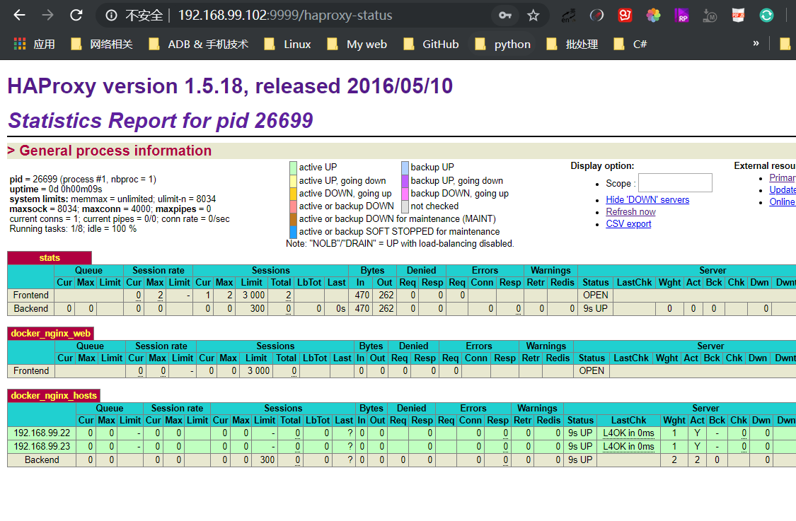


## 容器之间的互联
### 通过容器名称互联：
即在同一个宿主机上的容器之间可以通过自定义的容器名称相互访问，比如一个业务前端静态页面是使用 nginx，动态页面使用的是 tomcat， 由于容器在启动的时候其内部 IP 地址是 DHCP 随机分配的，所以如果通过内部访问的话，自定义名称是相对比较固定的，因此比较适用于此场景。

1. 先创建第一个容器，后续会使用到这个容器的名称：
```bash
docker run -it -d --name app1 -p 88:80 nginx
```

2. 查看当前 hosts 文件内容
```bash
docker exec -it app1 bash
```
```bash
root@be6f8876b2ae:/# cat /etc/hosts
127.0.0.1       localhost
::1     localhost ip6-localhost ip6-loopback
fe00::0 ip6-localnet
ff00::0 ip6-mcastprefix
ff02::1 ip6-allnodes
ff02::2 ip6-allrouters
172.17.0.3      be6f8876b2ae
```

3. 创建第二个容器
```bash
docker run -it -d -p 89:80 --name app2 --link app1 nginx
```

4. 查看第二个容器的 hosts 文件内容
```bash
docker exec -it app2 bash
```
```bash
root@150ce96afe52:/# cat /etc/hosts
127.0.0.1       localhost
::1     localhost ip6-localhost ip6-loopback
fe00::0 ip6-localnet
ff00::0 ip6-mcastprefix
ff02::1 ip6-allnodes
ff02::2 ip6-allrouters
172.17.0.3      app1 be6f8876b2ae  #连接的对方容器的 ID 和容器名称
172.17.0.4      150ce96afe52
```

5. 检测通信
```bash
ping app1
```
可能需要先安装ping工具
```bash
apt install iputils-ping
```
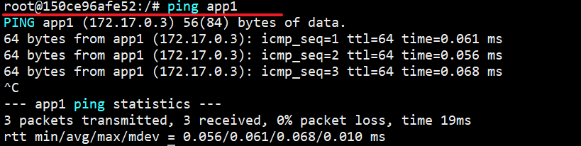

### 通过自定义容器别名互联：
上一步骤中，自定义的容器名称可能后期会发生变化， 那么一旦名称发生变化，程序之间也要随之发生变化，比如程序通过容器名称进行服务调用， 但是容器名称发生变化之后再使用之前的名称肯定是无法成功调用， 每次都进行更改的话又比较麻烦， 因此可以使用自定义别名的方式解决，即容器名称可以随意更，只要不更改别名即可，具体如下：
**命令格式：**
```bash
docker run -d --name 新容器名称 \
      --link 目标容器名称:自定义的名称 \
      -p 本地端口:容器端口 镜像名称 shell命令
```

1. 启动第三个容器
```bash
docker run -it -d -p 90:80 --name app3 --link app1:web1 nginx
```

2. 查看当前容器的 hosts 文件
```bash
docker exec -it app3 bash
```
```bash
root@c28c27a48883:/# cat /etc/hosts
127.0.0.1       localhost
::1     localhost ip6-localhost ip6-loopback
fe00::0 ip6-localnet
ff00::0 ip6-mcastprefix
ff02::1 ip6-allnodes
ff02::2 ip6-allrouters
172.17.0.3      web1 be6f8876b2ae app1   #多了一个别名
172.17.0.5      c28c27a48883
```

3. 检查自定义别名通信
```bash
ping web1
```

4. docker 网络类型：
Docker 的网络使用 docker network ls 命令看到有三种类型，下面将介绍每一种类型的具体工作方式：
使用参数 `–net=网络类型` 指定， 不指定默认就是 bridge 模式。

查看当前 docke 的网卡信息：
```bash
docker network list
```
> Bridge： 桥接，使用自定义 IP
> Host：  不获取 IP 直接使用物理机 IP， 并监听物理机 IP 监听端口
> None：  没有网络

**(1)、Host 模式**: 使用参数 –net=host 指定。
启动的容器如果指定了使用 host 模式，那么新创建的容器不会创建自己的虚拟网卡，而是直接使用宿主机的网卡和 IP 地址， 因此在容器里面查看到的 IP 信息就是宿主机的信息，访问容器的时候直接使用宿主机 IP+容器端口即可，不过容器的其他资源们必须文件系统、 系统进程等还是和宿主机保持隔离。此模式的网络性能最高，但是各容器之间端口不能相同， 适用于运行容器端口比较固定的业务。

0. 为避免端口冲突， 先删除所有的容器：
```bash
docker rm -f `docker ps -a -q` 
```
1. 启动一个新容器，并指定网络模式为 host
```bash
docker run -d --name app1 --net=host nginx
```
2. 访问宿主机验证
因为是host模式，所以直接访问宿主机的IP:192.168.99.23
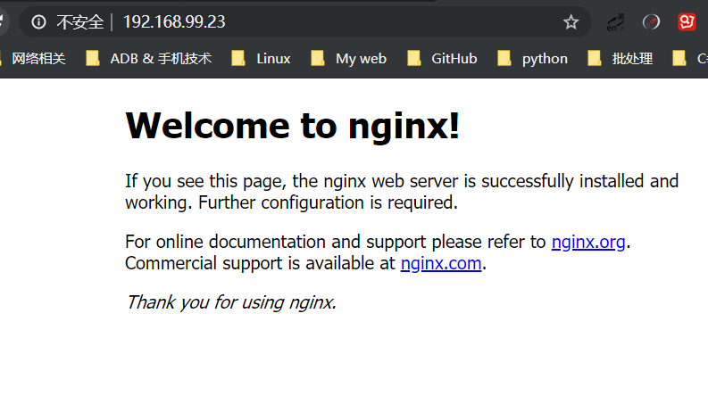

Host 模式不支持端口映射， 当指定端口映射的时候会提示如下警告信息：
使用主机网络模式时，将丢弃已指定的端口
```bash
docker run -d --name app2 -p 81:80 --net=host nginx
```


**(2)、None 模式**：使用参数 –net=none 指定
在使用 none 模式后， Docker 容器不会进行任何网络配置，其没有网卡、没有 IP也没有路由，因此默认无法与外界通信， 需要手动添加网卡配置 IP 等，所以极少使用

命令使用方式：
```bash
docker run -it -d --name net_none -p 80:80 --net=none nginx
```

**(3)、Container 模式**：使用参数 –net=container:名称 或 ID。
使用此模式创建的容器需指定和一个已经存在的容器共享一个网络，而不是和宿主机共享网，新创建的容器不会创建自己的网卡也不会配置自己的 IP，而是和一个已经存在的被指定的容器东西 IP 和端口范围，因此这个容器的端口不能和被指定的端口冲突， 除了网络之外的文件系统、进程信息等仍然保持相互隔离，两个容器的进程可以通过 lo 网卡及容器 IP 进行通信。

1. 先起一个容器
```bash
docker run -it -d --name app1 -p 80:8080 nginx
```
2. 另一个容器直接使用对方的网络
```bash
docker run -it -d --name app2 --net=container:app1 tomcat
```
3. nginx的默认端口为80，而8080是tomcat的默认端口，所以，如果我们直接访问宿主机192.168.99.23:80，应该是访问到tomcat才对。如果图
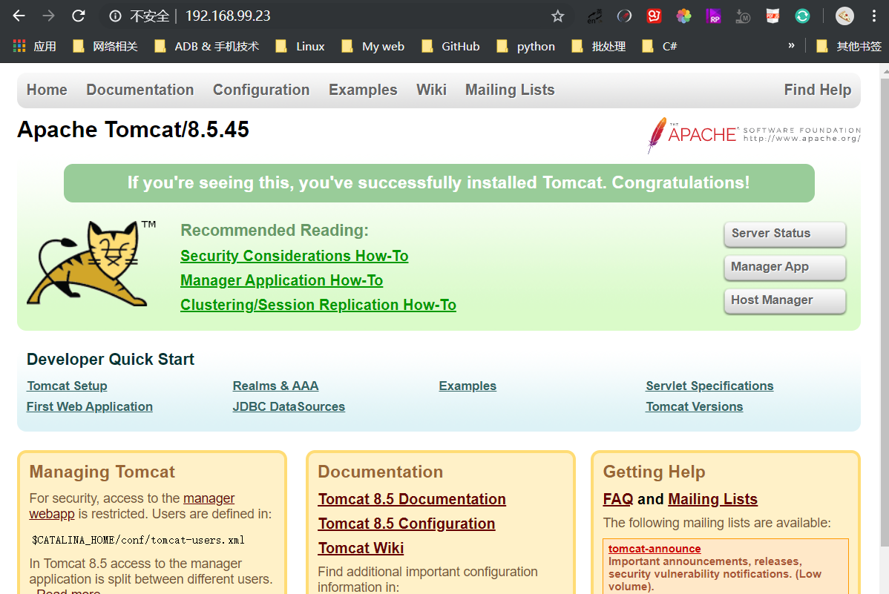

**(4)、bridge 模式：**
docker 的默认模式即不指定任何模式就是 bridge 模式， 也是使用比较多的模式，此模式创建的容器会为每一个容器分配自己的网络 IP 等信息，并将容器连接到一个虚拟网桥与外界通信


查看bridge模式的信息
```bash
docker network inspect bridge
```


### docker 跨主机互联之简单实现：
夸主机互联是说 A 宿主机的容器可以访问 B 主机上的容器，但是前提是保证各宿主机之间的网络是可以相互通信的， 然后各容器才可以通过宿主机访问到对方的容器， 实现原理是在宿主机做一个网络路由就可以实现 A 宿主机的容器访问 B主机的容器的目的， 复杂的网络或者大型的网络可以使用 google 开源的 k8s 进行互联。

**修改各宿主机网段：**
Docker 的默认网段是 172.17.0.x/24,而且每个宿主机都是一样的，因此要做路由的前提就是各个主机的网络不能一致，具体如下：

服务器A：192.168.99.22
服务器B：192.168.99.23

1. <font color=red>服务器 A </font>更改网段
```bash
vim /lib/systemd/system/docker.service
```
在`ExecStart`结尾追加`--bip=10.10.0.1/24`，ip是你想设置的网络的网关ip
```ini
ExecStart=/usr/bin/dockerd -H fd:// --containerd=/run/containerd/containerd.sock --bip=10.10.0.1/24
```

2. 重启 docker 服务
```bash
systemctl daemon-reload
systemctl restart docker
```

3. 验证 A 服务器网卡
```bash
ifconfig docker0
```
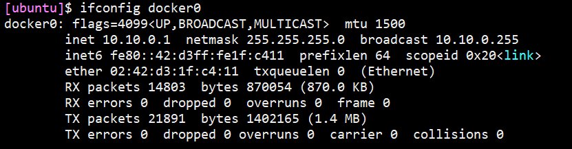

如果你的系统是Centos，需要打开ipforward
```bash
echo "net.ipv4.ip_forward = 1" >> /etc/sysctl.conf
sysctl -p 
```

4. 启动一个容器
```bash
docker run -it -p 81:80 nginx bash
```
```bash
[root@781e7f053c20 /]# ifconfig eth0
```
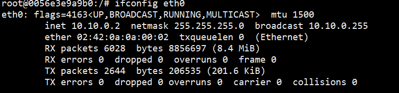

5. 添加静态路由（宿主机上）
```bash
route add -net 10.20.0.0/24 gw 192.168.99.23
iptables -A FORWARD -s 192.168.99.0/24 -j ACCEPT
```

1. <font color=red>服务器 B </font>更改网段
```bash
vim /lib/systemd/system/docker.service
```
在`ExecStart`结尾追加`--bip=10.20.0.1/24`，注意不能跟服务器A一样
```ini
ExecStart=/usr/bin/dockerd -H fd:// --containerd=/run/containerd/containerd.sock --bip=10.20.0.1/24
```

2. 重启 docker 服务
```bash
systemctl daemon-reload
systemctl restart docker
```

3. 验证网卡
```bash
ifconfig docker0
```
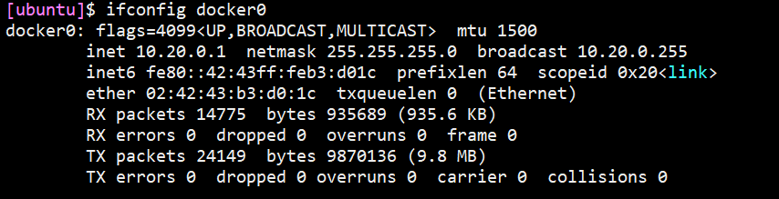

4. 如果你的系统是Centos，需要打开ipforward
```bash
echo "net.ipv4.ip_forward = 1" >> /etc/sysctl.conf
sysctl -p 
```

5. 启动一个容器
```bash
docker run -it -p 82:80 nginx bash
[root@781e7f053c20 /]# ifconfig eth0
```

6. 添加静态路由
```bash
route add -net 10.10.0.0/24 gw 192.168.99.22
iptables -A FORWARD -s 192.168.99.0/24 -j ACCEPT
```


**测试容器间互联**
两服务器分别起动两个容器进行测试：10.10.0.0网段是服务器A内的容器，10.20.0.0网段是服务器B内的容器
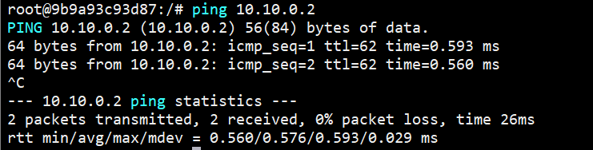
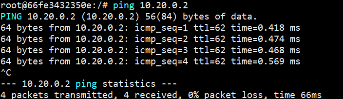

### 创建自定义网络：
可以基于 docker 命令创建自定义网络， 自定义网络可以自定义 IP 地范围和网关等信息。

帮助
```bash
docker network create –help
```

1. 创建自定义 docker 网络
```bash
docker network create -d bridge --subnet 10.100.0.0/24 \
      --gateway 10.100.0.1 my-net
```

2. 查看网络 
```bash
docker network list
```
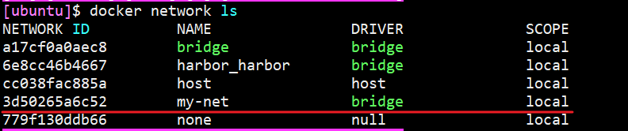

3. 使用自定义网络创建容器
```bash
docker run -it --net=my-net jibill/nginx:v1 bash
```
```bash
[root@42dba1061dd1 /]# ifconfig eth0
[root@42dba1061dd1 /]# ping www.baidu.com
```
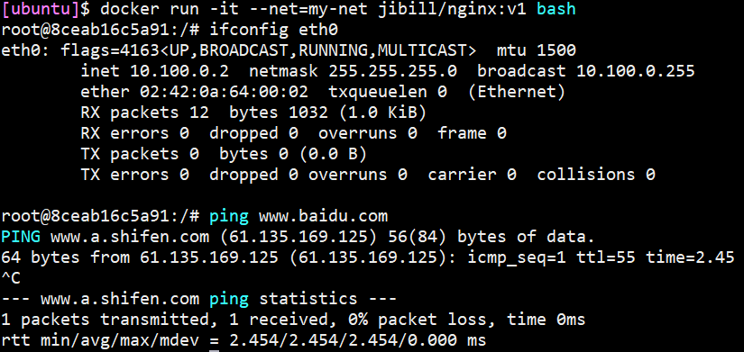


4. 创建默认网络容器
```bash
docker run -it jibill/nginx:v1 bash
```
```bash
[root@ed06c2785c92 /]# ifconfig eth0
[root@ed06c2785c92 /]# ping www.baidu.com
```

5. **如何与使用默认网络的容器通信：**
现在有一个docker0(10.10.0.0/24)网络一个自定义的my-net(10.100.0.0/24)网络， 每个网络上分别运行了不同数量的容器，那么怎么才能让位于不同网络的容器可以相互通信呢？

1. 保存下iptbales
```bash
iptables-save > iptables.sh
```

2. 修改iptables.sh
```bash
vim iptables.sh
```

把DOCKER-ISOLATION-STAGE-2除了`RETURN`结尾的都注释了

3. 重新导入 iptables
```bash
iptables-restore < iptables.sh
```

4. 验证通信
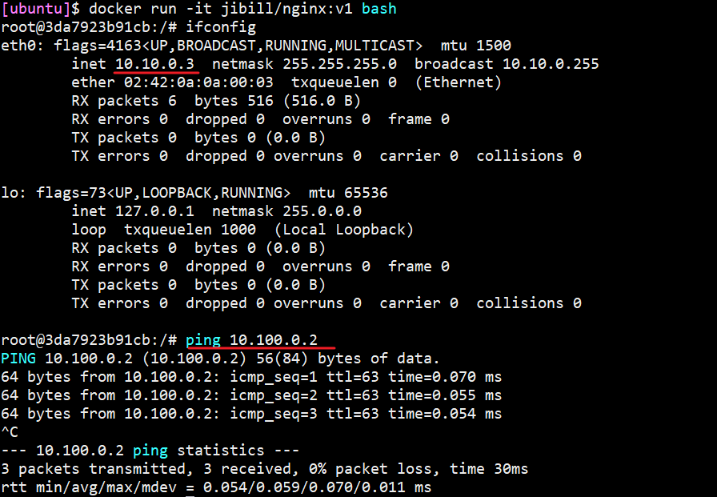

---
# docker资源限制
> 官网：https://docs.docker.com/config/containers/resource_constraints/

默认情况下， 容器没有资源限制， 可以使用主机内核调度程序允许的尽可能多的给定资源， Docker 提供了控制容器可以限制容器使用多少内存或 CPU 的方法，设置 docker run 命令的运行时配置标志。
其中许多功能都要求宿主机的内核支持 Linux 功能， 要检查支持， 可以使用docker info 命令，如果内核中禁用了某项功能， 可能会在输出结尾处看到警告，

如下所示：
```bash
WARNING: No swap limit support
```

对于 Linux 主机， 如果没有足够的内容来执行其他重要的系统任务， 将会抛出OOM (Out of Memory Exception,内存溢出、 内存泄漏、 内存异常), 随后系统会开始杀死进程以释放内存， 凡是运行在宿主机的进程都有可能被 kill， 包括 Dockerd和其它的应用程序， 如果重要的系统进程被 Kill,会导致和该进程相关的服务全部宕机。

产生 OOM 异常时， Dockerd 尝试通过调整 Docker 守护程序上的 OOM 优先级来减轻这些风险，以便它比系统上的其他进程更不可能被杀死，但是容器的 OOM优先级未调整， 这使得单个容器被杀死的可能性比 Docker 守护程序或其他系统进程被杀死的可能性更大，不推荐通过在守护程序或容器上手动设置--oomscore-adj 为极端负数，或通过在容器上设置--oom-kill-disable 来绕过这些安全措施。

## OOM 优先级机制：
linux 会为每个进程算一个分数，最终他会将分数最高的进程 kill。
> `/proc/PID/oom_score_adj` :范围为-1000 到 1000，值越高越容易被宿主机 kill掉，如果将该值设置为-1000，则进程永远不会被宿主机 kernel kill。
>
> `/proc/PID/oom_adj` :范围为-17 到+15，取值越高越容易被干掉，如果是-17，则表示不能被 kill，该设置参数的存在是为了和旧版本的 Linux 内核兼容。
>
> `/proc/PID/oom_score` :这个值是系统综合进程的内存消耗量、 CPU 时间(utime + stime)、存活时间(uptime - start time)和 oom_adj 计算出的，消耗内存越多分越高，存活时间越长分越低。

## 容器的内存限制：
Docker 可以强制执行硬性内存限制，即只允许容器使用给定的内存大小。
Docker 也可以执行非硬性内存限制，即容器可以使用尽可能多的内存，除非内核检测到主机上的内存不够用了。

**--oom-score-adj**： 宿主机 kernel 对进程使用的内存进行评分， 评分最高的将被宿主机内核 kill 掉， 可以指定一个容器的评分制但是不推荐手动指定。
**--oom-kill-disable**： 对某个容器关闭 oom 机制。

---
### 内存限制参数：
**-m**, **--memory**：容器可以使用的最大内存量，如果设置此选项，则允许的最内存值为 4m （4 兆字节）。
**--memory-swap**： 容器可以使用的交换分区大小， 必须要在设置了物理内存限制的前提才能设置交换分区的限制
**--memory-swappiness**： 设置容器使用交换分区的倾向性，值越高表示越倾向于使用 swap 分区，范围为 0-100， 0 为能不用就不用， 100 为能用就用。
**--kernel-memory**： 容器可以使用的最大内核内存量，最小为 4m，由于内核内存与用户空间内存隔离，因此无法与用户空间内存直接交换，因此内核内存不足的容器可能会阻塞宿主主机资源，这会对主机和其他容器或者其他服务进程产生影响，因此不要设置内核内存大小。
**--memory-reservation**：允许指定小于--memory 的软限制，当 Docker 检测到主机上的争用或内存不足时会激活该限制，如果使用--memory-reservation，则必须将其设置为低于--memory 才能使其优先。 因为它是软限制，所以不能保证容器不超过限制。
**--oom-kill-disable** 默认情况下，发生 OOM 时， kernel 会杀死容器内进程，但是可以使用--oom-kill-disable 参数，可以禁止 oom 发生在指定的容器上，即 仅在已设置`-m`选项的容器上禁用 OOM，如果-m 参数未配置，产生 OOM 时，主机为了释放内存还会杀死系统进程。

---
### swap 限制：
**--memory-swap**：只有在设置了 --memory 后才会有意义。使用 Swap,可以让容器将超出限制部分的内存置换到磁盘上， WARNING：经常将内存交换到磁盘的应用程序会降低性能。

>_不同 **--memory-swap** 的设置会产生不同的效果:_
> **值为正数**， 那么--memory 和--memory-swap 都必须要设置， `--memory-swap` 表示你能使用的内存和 swap 分区大小的总和，例如： `--memory=300m`, `--memory-swap=1g`, 那么该容器能够使用 300m 内存和 700m swap，即`--memory` 是实际物理内存大小值不变，而 swap 的实际大小计算方式为
$(--memory-swap)-(--memory)=容器可用 swap$。
>
> **如果设置为 0**:则忽略该设置，并将该值视为未设置，即未设置交换分区。
>
> **如果等于--memory 的值，并且--memory 设置为正整数:** 容器无权访问 swap 即也没有设置交换分区。
> 
> **如果设置为 unset**:如果宿主机开启了 swap，则实际容器的swap 值为 2x( --memory)，即两倍于物理内存大小，但是并不准确(在容器中使用free 命令所看到的 swap 空间并不精确， 毕竟每个容器都可以看到具体大小，但是宿主机的 swap 是有上限而且不是所有容器看到的累计大小)。
> **如果设置为-1**：如果宿主机开启了 swap，则容器可以使用主机上 swap 的最大空间。

动态修改容器内存，先计算出所需要的内存的字节数：如268435456(256M)，只能调大不能调小
```bash
echo "268435456" > /sys/fs/cgroup/memory/docker/9fa20d824b18.../memory.limit_in_bytes
```
> 9fa20d824b18... 是容器ID

### 内存限制验证：
假如一个容器未做内存使用限制， 则该容器可以利用到系统内存最大空间， 默认创建的容器没有做内存资源限制。
```bash
#测试镜像
docker pull lorel/docker-stress-ng 
```
查看帮助
```bash
apt install stress-ng
stress-ng --help 
```
或者这样也行
```bash
docker run -it --rm lorel/docker-stress-ng -help
```

### 内存大小硬限制
查看docker状态
```bash
docker stats
```

1. 启动两个工作进程，每个工作进程最大允许使用内存 256M，且宿主机不限制当前容器最大内存：
```bash
docker run -it --rm --name c1 lorel/docker-stress-ng \
      --vm 2 --vm-bytes 256M
```
> --vm 启动多少个进程
> --vm-bytes 为每个进程分配的内存

2. 宿主机限制容器最大内存使用：
```bash
docker run -it --rm -m 256m --name c2 lorel/docker-stress-ng \
      --vm 2 --vm-bytes 256M
```

3. 宿主机 cgroup 验证：
```bash
# cat /sys/fs/cgroup/memory/docker/容器 ID /memory.limit_in_bytes
268435456
```
> 宿主机基于 cgroup 对容器进行内存资源的大小限制
> 注：通过 echo 命令可以改内存限制的值，但是可以在原基础之上增大内存限制，缩小内存限制会报错 write error: Device or resource busy

### 内存大小软限制：
```bash
docker run -it --rm -m 256m --memory-reservation 128m \
      --name c3 lorel/docker-stress-ng --vm 2 --vm-bytes 256M
```

1. 宿主机 cgroup 验证：
```bash
# cat /sys/fs/cgroup/memory/docker/容器 ID/memory.soft_limit_in_bytes
134217728 
```
> 返回的软限制结果

### 关闭 OOM 机制
```bash
docker run -it --rm -m 256m --oom-kill-disable \
      --name c4 lorel/dockerstress-ng --vm 2 --vm-bytes 256M
```
```bash
# cat /sys/fs/cgroup/memory/docker/容器 ID/memory.oom_control
oom_kill_disable 1
under_oom 1
oom_kill 0
```

### 交换分区限制
```bash
docker run -it --rm -m 256m --memory-swap 512m \
      --name magedu-c1 centos bash
```
宿主机 cgroup 验证：
```bash
# cat /sys/fs/cgroup/memory/docker/容器 ID/memory.memsw.limit_in_bytes
536870912 
```

---
## 容器的 CPU 限制
一个宿主机，有几十个核心的 CPU， 但是宿主机上可以同时运行成百上千个不同的进程用以处理不同的任务， 多进程共用一个 CPU 的核心依赖计数就是为可压缩资源， 即一个核心的 CPU 可以通过调度而运行多个进程， 但是同一个单位时间内只能有一个进程在 CPU 上运行， 那么这么多的进程怎么在 CPU 上执行和调度的呢？

实时优先级： 0 - 99

非实时优先级(nice)： -20 - 19， 对应 100 - 139 的进程优先级

Linux kernel 进程的调度基于 CFS(Completely Fair Scheduler)， 完全公平调度

CPU 密集型的场景：优先级越低越好， 计算密集型任务的特点是要进行大量的计算，消耗 CPU 资源，比如计算圆周率、 数据处理、 对视频进行高清解码等等，全靠 CPU 的运算能力。

IO 密集型的场景：优先级值高点， 涉及到网络、磁盘 IO 的任务都是 IO 密集型任务，这类任务的特点是 CPU 消耗很少，任务的大部分时间都在等待 IO 操作完成（因为 IO 的速度远远低于 CPU 和内存的速度），比如 Web 应用， 高并发，数据量大的动态网站来说，数据库应该为 IO 密集型。

**磁盘的调度算法**
```bash
# cat /sys/block/sda/queue/scheduler
noop deadline [cfq]
```

默认情况下，每个容器对主机 CPU 周期的访问权限是不受限制的， 但是我们可以设置各种约束来限制给定容器访问主机的 CPU 周期，大多数用户使用的是默认的 CFS 调度方式， 在 Docker 1.13 及更高版本中， 还可以配置实时优先级。

### 参数：
**--cpus** ：指定容器可以使用多少可用 CPU 资源， 例如，如果主机有两个 CPU，并且设置了--cpus =“1.5”，那么该容器将保证最多可以访问 1.5 个的 CPU(如果是 4 核 CPU， 那么还可以是 4 核心上每核用一点，但是总计是 1.5 核心的CPU)， 这相当于设置--cpu-period =“100000”和--cpu-quota =“150000”
主要在 Docker 1.13 和更高版本中使用， 目的是替代`--cpu-period` 和`--cpuquota` 两个参数，从而使配置更简单， 最大不能超出宿主机的 CPU 总核心数(在操作系统看到的 CPU 超线程后的数值)。

分配给容器的 CPU 超出了宿主机 CPU 总数。
```bash
# docker run -it --rm --cpus 2 centos bash
docker: Error response from daemon: Range of CPUs is from 0.01 to 1.00, as there are only 1 CPUs available.
See 'docker run --help'. 
```

**--cpu-period**：(CPU 调度周期)设置 CPU 的 CFS 调度程序周期，必须与`--cpuquota` 一起使用，默认周期为 100 微秒
**--cpu-quota**： 在容器上添加 CPU CFS 配额， 计算方式为 `cpu-quota/cpu-period`的结果值， 早期的 docker(1.12 及之前)使用此方式设置对容器的 CPU 限制值，==新版本 docker(1.13 及以上版本)通常使用--cpus 设置此值。==

**--cpuset-cpus**：用于指定容器运行的 CPU 编号，也就是我们所谓的绑核。
**--cpuset-mem**：设置使用哪个 cpu 的内存，仅对 非统一内存访问(NUMA)架构有效。
**--cpu-shares**：用于设置 cfs 中调度的相对最大比例权重,cpu-share 的值越高的容器，将会分得更多的时间片(宿主机多核 CPU 总数为 100%， 假如容器 A 为1024， 容器 B 为 2048， 那么容器 B 将最大是容器 A 的可用 CPU 的两倍 )，默认的时间片 1024，最大 262144。

### 测试 CPU 限制
1. 未限制容器 CPU
对于一台四核的服务器，如果不做限制， 容器会把宿主机的 CPU 全部占完。
分配 4 核 CPU 并启动 4 个工作线程
```bash
docker run -it --rm --name c10 lorel/docker-stress-ng \
      --cpu 4 --vm 4
```
在宿主机使用 dokcer top 命令查看容器运行状态
```bash
docker top CONTAINER [ps OPTIONS]
```
容器运行状态：
```bash
docker stats
```
在宿主机查看 CPU 限制参数：
```bash
# cat /sys/fs/cgroup/cpuset/docker/${容器ID}/cpuset.cpus
0-3
```

2. 限制容器 CPU
只给容器分配最多两核宿主机 CPU 利用率
```bash
docker run -it --rm --name c11 \
      --cpus 2 lorel/docker-stress-ng --cpu 4 --vm 4
```
宿主机 cgroup 验证
```bash
# cat /sys/fs/cgroup/cpu,cpuacct/docker/容器 ID/cpu.cfs_quota_us
200000
```
> 每核心 CPU 会按照 1000 为单位转换成百分比进行资源划分， 2 个核心的 CPU 就是 200000/1000=200%， 4 个核心 400000/1000=400%，以此类推

宿主机 CPU 利用率

3. 将容器运行到指定的 CPU 上
```bash
docker run -it --rm --name c12 --cpus 1 \
      --cpuset-cpus 1,3 lorel/docker-stress-ng --cpu 2 --vm 2
```
```bash
# cat /sys/fs/cgroup/cpuset/docker/容器 ID /cpuset.cpus
1,3
```
容器运行状态
```bash
docker stats
```

4. 基于 cpu—shares 对 CPU 进行切分
启动两个容器， c13 的`--cpu-shares` 值为 1000， c14 的`--cpu-shares`为 500， 观察最终效果， `--cpu-shares` 值为 1000 的 c13 的 CPU 利用率基本是`--cpu-shares` 为 500 的 c14 的两倍：
```bash
docker run -it --rm --name c13 --cpu-shares 10 \
      lorel/docker-stress-ng --cpu 1 --vm 2

docker run -it --rm --name c14 --cpu-shares 5 \
      lorel/docker-stress-ng --cpu 1 --vm 2
```
验证容器运行状态
```bash
docker stats
```
宿主机 cgroup 验证
```bash
# cat /sys/fs/cgroup/cpu,cpuacct/docker/容器 ID/cpu.shares
1000
# cat /sys/fs/cgroup/cpu,cpuacct/docker/容器 ID/cpu.shares
500
```

5. 动态修改 CPU shares 值：
`--cpu-shares` 的值可以在宿主机 cgroup 动态修改， 修改完成后立即生效，其值可以调大也可以减小。
```bash
echo 2000 > /sys/fs/cgroup/cpu,cpuacct/docker/容器 ID/cpu.shares
```
验证修改后的容器运行状态
```bash
docker stats
```

---
# 单机编排之 Docker Compose：
当在宿主机启动较多的容器时候，如果都是手动操作会觉得比较麻烦而且容器出错这个时候推荐使用 docker 单机编排工具 docker-compose， docker-compose是 docker 容器的一种单机编排服务， docker-compose 是一个管理多个容器的工具，比如可以解决容器之间的依赖关系， 就像启动一个 nginx 前端服务的时候会调用后端的 tomcat，那就得先启动 tomcat，但是启动 tomcat 容器还需要依赖数据库， 那就还得先启动数据库， docker-compose 就可以解决这样的嵌套依赖关系，其完全可以替代 docker run 对容器进行创建、 启动和停止。

docker-compose 项目是 Docker 官方的开源项目，负责实现对 Docker 容器集群的快速编排， docker-compose 将所管理的容器分为三层，分别是工程（project），服务（service）以及容器（container）。
> github 地址 https://github.com/docker/compose

## 基础环境准备：
server1：192.168.99.21，Harbor
server2：192.168.99.22，docker-compose
下面开始在server1上安装harbor并且创建nginx、tomcat、haproxy镜像备用
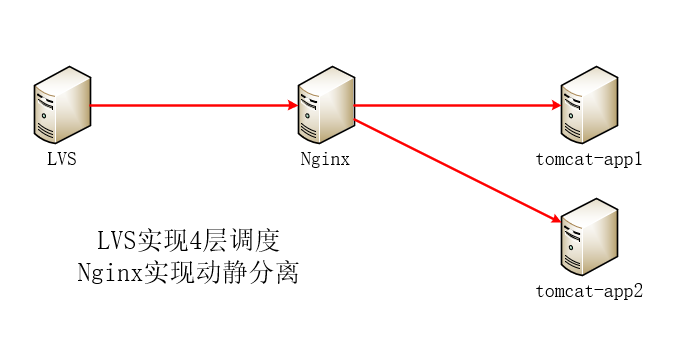

### 配置安装 Harbor：
1. 下载 Harbor 离线安装包：
```bash
cd /usr/local/src/
wget https://storage.googleapis.com/harbor-releases/release-1.7.0/harbor-offline-installer-v1.7.5.tgz
```

2. 解压
```bash
tar xf harbor-offline-installer-v1.7.5.tgz
ln -sv /usr/local/src/harbor /usr/local/
```

3. 下载docker-compose
**Ubuntu：**
```bash
apt update
apt install -y python-pip
pip install docker-compose
```

**Centos：**
```bash
yum install epel-release
yum install -y python-pip
pip install --upgrade pip
pip install docker-compose
```

4. 修改配置文件，最终配置如下
```bash
# vim harbor.cfg
...
hostname = 192.168.99.22
...
harbor_admin_password = root123
...
```

4. 安装
```bash
./install.sh
```

5. 编辑 docker 配置文件：
注意：如果我们配置的是 https 的话，本地 docker 就不需要有任何操作就可以访问 harbor 了
```bash
vim /lib/systemd/system/docker.service
```
在`ExecStart`追加
```ini
ExecStart=/usr/bin/dockerd -H fd:// --containerd=/run/containerd/containerd.sock --insecure-registry 192.168.99.21
```
> 其中 192.168.99.21 是我们部署 Harbor 的地址，即 hostname 配置项值。配置完后需要重启 docker 服务。


6. 重启 docker 服务：
```bash
systemctl daemon-reload
systemctl restart docker
```

7. 重启docker-compose
```bash
docker-compose restart
```

7. 验证能否登录 harbor：
```bash
docker login 192.168.99.21
```

> https://docs.docker.com/compose/reference/ 官方文档

### 制作nginx镜像
1. 下载镜像并初始化系统：
```bash
docker pull centos
mkdir -pv /opt/dockerfile/web/nginx/html
```

2. 编写 Dockerfile：
```bash
cd /opt/dockerfile/web/nginx
vim Dockerfile
```
```bash
From centos:latest

MAINTAINER chen 123456@qq.com

ADD nginx-1.10.3.tar.gz /usr/local/src/

RUN rpm -ivh http://mirrors.aliyun.com/epel/epel-release-latest-7.noarch.rpm \
        && yum install -y vim wget tree lrzsz gcc gcc-c++ automake pcre pcre-devel zlib zlib-devel openssl openssl-devel iproute net-tools iotop \
        && cd /usr/local/src/nginx-1.10.3 \
        && ./configure --prefix=/usr/local/nginx --with-http_sub_module \
        && make \
        && make install \
        && cd /usr/local/nginx/
ADD nginx.conf /usr/local/nginx/conf/nginx.conf
RUN useradd nginx -s /sbin/nologin \
        && ln -sv /usr/local/nginx/sbin/nginx /usr/sbin/nginx \
        && echo "test nginx page" > /usr/local/nginx/html/index.html

EXPOSE 80 443

CMD ["nginx","-g","daemon off;"]
```

1. 准备网页
```bash
cd /opt/dockerfile/web/nginx/html
echo "test nginx" > index.html
```

2. 目录如下
```bash
# cd ..
# tree .
.
├── Dockerfile
├── html
│   └── index.html
├── nginx-1.10.3.tar.gz
└── nginx.conf
```

3. 执行镜像构建
```bash
docker build -t nginx:v1 /opt/dockerfile/web/nginx
```

5. 查看是否生成本地镜像
```bash
docker images
```

6. 从镜像启动容器
```bash
docker run --rm -p 81:80 --name nginx-web1 \
	-v /opt/dockerfile/web/nginx/html/:/usr/local/nginx/html/ \
	-v /opt/dockerfile/web/nginx/nginx.conf:/usr/local/nginx/conf/nginx.conf \
	mynginx:v1
```

7. 访问 web 界面
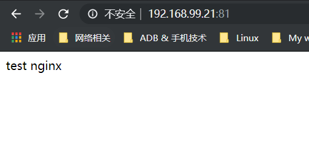

8. 镜像打 tag：
```bash
docker tag mynginx:v1 192.168.99.21/nginx/mynginx:v1
```

9. 在 harbor 管理界面创建项目(需要先创建项目再上传镜像)
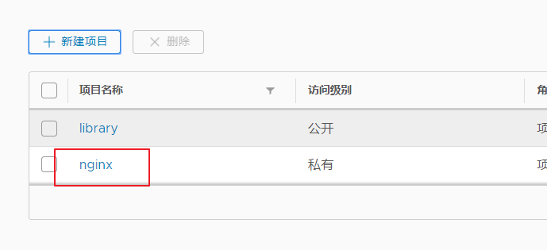

10. 将镜像 push 到 harbor：
```bash
docker push 192.168.99.21/nginx/mynginx:v1
```

11. 上传完成 
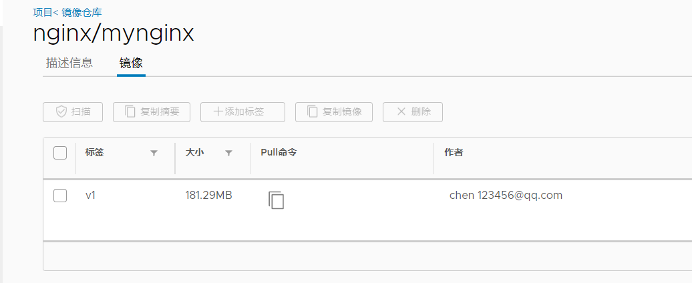

---
### 制作JDK镜像
1. 执行构建 JDK 镜像：
```bash
mkdir -p /opt/dockerfile/web/jdk
cd /opt/dockerfile/web/jdk/
```

2. 编辑Dockerfile
```bash
vim Dockerfile
```
```bash
#JDK Base Image
FROM centos:latest

ADD jdk-8u211-linux-x64.tar.gz /usr/local/src/
RUN ln -sv /usr/local/src/jdk1.8.0_211 /usr/local/jdk
ADD profile /etc/profile
ENV JAVA_HOME /usr/local/jdk
ENV JRE_HOME $JAVA_HOME/jre
ENV CLASSPATH $JAVA_HOME/lib/:$JRE_HOME/lib/
ENV PATH $PATH:$JAVA_HOME/bin

RUN rm -rf /etc/localtime \
      && ln -snf /usr/share/zoneinfo/Asia/Shanghai/etc/localtime \
      && echo "Asia/Shanghai" > /etc/timezone
```

3. 准备profile文件
```bash
vim profile
```
```bash
# /etc/profile

# System wide environment and startup programs, for login setup
# Functions and aliases go in /etc/bashrc

# It's NOT a good idea to change this file unless you know what you
# are doing. It's much better to create a custom.sh shell script in
# /etc/profile.d/ to make custom changes to your environment, as this
# will prevent the need for merging in future updates.

pathmunge () {
    case ":${PATH}:" in
        *:"$1":*)
            ;;
        *)
            if [ "$2" = "after" ] ; then
                PATH=$PATH:$1
            else
                PATH=$1:$PATH
            fi
    esac
}


if [ -x /usr/bin/id ]; then
    if [ -z "$EUID" ]; then
        # ksh workaround
        EUID=`/usr/bin/id -u`
        UID=`/usr/bin/id -ru`
    fi
    USER="`/usr/bin/id -un`"
    LOGNAME=$USER
    MAIL="/var/spool/mail/$USER"
fi

# Path manipulation
if [ "$EUID" = "0" ]; then
    pathmunge /usr/sbin
    pathmunge /usr/local/sbin
else
    pathmunge /usr/local/sbin after
    pathmunge /usr/sbin after
fi

HOSTNAME=`/usr/bin/hostname 2>/dev/null`
HISTSIZE=1000
if [ "$HISTCONTROL" = "ignorespace" ] ; then
    export HISTCONTROL=ignoreboth
else
    export HISTCONTROL=ignoredups
fi

export PATH USER LOGNAME MAIL HOSTNAME HISTSIZE HISTCONTROL

# By default, we want umask to get set. This sets it for login shell
# Current threshold for system reserved uid/gids is 200
# You could check uidgid reservation validity in
# /usr/share/doc/setup-*/uidgid file
if [ $UID -gt 199 ] && [ "`/usr/bin/id -gn`" = "`/usr/bin/id -un`" ]; then
    umask 002
else
    umask 022
fi

for i in /etc/profile.d/*.sh /etc/profile.d/sh.local ; do
    if [ -r "$i" ]; then
        if [ "${-#*i}" != "$-" ]; then
            . "$i"
        else
            . "$i" >/dev/null
        fi
    fi
done

unset i
unset -f pathmunge

export JAVA_HOME=/usr/local/jdk
export TOMCAT_HOME=/apps/tomcat
export PATH=$JAVA_HOME/bin:$JAVA_HOME/jre/bin:$TOMCAT_HOME/bin:$PATH
export CLASSPATH=.$CLASSPATH:$JAVA_HOME/lib:$JAVA_HOME/jre/lib:$JAVA_HOME/lib/tools.jar
```

3. 上传`jdk-8u212-linux-x64.tar.gz`
```bash
# tree /opt/dockerfile/web/jdk
/opt/dockerfile/web/jdk
├── Dockerfile
├── jdk-8u212-linux-x64.tar.gz
└── profile
```

4. 构建镜像
```bash
cd /opt/dockerfile/web/jdk
docker build -t myjdk:v1 .
```

5. 镜像打上tag
```bash
docker tag myjdk:v1 192.168.99.21/jdk/myjdk:v1
```

6. 在harbor页面上创建jdk项目
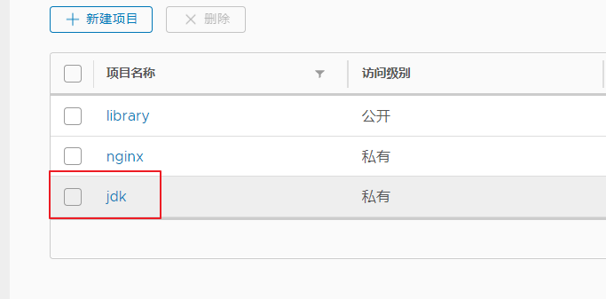

7. 将镜像上传到 harbor （下面有讲）
```bash
docker push 192.168.99.21/jdk/myjdk:v1
```


---
### 从 JDK 镜像构建 tomcat镜像

1. 进入tomcat目录：
```bash
mkdir -p /opt/dockerfile/web/tomcat
cd /opt/dockerfile/web/tomcat
```

2. 编辑Dockerfile文件
```bash
vim Dockerfile
```
```ini
FROM 192.168.99.21/jdk/myjdk:v1
RUN useradd www -u 2019

ENV TZ "Asia/Shanghai"
ENV LANG en_US.UTF-8
ENV TERM xterm
ENV TOMCAT_MAJOR_VERSION 8
ENV TOMCAT_MINOR_VERSION 8.0.49
ENV CATALINA_HOME /apps/tomcat
ENV APP_DIR ${CATALINA_HOME}/webapps

RUN mkdir /apps
ADD apache-tomcat-8.5.45.tar.gz /apps
RUN ln -sv /apps/apache-tomcat-8.5.45 /apps/tomcat
```

3. 上传 tomcat 压缩包：`apache-tomcat-8.5.45.tar.gz`
```bash	
tree /opt/dockerfile/web/tomcat
/opt/dockerfile/web/tomcat
├── apache-tomcat-8.5.45.tar.gz
└── Dockerfile
```

4. 通过脚本构建 tomcat 基础镜像
```bash
docker build -t mytomcat:v1 .
```

5. 验证镜像构建完成
```bash
docker images
```

6. 镜像打上tag
```bash
docker tag mytomcat:v1 192.168.99.21/tomcat/mytomcat:v1
```

7. 在harbor页面上创建tomcat项目
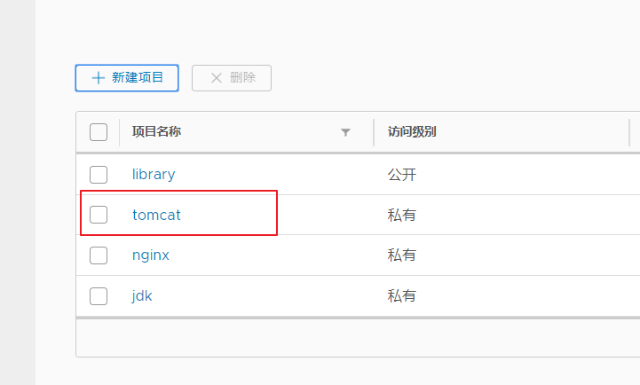

8. 上传
```bash
docker push 192.168.99.21/tomcat/mytomcat
```

---
### 构建tomcat-app业务镜像：
1. 准备目录
```bash
mkdir -pv /opt/dockerfile/web/tomcat-app
cd /opt/dockerfile/web/tomcat-app
```

2. 准备 Dockerfile：
```bash
vim Dockerfile
```
```ini
FROM 192.168.99.21/tomcat/mytomcat:v1
ADD run_tomcat.sh /apps/tomcat/bin/run_tomcat.sh
ADD myapp/* /apps/tomcat/webapps/myapp/
RUN chown www.www /apps/ -R
RUN chmod +x /apps/tomcat/bin/run_tomcat.sh
EXPOSE 8080 8009
CMD ["/apps/tomcat/bin/run_tomcat.sh"]
```

3. 准备自定义 myapp 页面：
```bash
mkdir myapp
echo "MyTomcat Web app Page1" > myapp/index.html
```

4. 准备容器启动执行脚本`run_tomcat.sh`：
```bash
cd ..
vim run_tomcat.sh
```
```bash
#!/bin/bash
echo "nameserver 223.5.5.5" > /etc/resolv.conf
su - www -c "/apps/tomcat/bin/catalina.sh start"
su - www -c "tail -f /etc/hosts"
```

5. 文件目录
```bash
# tree
.
├── Dockerfile
├── myapp
│   └── index.html
└── run_tomcat.sh
```

6. 构建
```bash
docker build -t mytomcat-app:v1 .
```

7. 查看镜像
```bash
docker images
```

8. 给镜像打tag
```bash
docker tag mytomcat-app:v1 192.168.99.21/tomcat/mytomcat-app:v1
```

9. 上传镜像
```bash
docker push 192.168.99.21/tomcat/mytomcat-app:v1
```

---
### 制作 haproxy 镜像：
1. 进入目录
```bash
mkdir -pv /opt/dockerfile/app/haproxy
cd /opt/dockerfile/app/haproxy
```

2. 准备 Dockerfile：
```bash
vim Dockerfile
```
```bash
#Haproxy Base Image
FROM centos
ADD haproxy-2.0.5.tar.gz /usr/local/src/

RUN yum -y install gcc gcc-c++ glibc glibc-devel pcre \
                pcre-devel openssl openssl-devel systemd-devel \
                net-tools vim iotop bc zip unzip zlib-devel lrzsz \
                tree screen lsof tcpdump wget ntpdate  \
      && cd /usr/local/src/haproxy-2.0.5 \
      && make ARCH=x86_64 TARGET=linux-glibc \
              USE_PCRE=1 USE_OPENSSL=1 USE_ZLIB=1 \
              USE_SYSTEMD=1 USE_CPU_AFFINITY=1 \
              PREFIX=/usr/local/haproxy \
      && make install PREFIX=/usr/local/haproxy \
      && cp haproxy /usr/sbin/ \
      && mkdir /usr/local/haproxy/run
ADD haproxy.cfg /etc/haproxy/
ADD run_haproxy.sh /usr/bin
RUN chmod +x /usr/bin/run_haproxy.sh
EXPOSE 80 9999
CMD ["/usr/bin/run_haproxy.sh"]
```

3. 准备`run_haproxy.sh`脚本
```bash
vim run_haproxy.sh
```
```bash
#!/bin/bash
haproxy -f /etc/haproxy/haproxy.cfg
tail -f /etc/hosts
```

4. 准备 `haproxy.cfg` 配置文件：
```bash
vim haproxy.cfg
```
```bash
global
	chroot /usr/local/haproxy
	#stats socket /var/lib/haproxy/haproxy.sock mode 600 level admin
	uid 99
	gid 99
	daemon
	nbproc 1
	pidfile /usr/local/haproxy/run/haproxy.pid
	log 127.0.0.1 local3 info

defaults
	option http-keep-alive
	option forwardfor
	mode http
	timeout connect 300000ms
	timeout client 300000ms
	timeout server 300000ms

listen stats
	mode http
	bind 0.0.0.0:9999
	stats enable
	log global
	stats uri /haproxy-status
	stats auth haadmin:q1w2e3r4ys

listen web_port
	bind 0.0.0.0:80
	mode http
	log global
	balance roundrobin
	server web1 192.168.99.22:81 check inter 3000 fall 2 rise 5
```
> 调度到后端nginx服务的81端口

3. 准备 haproxy 源码文件:`haproxy-2.0.5.tar.gz`
```bash
# tree /opt/dockerfile/app/haproxy
/opt/dockerfile/app/haproxy
├── Dockerfile
├── haproxy-2.0.5.tar.gz
├── haproxy.cfg
└── run_haproxy.sh
```

5. 准备构建脚本：
```bash
docker build -t haproxy:v1 .
```

6. 给镜像打tag
```bash
docker tag haproxy:v1 192.168.99.21/haproxy/haproxy:v1
```

7. harbor创建haproxy项目
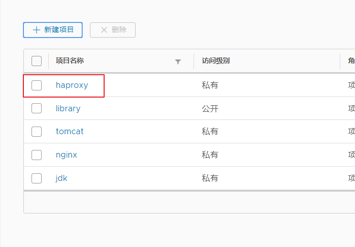

8. 上传镜像
```bash
docker push 192.168.99.21/haproxy/haproxy:v1
```

---
## 从 docker compose 启动单个容器
<b><font color=red>换成server2继续：</b></font>

0. 安装docker-18.09.9
过程略

1. 下载docker-compose
**Ubuntu：**
```bash
apt update
apt install -y python-pip
pip install docker-compose
```
**Centos：**
```bash
yum install epel-release
yum install -y python-pip
pip install --upgrade pip
pip install docker-compose
```

2. 验证 docker-compose 版本
```bash
docker-compose -v
```

3. 查看 docker-compose 帮助
```bash
docker-compose --help 
```

4. 编辑 docker 配置文件：
```bash
vim /lib/systemd/system/docker.service
```
在`ExecStart`追加
```ini
ExecStart=/usr/bin/dockerd -H fd:// --containerd=/run/containerd/containerd.sock --insecure-registry 192.168.99.21
```
> 其中 192.168.99.21 是我们部署 Harbor 的地址，即 hostname 配置项值。配置完后需要重启 docker 服务。


6. 重启 docker 服务：
```bash
systemctl daemon-reload
systemctl restart docker
```

7. 测试连接
```bash
docker login 192.168.99.21
```


8. 创建网页存放目录，给容器挂载用
```bash
mkdir -pv /opt/dockerfile/web/nginx/html
cd /opt/dockerfile/web/nginx/html
echo "test nginx" > index.html
```

9. 目录可以在任意目录， 推荐放在有意义的位置。如：
```bash
cd /opt/
mkdir docker-compose
cd docker-compose
```

10. 单个容器的 docker compose 文件：
编写一个 yml 格式的配置 docker-compose 文件， 启动一个 nginx 服务
```bash
vim docker-compose.yml
```
```yaml
service-nginx-web:
  image: 192.168.99.21/nginx/mynginx:v1
  container_name: nginx-web1
  expose:
    - 80
    - 443
  ports:
    - "80:80"
    - "443:443"
  volumes:
    - "/opt/dockerfile/web/nginx/html/:/usr/local/nginx/html/"
```
> service-nginx-web：服务名
> image：镜像名
> container_name：容器名
> expose：开放端口
> post：宿主机映射端口
> volume：数据卷挂载

3. 启动容器
```bash
docker-compose up -d 
```
> 不加是 d 前台启动
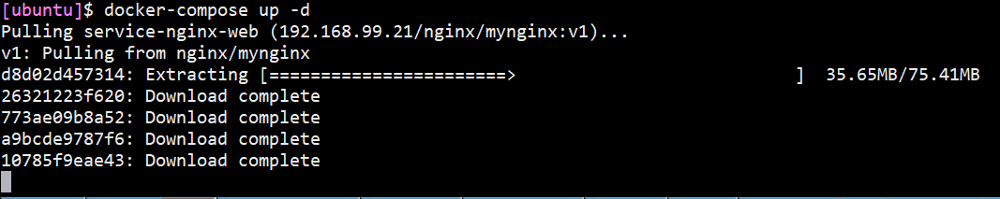

4. 启动完成
```bash
# docker ps  | grep nginx
1e453106ca9c        192.168.99.21/nginx/mynginx:v1           "nginx -g 'daemon of…"   49 seconds ago      Up 47 seconds          443/tcp, 0.0.0.0:80->80/tcp    
```

5. 查看容器进程
```bash
docker-compose ps
```
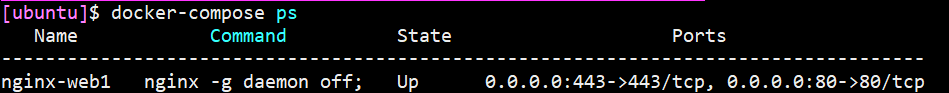

6. web 访问测试
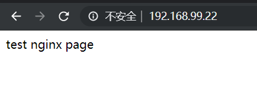


### 启动多个容器
docker pull 192.168.99.21/tomcat/mytomcat-app:v1

1. 编辑配置文件
```bash
cd /opt/docker-compose/
vim docker-compose.yml
```
```yaml
service-nginx-web:
  image: 192.168.99.21/nginx/mynginx:v1
  container_name: nginx-web1
  expose:
    - 80
    - 443
  ports:
    - "81:80"
    - "443:443"
  volumes:
    - "/opt/dockerfile/web/nginx/html/:/usr/local/nginx/html/"

service-tomcat-app1:
  image: 192.168.99.21/tomcat/mytomcat-app:v1
  container_name: tomcat-app1
  expose:
    - 8080
  ports:
    - "8080:8080"
```

2. 重启容器
```bash
docker-compose stop
docker-compose up -d
```

3. web 访问测试
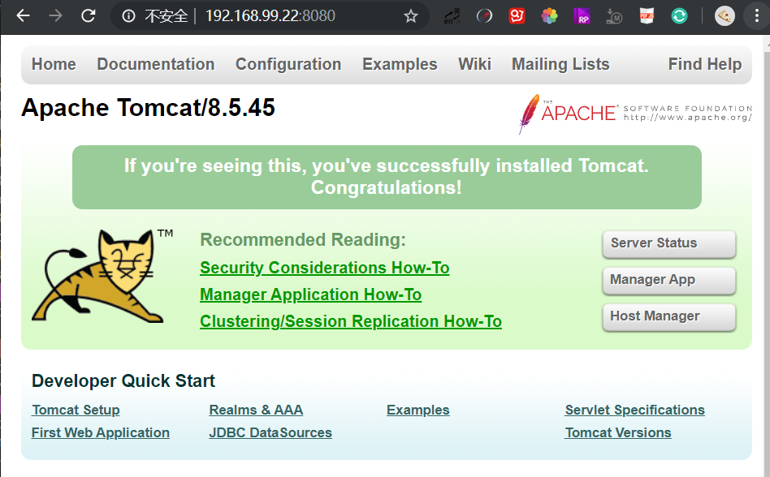


4. **重启/停止/启动单个指定容器**
```bash
docker-compose restart/stop/start service-nginx-web 
```
> 写容器的 service 名称，则是指定。
> 不指定则是所有

5. 重启所有容器：
```bash
docker-compose restart
```

## 实现Nginx反向代理Tomcat

### 创建nginx配置文件
1. 创建nginx目录
```bash
mkdir /opt/app
mkdir -p nginx/html/app{1..2}
cd /opt/app
mkdir -p nginx/conf
cd nginx/conf
```

2. 创建nginx配置文件
```bash
vim nginx.conf
```
```html
#user  nobody;
worker_processes  1;

#pid        logs/nginx.pid;

events {
    worker_connections  1024;
}

http {
    include       mime.types;
    default_type  application/octet-stream;

    #log_format  main  '$remote_addr - $remote_user [$time_local] "$request" '
    #                  '$status $body_bytes_sent "$http_referer" '
    #                  '"$http_user_agent" "$http_x_forwarded_for"';

    #access_log  logs/access.log  main;

    sendfile        on;
    #tcp_nopush     on;

    #keepalive_timeout  0;
    keepalive_timeout  65;

    #gzip  on;
upstream tomcat_webserver {
      server service-tomcat-app1:8080;
      server service-tomcat-app2:8080;
}
    server {
        listen       80;
        server_name  localhost;

        #charset koi8-r;

        #access_log  logs/host.access.log  main;

        location /app1 {
            root   /apps/nginx/html;
            index  index.html index.htm;
        }
        location /app2 {
            root   /apps/nginx/html;
            index  index.html index.htm;
        }
        location /tomcat-app {
            proxy_pass http://tomcat_webserver;
            proxy_set_header Host $host;
            proxy_set_header X-Forwarded-For $proxy_add_x_forwarded_for;
            proxy_set_header X-Real-IP $remote_addr;
        }

        #error_page  404              /404.html;

        # redirect server error pages to the static page /50x.html
        #
        error_page   500 502 503 504  /50x.html;
        location = /50x.html {
            root   html;
        }
    }
}
```

3. 创建网页
```bash
echo app111111 > /opt/app/nginx/html/app1/index.html
echo app222222 > /opt/app/nginx/html/app2/index.html
```

### 创建haproxy配置文件
```bash
cd /opt/app
mkdir -p haproxy/conf
vim ./haproxy/conf/haproxy.cfg
```
```bash
global
        chroot /usr/local/haproxy
        uid 99
        gid 99
        daemon
        nbproc 1
        pidfile /usr/local/haproxy/run/haproxy.pid
        log 127.0.0.1 local3 info

defaults
        option http-keep-alive
        option forwardfor
        mode http
        timeout connect 300000ms
        timeout client 300000ms
        timeout server 300000ms

listen stats
        mode http
        bind 0.0.0.0:9999
        stats enable
        log global
        stats uri /haproxy-status
        stats auth admin:123

listen web_port
        bind 0.0.0.0:80
        mode http
        log global
        balance roundrobin
        server web1 nginx-web1:80 check inter 3000 fall 2 rise 5
```
> nginx-web1:80 这里写的是容器内部的端口，所以nginx容器开放的什么端口就写多少，默认80。因为没有对宿主机映射，所以可以不会端口冲突。
> nginx-web1 是容器名

### 准备tomcat配置文件
```bash
cd /opt/app
mkdir -p tomcat/conf
vim tomcat/conf/server.xml
```
```bash
<?xml version="1.0" encoding="UTF-8"?>
<!--
  Licensed to the Apache Software Foundation (ASF) under one or more
  contributor license agreements.  See the NOTICE file distributed with
  this work for additional information regarding copyright ownership.
  The ASF licenses this file to You under the Apache License, Version 2.0
  (the "License"); you may not use this file except in compliance with
  the License.  You may obtain a copy of the License at

      http://www.apache.org/licenses/LICENSE-2.0

  Unless required by applicable law or agreed to in writing, software
  distributed under the License is distributed on an "AS IS" BASIS,
  WITHOUT WARRANTIES OR CONDITIONS OF ANY KIND, either express or implied.
  See the License for the specific language governing permissions and
  limitations under the License.
-->
<!-- Note:  A "Server" is not itself a "Container", so you may not
     define subcomponents such as "Valves" at this level.
     Documentation at /docs/config/server.html
 -->
<Server port="8005" shutdown="SHUTDOWN">
  <Listener className="org.apache.catalina.startup.VersionLoggerListener" />
  <!-- Security listener. Documentation at /docs/config/listeners.html
  <Listener className="org.apache.catalina.security.SecurityListener" />
  -->
  <!--APR library loader. Documentation at /docs/apr.html -->
  <Listener className="org.apache.catalina.core.AprLifecycleListener" SSLEngine="on" />
  <!-- Prevent memory leaks due to use of particular java/javax APIs-->
  <Listener className="org.apache.catalina.core.JreMemoryLeakPreventionListener" />
  <Listener className="org.apache.catalina.mbeans.GlobalResourcesLifecycleListener" />
  <Listener className="org.apache.catalina.core.ThreadLocalLeakPreventionListener" />

  <!-- Global JNDI resources
       Documentation at /docs/jndi-resources-howto.html
  -->
  <GlobalNamingResources>
    <!-- Editable user database that can also be used by
         UserDatabaseRealm to authenticate users
    -->
    <Resource name="UserDatabase" auth="Container"
              type="org.apache.catalina.UserDatabase"
              description="User database that can be updated and saved"
              factory="org.apache.catalina.users.MemoryUserDatabaseFactory"
              pathname="conf/tomcat-users.xml" />
  </GlobalNamingResources>

  <!-- A "Service" is a collection of one or more "Connectors" that share
       a single "Container" Note:  A "Service" is not itself a "Container",
       so you may not define subcomponents such as "Valves" at this level.
       Documentation at /docs/config/service.html
   -->
  <Service name="Catalina">

    <!--The connectors can use a shared executor, you can define one or more named thread pools-->
    <!--
    <Executor name="tomcatThreadPool" namePrefix="catalina-exec-"
        maxThreads="150" minSpareThreads="4"/>
    -->


    <!-- A "Connector" represents an endpoint by which requests are received
         and responses are returned. Documentation at :
         Java HTTP Connector: /docs/config/http.html
         Java AJP  Connector: /docs/config/ajp.html
         APR (HTTP/AJP) Connector: /docs/apr.html
         Define a non-SSL/TLS HTTP/1.1 Connector on port 8080
    -->
    <Connector port="8080" protocol="HTTP/1.1"
               connectionTimeout="20000"
               redirectPort="8443" />
    <!-- A "Connector" using the shared thread pool-->
    <!--
    <Connector executor="tomcatThreadPool"
               port="8080" protocol="HTTP/1.1"
               connectionTimeout="20000"
               redirectPort="8443" />
    -->
    <!-- Define a SSL/TLS HTTP/1.1 Connector on port 8443
         This connector uses the NIO implementation. The default
         SSLImplementation will depend on the presence of the APR/native
         library and the useOpenSSL attribute of the
         AprLifecycleListener.
         Either JSSE or OpenSSL style configuration may be used regardless of
         the SSLImplementation selected. JSSE style configuration is used below.
    -->
    <!--
    <Connector port="8443" protocol="org.apache.coyote.http11.Http11NioProtocol"
               maxThreads="150" SSLEnabled="true">
        <SSLHostConfig>
            <Certificate certificateKeystoreFile="conf/localhost-rsa.jks"
                         type="RSA" />
        </SSLHostConfig>
    </Connector>
    -->
    <!-- Define a SSL/TLS HTTP/1.1 Connector on port 8443 with HTTP/2
         This connector uses the APR/native implementation which always uses
         OpenSSL for TLS.
         Either JSSE or OpenSSL style configuration may be used. OpenSSL style
         configuration is used below.
    -->
    <!--
    <Connector port="8443" protocol="org.apache.coyote.http11.Http11AprProtocol"
               maxThreads="150" SSLEnabled="true" >
        <UpgradeProtocol className="org.apache.coyote.http2.Http2Protocol" />
        <SSLHostConfig>
            <Certificate certificateKeyFile="conf/localhost-rsa-key.pem"
                         certificateFile="conf/localhost-rsa-cert.pem"
                         certificateChainFile="conf/localhost-rsa-chain.pem"
                         type="RSA" />
        </SSLHostConfig>
    </Connector>
    -->

    <!-- Define an AJP 1.3 Connector on port 8009 -->
    <Connector port="8009" protocol="AJP/1.3" redirectPort="8443" />


    <!-- An Engine represents the entry point (within Catalina) that processes
         every request.  The Engine implementation for Tomcat stand alone
         analyzes the HTTP headers included with the request, and passes them
         on to the appropriate Host (virtual host).
         Documentation at /docs/config/engine.html -->

    <!-- You should set jvmRoute to support load-balancing via AJP ie :
    <Engine name="Catalina" defaultHost="localhost" jvmRoute="jvm1">
    -->
    <Engine name="Catalina" defaultHost="localhost">

      <!--For clustering, please take a look at documentation at:
          /docs/cluster-howto.html  (simple how to)
          /docs/config/cluster.html (reference documentation) -->
      <!--
      <Cluster className="org.apache.catalina.ha.tcp.SimpleTcpCluster"/>
      -->

      <!-- Use the LockOutRealm to prevent attempts to guess user passwords
           via a brute-force attack -->
      <Realm className="org.apache.catalina.realm.LockOutRealm">
        <!-- This Realm uses the UserDatabase configured in the global JNDI
             resources under the key "UserDatabase".  Any edits
             that are performed against this UserDatabase are immediately
             available for use by the Realm.  -->
        <Realm className="org.apache.catalina.realm.UserDatabaseRealm"
               resourceName="UserDatabase"/>
      </Realm>

      <Host name="localhost"  appBase="/data/tomcat/webapps/app"
            unpackWARs="true" autoDeploy="true">

        <!-- SingleSignOn valve, share authentication between web applications
             Documentation at: /docs/config/valve.html -->
        <!--
        <Valve className="org.apache.catalina.authenticator.SingleSignOn" />
        -->

        <!-- Access log processes all example.
             Documentation at: /docs/config/valve.html
             Note: The pattern used is equivalent to using pattern="common" -->
        <Valve className="org.apache.catalina.valves.AccessLogValve" directory="logs"
               prefix="localhost_access_log" suffix=".txt"
               pattern="%h %l %u %t &quot;%r&quot; %s %b" />
      </Host>
    </Engine>
  </Service>
</Server>
```

2. 准备tomcat动态页面
```bash
cd /opt/app
mkdir -p tomcat/app1/tomcat-app
cd tomcat/app1/tomcat-app
```
> 注意这里：因为nginx中location配置的配置路径是tomcat-app，往tomcat调度的时候会带上这个路径，所以，挂载进去的路径也要与之匹配。即：要能够访问http://tomcat-app1:8080/tomcat-app，才能通过nginx来调度

3. 动态页面示例
```bash
vim showhost.jsp
```
```bash
<%@page import="java.util.Enumeration"%>
<br />
host:
<%try{out.println(""+java.net.InetAddress.getLocalHost().getHostName());}catch(Exception e){}%>
<br />
remoteAddr: <%=request.getRemoteAddr()%>
<br />
remoteHost: <%=request.getRemoteHost()%>
<br />
sessionId: <%=request.getSession().getId()%>
<br />
serverName:<%=request.getServerName()%>
<br />
scheme:<%=request.getScheme()%>
<br />
<%request.getSession().setAttribute("t1","t2");%>
<%
Enumeration en = request.getHeaderNames();
while(en.hasMoreElements()){
String hd = en.nextElement().toString();
out.println(hd+" : "+request.getHeader(hd));
out.println("<br />");
}
%>
```

### 创建docker-compose.yml
```bash
mkdir -p /opt/app
cd /opt/app
vim docker-compose.yml
```
```bash
service-haproxy:
  image: 192.168.99.21/haproxy/haproxy:v1
  container_name: haproxy
  volumes:
    - ./haproxy/conf/haproxy.cfg:/etc/haproxy/haproxy.cfg
  expose:
    - 80
    - 443
    - 9999
  ports:
    - "80:80"
    - "443:443"
    - "9999:9999"
  links:
    - service-nginx-web

service-nginx-web:
  image: 192.168.99.21/nginx/mynginx:v1
  container_name: nginx-web1
  volumes:
    - ./nginx/html/app1:/apps/nginx/html/app1
    - ./nginx/html/app2:/apps/nginx/html/app2
    - ./nginx/conf/nginx.conf:/usr/local/nginx/conf/nginx.conf
  expose:
    - 80
    - 443
  links:
    - service-tomcat-app1
    - service-tomcat-app2

service-tomcat-app1:
  image: 192.168.99.21/tomcat/mytomcat-app:v1
  container_name: tomcat-app1
  volumes:
    - ./tomcat/app1:/data/tomcat/webapps/app/ROOT
    - ./tomcat/conf/server.xml:/apps/tomcat/conf/server.xml
  expose:
    - 8080

service-tomcat-app2:
  image: 192.168.99.21/tomcat/mytomcat-app:v1
  container_name: tomcat-app2
  volumes:
    - ./tomcat/app1:/data/tomcat/webapps/app/ROOT
    - ./tomcat/conf/server.xml:/apps/tomcat/conf/server.xml
  expose:
    - 8080
```

### 最终文件目录
```bash
cd /opt/app
# tree
.
├── docker-compose.yml
├── haproxy
│   └── conf
│       └── haproxy.cfg
│   
├── nginx
│   ├── conf
│   │   └── nginx.conf
│   └── html
│       ├── app1
│       │   └── index.html
│       └── app2
│           └── index.html
└── tomcat
    ├── app1
    │   └── tomcat-app
    │       └── showhost.jsp
    └── conf
        └── server.xml
```

### 测试访问 
http://192.168.99.22/tomcat-app/showhost.jsp
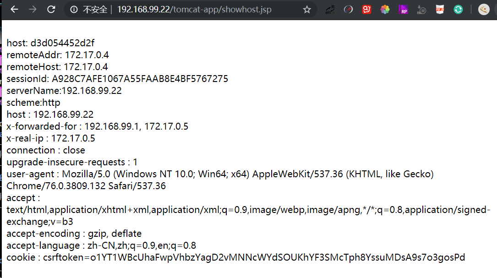

