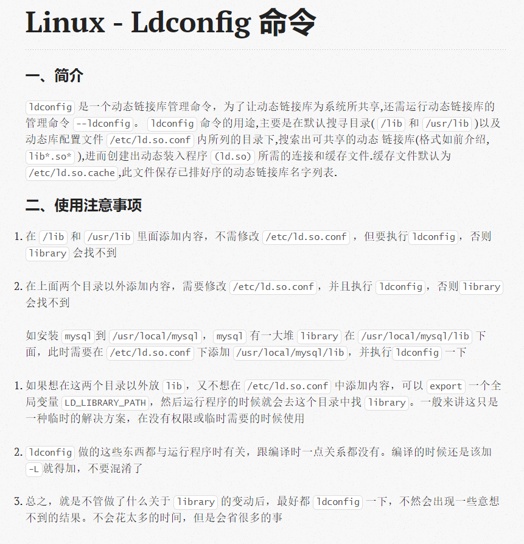

### Linux - Ldconfig 命令
> JUN 26TH, 2015 2:34 PM
- 一、简介
    - ldconfig 是一个动态链接库管理命令，为了让动态链接库为系统所共享,还需运行动态链接库的管理命令 --ldconfig。 ldconfig 命令的用途,主要是在默认搜寻目录( /lib 和 /usr/lib )以及动态库配置文件 /etc/ld.so.conf 内所列的目录下,搜索出可共享的动态 链接库(格式如前介绍,lib*.so* ),进而创建出动态装入程序 (ld.so) 所需的连接和缓存文件.缓存文件默认为 /etc/ld.so.cache,此文件保存已排好序的动态链接库名字列表.

- 二、使用注意事项
    - 在 /lib 和 /usr/lib 里面添加内容，不需修改 /etc/ld.so.conf ，但要执行ldconfig，否则 library 会找不到

    - 在上面两个目录以外添加内容，需要修改 /etc/ld.so.conf，并且执行 ldconfig，否则library会找不到

    - 如安装 mysql到 /usr/local/mysql，mysql 有一大堆 library 在 /usr/local/mysql/lib 下面，此时需要在 /etc/ld.so.conf 下添加 /usr/local/mysql/lib，并执行ldconfig 一下

    - 如果想在这两个目录以外放 lib，又不想在 /etc/ld.so.conf 中添加内容，可以 export 一个全局变量 LD_LIBRARY_PATH，然后运行程序的时候就会去这个目录中找 library。一般来讲这只是一种临时的解决方案，在没有权限或临时需要的时候使用

    - ldconfig 做的这些东西都与运行程序时有关，跟编译时一点关系都没有。编译的时候还是该加-L就得加，不要混淆了

    - 总之，就是不管做了什么关于 library 的变动后，最好都 ldconfig 一下，不然会出现一些意想不到的结果。不会花太多的时间，但是会省很多的事
