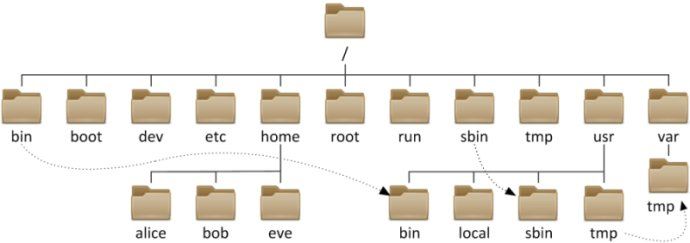

# Linux學前須知

*  已提供的練手服務器：  
    - 電腦：XShell      
    - 手機：下載和安裝juiceSSH  
    - 服務器地址： 192.168.5.202:22
    - 用戶名為名字首字母小寫，如：yts  
    - 密碼為：123  
    - 當前用戶名：cc  gzp  hcw  hjn  hwy  lxh  lsf  nl  xsf  yj  yts  yzh  ztl  zwm

* Linux的基本思想有两点：
    1. 一切都是文件；
    2. 每个文件都有确定的用途  
* Linux是一款“免费”的操作系统（理解為系統免費，軟件可能收費）
* Linux支持多用户同時操作的系統，各个用户对于自己的文件设备有自己特殊的权利，保证了各用户之间互不影响
* Linux衍生系列
    - Deepin、红旗、XX麒麟、一铭、『安卓』……（開源的Linux，只要技術高，人人可以擁有一個屬於自己的Linux）
    - Redhat：企業版本RHEL，普通功能免費，企業功能服務付費。有專業的售後維護。（推薦有錢人用+推薦企業服務用）
    - Centeros：用红帽子企业百版linux的源码重新编译出来的企业级的linux系统。重點是他是免費的（企業最愛，推薦企業服務用）。
    - Ubuntu和Fedora：桌面功能做得更加炫酷（推薦開發，理由是基本都能安裝開發時候用到的大量開發工具軟件）

# 本節培訓課課程內容：
* 學會最基本技能：man  
* 目录的增、删、改、查操作  
    mkdir (创建新目录)  
    rmdir (删除空的目录)  
    cp (复制目录或文件)  
    mv (移动文件与目录，或修改名称)  
    ls(列出某目录中的内容)  
* 文件的增、删、改、查操作  
    touch(新增文件)  
    rm (删除文件或目录)  
    cat(查看文件内容)  
* vi/vim（操作文件）  
* 命令模式  
* 編輯模式  
* 作業  
* ~~文件或目录的属性管理~~  
* ~~文件的特殊操作~~
# 目錄結構
## 一切皆為文件 （和Windows不一樣）
| 目录 |  說明    |
| ------ | ------ |
|/bin | 	存放二进制可执行文件(ls,cat,mkdir等)，常用命令一般都在这里。  |
|/etc | 	存放系统管理和配置文件  |
|/home | 	存放所有用户文件的根目录，是用户主目录的基点，比如用户user的主目录就是/home/user，可以用~user表示  |  
|/usr | 	用于存放系统应用程序，比较重要的目录/usr/local 本地系统管理员软件安装目录（安装系统级的应用）。这是最庞大的目录，要用到的应用程序和文件几乎都在这个目录。  |
|/usr/x11r6 |  存放x window的目录  |
|/usr/bin |  众多的应用程序    |
|/usr/sbin |  超级用户的一些管理程序    |
|/usr/doc |  Linux文档    |
|/usr/include  | linux下开发和编译应用程序所需要的头文件    |
|/usr/lib |  常用的动态链接库和软件包的配置文件    |
|/usr/man |  帮助文档    |
|/usr/src |  源代码，linux内核的源代码就放在/usr/src/linux里    |
|/usr/local/bin |  本地增加的命令    |
|/usr/local/lib |  本地增加的库  |
|/opt | 	额外安装的可选应用程序包所放置的位置。一般情况下，我们可以把tomcat等都安装到这里。  |
|/proc | 	虚拟文件系统目录，是系统内存的映射。可直接访问这个目录来获取系统信息。  |
|/root | 	超级用户（系统管理员）的主目录（特权阶级^o^）  |
|/sbin | 	存放二进制可执行文件，只有root才能访问。这里存放的是系统管理员使用的系统级别的管理命令和程序。如ifconfig等。  |
|/dev | 	用于存放设备文件。  |
|/mnt | 	系统管理员安装临时文件系统的安装点，系统提供这个目录是让用户临时挂载其他的文件系统。  |
|/boot | 	存放用于系统引导时使用的各种文件  |
|/lib | 	存放跟文件系统中的程序运行所需要的共享库及内核模块。共享库又叫动态链接共享库，作用类似windows里的.dll文件，存放了根文件系统程序运行所需的共享文件。  |
|/tmp | 	用于存放各种临时文件，是公用的临时文件存储点。  |
|/var | 	用于存放运行时需要改变数据的文件，也是某些大文件的溢出区，比方说各种服务的日志文件（系统启动日志等。）等。  |
|/lost+found | 	这个目录平时是空的，系统非正常关机而留下"无家可归"的文件（windows下叫什么.chk）就在这里  |

# 目錄結構圖    (部分)
  
<u>問：Linux系统中 /bin、/sbin、/usr/bin、/usr/sbin、/usr/local/bin、/usr/local/sbin 目录的区别  
    查問：boot、dev、etc、home、bin、var目錄分別保存什么？  </u>

# man命令  【Linux系統管理員必備技能】
    参考手册  
    一言以蔽之："有困難，找男人（man）"
### 語法:
`man [common]`  
### EX:
`man man`  
<u>問：man命令提供了哪些類型的幫助？</u>

# 文件的管理-1

## 語法:ls  [目錄名稱]
    列出指定『目錄名稱』下的全部文件和文件夾
    選項與參數：
    -a：列出包含隱藏文件在內的全部文件和文件夾
    -l：列出文件或者文件夾的屬性與權限等數據
### EX:
`# ls`   
`# ls /etc`    
<u>研究：ls命令+通配符</u>

## 語法:cd [ PATH ]
    切換目錄
### EX:
`cd /etc`   
<u>問：如何切換到家目錄、上一層目錄</u>

## 語法:mkdir [-mp] 目录名称  
    創建空的文件夾
    選項與參數:
    -m ：mode創建目錄的同時指定目錄的權限（後期講了權限管理後再學習）
    -p ：目錄遞歸的上一層路徑
### EX:
`# cd /home/yts`   
`# mkdir  ./music`   
`# mkdir  document`   
`# mkdir -p  ./document/student/xiangyan/exam/test1`   
<u>思考：如何同時創建多個空目錄</u>

## 語法:touch [文件名]  
    当参数为已存在的文件，则表示更新该文件的创建时间为当前时间。若参数为不存在的文件则表示新建空的文件
### EX:
`# ll ./music <==查看文件信息`  
`# touch ./music/1.mp3 <==創建空文件`   
`# ll ./music <==查看文件信息`  
`# touch ./music/1.mp3 <==創建空文件`   
`# ll ./music <==查看文件信息`     

## 語法:rmdir  [-p] 目錄名稱  
    刪除空的文件夾
    選項與參數：
    -p ：連同上一級『空的』目錄一同刪除，僅僅當前目錄刪除後，所連帶的上一級目錄也為空目錄的時候才會被刪除。
### EX:
`# mkdir emptyDir <==創建空目錄`   
`# mkdir dataDir <==創建有數據的目錄`   
`# touch ./dataDir/datafile.txt <==給數據目錄添加數據`   
`# rmdir emptyDir <==可直接刪除`   
`# rmdir dataDir <==有數據在當前目錄下，所以無法用直接删除！`    
<u>思考：如何同時刪除多個空目錄</u>

## 語法:cp [-adfilprsu] 來源文檔(source) 目標文檔(destination)
    拷貝『來源文檔』到『目錄文檔』
    選項與參數:
    -i：若目標文檔已經存在的時候，在同意『覆蓋』操作後進行拷貝操作
    -p：連同文件的屬性一併複製過去（備份的時候經常用到）
    -r：遞歸的複製，用於目錄之間的複製
### EX:
`# cp  /etc/passwd ./dataDir`  
`# cp  /etc/passwd ./dataDir`  
`# cp  -i /etc/passwd ./dataDir <==追加了拷貝信息：提問『是否覆蓋？』`   
<u>操作：將dataDir目錄，（備份）拷貝到 document目錄下</u>

## 語法:mv [-fiu] source destination
    移動『來源文檔』到『目錄文檔』,也可用於重命名
    選項與參數:
    -i：若目標文檔已經存在的時候，在同意『覆蓋』操作後進行拷貝操作
    -f：連同文件的屬性一併複製過去（備份的時候經常用到）
### EX:
`# mv dataDir/passwd document/student/`   
<u>操作：重命名之前的music目錄為mp3目錄</u>

## 語法:rm [-fir] source
    移除（刪除）文件或者文件夾
    選項與參數:
    -f：強制刪除，忽略一切問題和警告，硬性刪除（謹慎使用）
    -i：人機交互的方式刪除，會在刪除之前進行提問
    -r：遞歸刪除，一般用於目錄刪除，（謹慎使用）
### EX:
`# rm dataDir/passwd`   
<u>操作：刪除/home/yts/目錄下的所有文件以及文件夾（目錄）</u>

## 語法:cat [option] file
    连接文件并在标准输出上打印
    選項與參數:
    -n：顯示行號
    -i：人機交互的方式刪除，會在刪除之前進行提問
    -r：遞歸刪除，一般用於目錄刪除，（謹慎使用）
### EX:
`# cat -n document/student/passwd`   

# 階段性小測試：
    1.創建目錄的命令  
        (1)以自己的英文名字為文件名，創建一個目錄  
    2.刪除目錄的命令
        (1)以當前日期為文件名，創建一個目錄
        (2)刪除該文件
    3.拷貝文件或文件夾
        (1)拷貝英文名文件夾到系統的/tmp目錄
    4.移動文件或文件夾
        (1)新建一個名為myTmp的目錄
        (2)給這個目錄重命名為myTest
    5.查看當前目錄下的文件/文件夾列表
        (1)查看根目錄下的所有文件和文件夾
    6.創建空文件
        (1)快速創建一個空文件
    7.刪除文件
        (1)刪除剛才創建的所有的文件

# 文件編輯操作
## 文件命名規則
    Linux 系统中，文件和目录的命名规则如下：
        1.除了字符“/”之外，所有的字符都可以使用，但是要注意，在目录名或文件名中，使用某些特殊字符并不是明智之举。例如，在命名时应避免使用 <、>、？、* 和非打印字符等。（如果一个文件名中包含了特殊字符，例如空格，那么在访问这个文件时就需要使用引号将文件名括起来）
        2.目录名或文件名的长度不能超过 255 个字符。
        3.目录名或文件名是区分大小写的。如 DOG、dog、Dog 和 DOg ，是互不相同的目录名或文件名，但使用字符大小写来区分不同的文件或目录，也是不明智的。
        4.与 Windows 操作系统不同，文件的扩展名对 Linux 操作系统没有特殊的含义，换句话说，Linux 系统并不以文件的扩展名开分区文件类型。例如，dog.exe 只是一个文件，其扩展名 .exe 并不代表此文件就一定是可执行文件（以後講到權限再解釋為什么，也可以在課後自行鑽研一番）。

## 文件編輯命令：vi  或者  vim    

## 命令模式（基礎操作，需要掌握）
| 命令 |  說明|  
| ------ | ------ |  
| yy | 复制光标所在行|   
| 2yy | 复制光标所在行开始的2行|     
| p | 粘贴 |  
| dd | 删除光标所在行（实际是剪切） |  
| 3dd | 删除光标所在行开始的3行（剪切） |  
| h | 左移一个字符 |  
| j  | 下移一个字符 |  
| k | 上移一个字符 |  
| l  | 右移一个字符 |  
| Ctrl+F（PageDown） | 下翻一屏 |  
| Ctrl+B（PageUp） | 上翻一屏 |  
| G | 移到缓冲区最后一行 |  
| num G | 移到缓冲区第num行 |  
| gg | 移到缓冲区第一行 |  
| u | 撤销前一编辑命令 |  
| Ctrl+u | 撤销前一撤销命令(重做) |  
| r char | 用char替换当前光标所在位置的单个字符 |  
| R text | 用text覆盖当前光标所在位置的数据，直到按下ESC键 |  
| :q | 如果未修改缓冲区数据，退出 |  
| :q! | 取消所有对缓冲区数据的修改并退出 |  
| :w filename | 将文件保存到另一个文件中 |  
| :wq | 将缓冲区数据保存到文件中并退出 |  
| x | 删除当前光标所在的字符 |  
| X（大写） | 删除当前光标前一个字符 |  

## 查找與替換（底線命令模式）
    
#### 查找：“/”+查找的內容，按回車開始查找，按“n”顯示（高亮）到下一個出現的地方。

#### 替換

| 命令|說明|  
| ------ | ------ |  
| :s/old/new/g | 替换一行中的所有old|  
| :n,ms:/old/new/g  | 替换行号n和m之间的所有old|  
| :%s/old/new/g | 替换整个文件中的所有old|  
| :%s/old/new/gc | 替换整个文件中的所有old，但在每次出现时提示，询问是否要替换|  

## 輸入（編輯）模式
    按insert按鍵或者i/a/o按鍵進入編輯模式,可進行文本輸入，刪除，修改

## 練習（作業）
* 拷貝/etc/passwd 這個文件到用戶自身的家目錄下（如yts用戶的家目錄為/home/yts）
* 在自家目錄下創建名為『my_homework』的目錄
* 將剛才拷貝到自家目錄下的passwd文件，連同屬性一併拷貝到名為『my_homework』的目錄中去，  
    分別命名為passwd，以及passwd_bak（兩個文件）
* 使用vim編輯器對『my_homework』目錄下的passwd文件進行編輯：  
    1.找出所有1001的字符串，修改為1000  
    2.找出自己的用戶名，並將最後的/bin/bash修改為/sbin/nologin  
    3.保存並且推出  
    4.輸入history命令，將先前的操作歷史進行截圖，上交作業。
