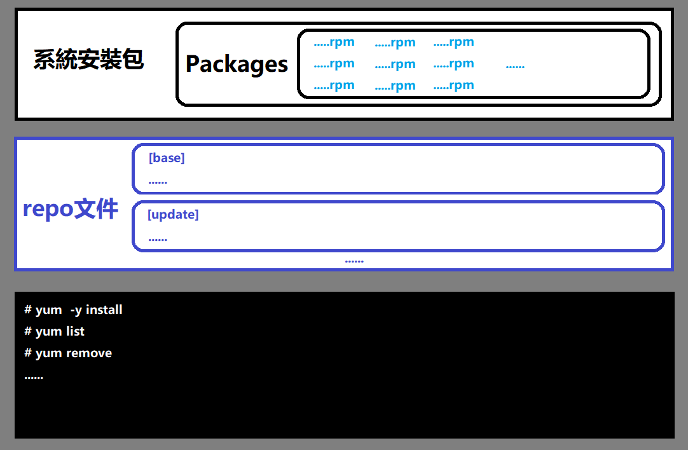

# Linux軟件安裝
* 實驗環境：
    - 練習操作平台：https://www.katacoda.com/learn     （特別鳴謝：歐陽錦洪~歐陽） 
    - 內部ftp系統源：ftp://192.168.5.202/pub/centerOS/Packages/  
    - 內部centos7系統源鏡像：http://192.168.5.202/centos7.iso  
    - 內部遠程服務器IP：192.168.5.202  
    - 192.168.5.202服務器賬號密碼：root / root  
    - 外部centos7：http://mirror.centos.org/centos/7/os/x86_64/Packages/  
# 本節培訓課課程內容  
* 安装源的介绍  

* yum源的配置  
    - yum配置文件  
    - yum命令  
    - rpm命令  

* 文件下载命令  
    - wget 命令  

* 文件的归档和释放  
    - tar命令归档文件  
    - tar命令释放文件  
* 階段性小測  

# 安装源的介绍  
    安裝源：俗稱安裝包。  
        linux系列的所有系統，常用以下幾種方式發布安裝源  
    1.iso鏡像文件    如：file://文件夾路徑    
    2.ftp服務器發布   如：ftp://域名/發布的文件夾路徑    
    3.http服務器發布  如：
        http://mirror.centos.org/centos/7/os/x86_64/Packages/
        http://mirrors.aliyun.com/repo/Centos-7.repo  

## 安裝基本方法：1.make  2.rpm  *3.yum  

# yum源的配置  
 **需要root權限**
## yum結構圖  
   

## 配置文件：/etc/yum.repos.d/？？？.repo  

### 配置基本要素：  

| 參數 |  說明|    
| ------ | ------ |    
|[base] | 安裝源標記（也叫倉庫標記、倉庫名稱、容器名,英文：repository name） |     
|name | 安裝源的名稱（包括版本信息） |    
|baseurl | 安裝源所在位置 |   
|enabled=1 | 使用 |   
|gpgcheck	 | 對稱性密鑰檢查開關，有密鑰設置為1，沒有就設置為0 |   
|gpgkey |  密鑰文件所在路徑（gpgcheck=1的時候，必須填寫） |   

#### [更多參數參考鏈接](https://www.cnblogs.com/L-H-R-X-hehe/p/3788291.html)
    https://www.cnblogs.com/L-H-R-X-hehe/p/3788291.html
    

### 內部教學配置案例1  
    [inner-base-source]   
    name=centos-7 for inner study   
    baseurl='ftp://192.168.5.202/pub/centerOS/'   
    enable=1   
    gpgcheck=0   

### 內部教學配置案例2  
    [inner-base-source-with-key]  
    name=centos-7 for inner study  
    baseurl='ftp://192.168.5.202/pub/centerOS/'  
    gpgcheck=1  
    gpgkey='ftp://192.168.5.202/pub/centerOS/RPM-GPG-KEY-CentOS-7'  
    enabled=1  

## yum命令   
語法：yum [options] [subcommand] [package ...]
功能：管理軟件的安裝
### 常用參數案例
     yum list  [packagename]    查看指定軟件包的信息
     yum list mysql*	             使用通配符
     yum search 查询名	模糊搜索包含指定名字的軟件包
     yum [-y] install 包1 包2 ... 包n	安裝指定軟件
     yum update 包1 包2 ... 包n	升級
     yum remove 包1 包2 ... 包n     卸載

<u>小任務：安裝wget和lftp，安裝httpd ，安裝ftp</u>

## 文件下载命令  wget [option]... [URL]...  
功能：網絡文件下載（用于下載別人發布的安裝源）
### EX:
    # wget http://mirror.centos.org/centos/7/os/x86_64/Packages/ImageMagick-6.9.10.68-3.el7.x86_64.rpm    
## rpm命令  
語法：rpm [选项...][軟件]  

| 參數 |  說明|  
| ------ | ------ |  
| -a | 查询所有套件 |   
| -h或--hash | 套件安装时列出标记 |   
| -i | 显示套件的相关信息 |   
| -l | 显示套件的文件列表 |   
| -q | 使用询问模式，当遇到任何问题时，rpm指令会先询问用户 |   
| -R | 显示套件的关联性信息 |   

### 如何安装rpm软件包  
    rpm -ivh your-package                # 直接安装  

### 卸载rpm软件包
    [root@localhost ~]# rpm -ql tree        # 查询  
    [root@localhost ~]# rpm -e tree          # 卸载  

### 列出所有安装过的包  
    [root@localhost ~]# rpm -qa  

### rpm包中的文件安装的位置  
    [root@localhost ~]# rpm -ql 包名  

### 哪个软件包包含这个程序  
    rpm -qf `which 程序名`    #返回软件包的全名  
    rpm -qif `which 程序名`   #返回软件包的有关信息  
    rpm -qlf `which 程序名`   #返回软件包的文件列表[root@localhost ~]# rpm -qf `which sshd`  

#### [rpm命令其他參數參考鏈接](https://www.runoob.com/linux/linux-comm-rpm.html)
    https://www.runoob.com/linux/linux-comm-rpm.html

# 文件的歸檔和釋放
## 語法: tar [option]...[文件名][文件內容]    
    🔺 歸檔  
        tar -cf   jpg.tar *.jpg //将當前目錄下全部jpg文件打包成tar.jpg 
    🔺 查看文件
        tar -tf   jpg.tar //将當前目錄下全部jpg文件打包成tar.jpg 
    🔺 釋放：
        tar -xf  file.tar //解壓tar包到當前目錄
    · 压缩
        tar -czf  jpg.tar.gz  *.jpg //將資料夾裏全部jpg檔案打包成jpg.tar，而且將其用gzip壓縮，生成一個gzip壓縮過的包，命名為jpg.tar.gz
        tar -cjf  jpg.tar.bz2  *.jpg //將資料夾裏全部jpg檔案打包成jpg.tar，而且將其用bzip2壓縮。生成一個bzip2壓縮過的包。命名為jpg.tar.bz2
        tar -cZf  jpg.tar.Z   *.jpg //將資料夾裏全部jpg檔案打包成jpg.tar，而且將其用compress壓縮。生成一個umcompress壓縮過的包，命名為jpg.tar.Z
        rar a  jpg.rar  *.jpg //rar格式的壓縮。須要先下載rar for linux
        zip  jpg.zip  *.jpg //zip格式的壓縮。須要先下載zip for linux
    · 解壓（.tar.xz檔案先得用xz進行解壓）
        tar -xzvf file.tar.gz//解壓tar.gz
        tar -xjvf file.tar.bz2//解壓tar.bz2
        tar -xZvf file.tar.Z //解壓tar.Z
        unrar e file.rar//解壓rar
        unzip file.zip//解壓zip
    · 總結
        1、*.tar 用tar -xvf解壓
        2、*.gz 用gzip -d或者gunzip解壓
        3、*.tar.gz和*.tgz 用tar -xzf解壓
        4、*.bz2 用bzip2 -d或者用bunzip2解壓
        5、*.tar.bz2 用tar -xjf解壓
        6、*.Z 用uncompress解壓
        7、*.tar.Z 用tar -xZf解壓
        8、*.rar 用unrar e解壓
        9、*.zip 用unzip解壓
#### [参考連接](https://www.cnblogs.com/lxjshuju/p/6732923.html)
        https://www.cnblogs.com/lxjshuju/p/6732923.html

# 階段性小測試
    - 使用vim命令，配置如案例1中的yum源，並保存到/tmp/my_yum.repo  
    - 查詢所有具有『lftp』關鍵字的安裝包  
    - 創建一名為my_packages的目錄  
    - 將已經外部centos7：http://mirror.centos.org/centos/7/os/x86_64/Packages/中所有包含『lftp』關鍵字的rpm包下載到『my_packages』目錄中  
    - 下載好之后，將『my_packages』目錄進行歸檔，歸檔後的文件名為『my_package.tar』
    - 安裝lftp服務  
    
## 作業提交地址  
    (共享盤盤符):\03科技部\運維組\linux培訓\linux作業收集\class3軟件安裝  
