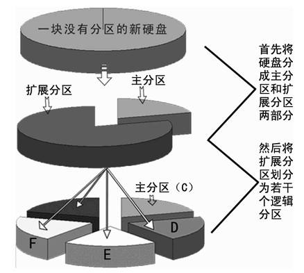
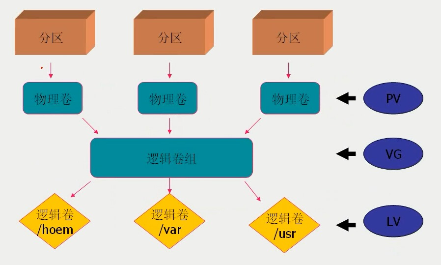

# Linux磁盤管理  
* 實驗環境：  
    - 內部遠程服務器IP：192.168.5.202  
    - 硬盤空閒空間：每位同朋最多可用 【5G】 空間  
# 本節培訓課課程內容  
* 硬盤相關常識  
* linux下的磁盤管理  
    - 創建分區  
    - 分區格式化  
    - 分區掛載  
    - 刪除分區  
* lvm（邏輯卷管理）  
    - 案例場景  
    - 概念術語  
    - 創建邏輯卷  
    - 修改邏輯卷  
    - 刪除邏輯卷  
    - 遷移邏輯卷  
    - 掛載邏輯卷  

# 磁盤相關常識    
### 一個磁盤主流技術模式限制下：只能分出4個分區  （PS:GPT模式下理論上可以有128个分區）  
### 分區有2種類型：    
        - 主分區  
            主分區可以直接格式化使用  
        - 擴展分區  
            擴展分區不可直接使用，所以產生一個概念上的分區：
                -- 邏輯分區  
                    理論上：邏輯分區可以有無限個
### PS:分區指引
    1個主分區 + 0個擴展分區=1個分區
    1個主分區 + 1個擴展分區=2個分區  
    2個主分區 + 1個擴展分區=3個分區
    3個主分區 + 1個擴展分區=4個分區
    4個主分區 + 0個擴展分區=4個分區

    不可能有5個分區，不可能有2個擴展分區（邏輯分區不在考慮範圍內：不是一個概念上的分區）

# linux下的磁盤管理 
## 創建分區  
### 查看磁盘使用情况
    df -h
### 列出可用塊设备的信息
    lsblk
### 列出设备的状况  
    fdisk -l
### 对指定磁盘操作  
    fdisk /dev/sda
### 磁盤分區命名規則
    格式：/dev/xxyN
| 參數 |  說明|  
| ------ | ------ |  
| xx | 分區所在的設備類型。sd  (SCSI接口磁盤)，hd   (IDE接口磁盤) |   
| y | 以字母標記xx類型下的磁盤編號 |   
| N | 以數字標記xxy下的磁盤分區編號 |  
#### 案例
| 樣例 |  說明|  
| ------ | ------ |  
| sda | 第一塊SCSI接口磁盤 |   
| sdb | 第二塊SCSI接口磁盤 |   
| hda | 第一塊IDE接口磁盤 |   
| sda1 | 第一塊IDE接口磁盤下的第一個分區 |   
| sda2 | 第一塊IDE接口磁盤下的第二個分區 |  
### 新建分區  *(在執行了  *fdisk/dev/sda* 之後)*
    Command action
    d   delete a partition
    g   create a new empty GPT partition table
    G   create an IRIX (SGI) partition table
    l   list known partition types
    m   print this menu
    n   add a new partition
    o   create a new empty DOS partition table
    p   print the partition table
    q   quit without saving changes
    s   create a new empty Sun disklabel
    t   change a partition's system id
    v   verify the partition table
    w   write table to disk and exit
    x   extra functionality (experts only)
#### 操作步驟案例：
1.  p   查看一下當前磁盤分區情況  
2.  n   新建 
3.  輸入分區序號（默認按回車） 
4.  磁盤分區開始位置（默認按回車）  
5.  +NG 磁盤分區結束位置  
6.  p   查看下添加情況  
7.  w   保存和退出  
8.  `# partx -a /dev/sda`   可告知系統內核，讓修改立即生效

## 分區格式化  
    mkfs.xfs    /dev/sda6
## 分區掛載  
    mkdir ./mysd 
    mount /dev/sda6 ./mysd  
<U>問題1：能否將分區掛載到多個目錄中？</U>
## 刪除分區 
1.  卸載分區
        可以目錄為基準或者以分區為基準
<U>問題2：有什麼區別？？</U>
2.  fdisk/dev/sda
3.  d   刪除
4.  w   保存修改
5.  partx -a /dev/sda   可告知系統內核，讓修改立即生效

# lvm（邏輯卷管理）
    共享盤：2T  滿了
    處理方案：買個新盤，數據拷貝。。。。。。

## 概念術語
|術語|描述|
|-----|-----|
|PV | 物理卷：將分區打散為的存儲小塊|
|VG | 卷組：將打散後的小塊重新組合，形成一個倉庫|
|LV | 邏輯卷：將卷組裡面的小塊重新劃分為分區：邏輯卷分區（可直接格式化，掛載，讀寫數據） |
##  命令列表
|分类|命令|说明|示例|
|-----|-----|-----|-----|
|PV|	pvcreate|	创建物理卷|	pvcreate /dev/sdb1|
|PV|	pvdisplay|	显示已创建的物理卷的详细信息||	 
|PV|	pvs|	显示已创建的物理卷的汇总信息||	 
|PV|	pvmove|	分區數據遷移|	pvmove /dev/sdb1 /dev/sda2|
|PV|	pvremove|	删除物理卷|	pvremove /dev/sdb1|
|VG|	vgcreate|	创建卷组|	pvcreate vg1 /dev/sdb1 /dev/sdb2 …|
|VG|	vgdisplay|	显示已创建的卷组的详细信息||	 
|VG|	vgs|	显示已创建的卷组的汇总信息	|| 
|VG|	vgextend|	扩展卷组	|vgextend vg1 /dev/sdb3 …|
|VG|	vgreduce|	收缩卷组	|vgreduce vg1 /dev/sdb5|
|VG|	vgremove|	删除卷组	|vgremove vg1|
|LV|	lvcreate|	创建逻辑卷	|lvcreate -L 1000M -n lv1 vg1|
|LV|	lvdisplay|	显示已创建的逻辑卷的详细信息||	 
|LV|	lvs|	显示已创建的逻辑卷的汇总信息|	 
|LV|	lvresize|	重设逻辑卷大小	|lvresize -L 1000M /dev/vg1/lv1|
|LV|	lvremove|	删除逻辑卷	|lvremove /dev/vg1/lv1|
|LV|	xfs_growfs|	更新逻辑卷信息(xfs)	|xfs_growfs /dev/vg1/lv1|
|LV|	resize2fs|	更新逻辑卷信息(ext4)	|resize2fs /dev/vg1/lv1|
|LV|    e2fsck|	检查逻辑卷错误(ext4)|e2fsck -f /dev/vg1/lv1|
## 案例1：（最簡單的邏輯卷創建步驟）
#### 將/dev/sda6做成邏輯卷
`# pvcreate /dev/sda6`  
`# pvdisplay`  
`# vgcreate vg0 -s 16M /dev/sda6`  
`# vgdisplay`   
`# lvcreate  -L 1G -n lv0 vg0`   
`# mkfs.xfs /dev/vg0/lv0`  
#### 開機自動掛載
`# vim /etc/fstab`  
+`  /dev/vg0/lv0 /home/yts/lvdir xfs defaults    0 0`  
`# mount -a`  
## 案例2：擴展lv（將lvdir目錄的容量擴大）
`# lvresize -L 600M /dev/vg0/lv0`  
`# lvdisplay`  
`# df -h`  
`# xfs_growfs /dev/vg0/lv0`  
`# df -h`  
<u>PS：使用場景中，一般不縮小lv，xfs格式不支持直接縮小</u>  

## 案例3：卷組（VG）擴容
`# vgdisplay`  
`# pvcreate /dev/sda7`  
`# vgextend vg0 /dev/sda7`  
`# vgdisplay`  

## 案例4：分區數據遷移
`# pvmove /dev/sda6 /dev/sda7`  
`# vgreduce vg0 /dev/sda6`  

## 案例5：還原（釋放）lvm 資源
`# umount /dev/mapper/vg0-lv0`  
`# lvremove /dev/vg0/lv0`  
`# vgremove vg0`  
`# pvremove /dev/sda6`  
`# pvremove /dev/sda7`  

# 作業
    1.創建2個分區，大小分別人1G和2G，
        - 創建之前截圖
        - 創建之後截圖
    2.將剛才創建的第一個分區打散為PV,
        - 截圖通過pvdisplay查看這個分區的信息
    3.如課堂所述，創建一個的邏輯卷，
        - VG 命名格式例子：yts_vg
        - 通過vgdisplay查看創建好之後的信息，並且截圖
        - LV 命名格式例子：yts_lv
        - lv 初始大小為128M
        - 通過lvdisplay查看創建好之後的信息，並且截圖
        - 將此邏輯卷掛載到同名目錄上。如：yts_lv邏輯卷掛載到yts_lv目錄上
        - 通過df -h查看創建好之後的信息，並且截圖
    4.擴大卷組
        - 將第二個分區加入卷組
        - 通過vgdisplay查看擴大之後的信息，並且截圖
    5.擴大你的邏輯卷
        - 擴大邏輯卷大小為2.5G（允許一定範圍內的差異）
        - 通過df -h查看擴展好之後的信息，並且截圖
    5.釋放所有資源
        - 給其他同朋練習
        - 還原存儲資源為初始狀態

# 第二課  
## 實踐課  
### 實踐題目：  
1. 分區的掛載和卸載  
	假設我們的linux服務器搭建好了一個網站服務，根目錄為：/var/www/html。同時也搭建好了一個FTP服務，根目錄為/var/ftp/pub  
	這兩個服務都有一個對應的download目錄：（/var/www/html/download和/var/ftp/pub/download）  
	為了節省空間，將兩者的download都映射到同一個分區。
	請同朋們進行實操
2. 邏輯卷管理1  
	請用各自的語言描述lvm的製作過程。
3. 邏輯卷管理2   
	在存儲服務器（共享盤）未搭建之前，預估共享盤大小為1G，後來由於業務需要，比如：培訓課的所有課程都要錄像並且保存，發現需要2G，甚至更多的容量才夠用。 
	請製作邏輯卷：share  
4. 邏輯卷管理3   
	某天發現：邏輯卷組的第二塊硬盤（模擬為某個分區）已經使用了5年以上，達到了更新換代的年限。
	請使用新的硬盤（模擬為新分區）進行替換。
