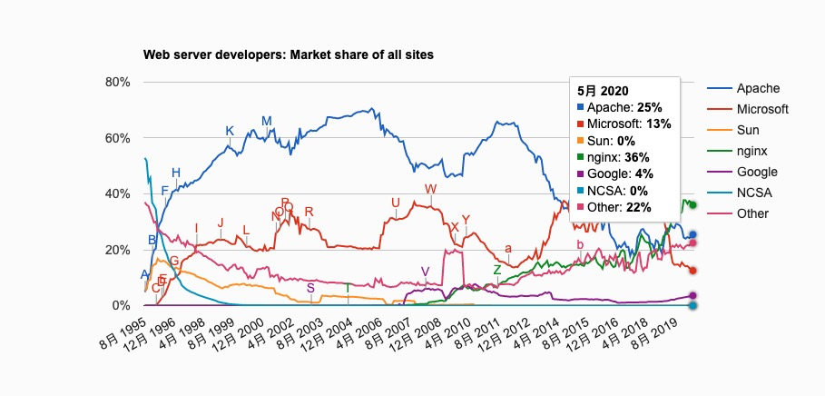
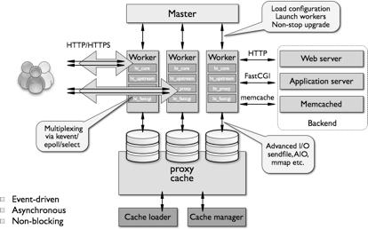
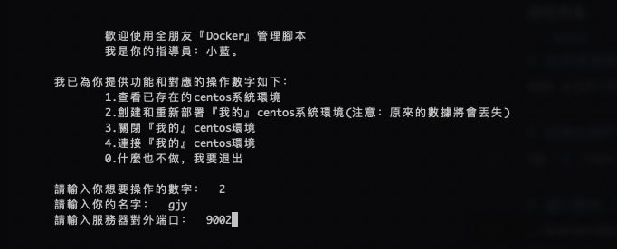

# nginx教程

[toc]

## 一、nginx是什麼

 

Nginx（engine x）是一個高性能的HTTP和反向代理web服務器，同時也提供了IMAP/POP3/SMTP服務。Nginx是由伊戈爾·賽索耶夫為俄羅斯訪問量第二的Rambler.ru網站（俄文：Рамблер）開發的，第一個公開版本0.1.0發佈於2004年10月4日。

其將原始程式碼以類BSD許可證的形式發佈，因它的穩定性、豐富的功能集、示例設定檔和低系統資源的消耗而聞名。2011年6月1日，nginx 1.0.4發佈。

Nginx是一款羽量級的Web服務器/反向代理伺服器及電子郵件（IMAP/POP3）代理伺服器，在BSD-like協定下發行。其特點是佔有記憶體少，併發能力强，事實上nginx的併發能力在同類型的網頁服務器中表現較好，中國大陸使用nginx網站用戶有：百度、京東、新浪、網易、騰訊、淘寶等。

 

 

## 二、為什麼要用nginx

1. 高並發響應性能非常好，官方nginx處理靜態文件並發可以高達 5w/s
2. 反向代理性能非常好。
3. 內存和cpu佔用率低。（為 Apache 的 1/5-1/10）
4. 對後端服務有健康檢查功能。
5. 支持fastcgi方式。
6. 配置代碼簡潔容易上手。
7. 允許直接與 memcache / Redis 或者其他 “NoSQL” 解決方案集成。

## 三、nginx能夠做什麼

1. 基本http服務：http代理和反向代理，支持緩存加速，簡單的負載均衡和容錯
2. 高級http服務：虛擬主機，URL重定向，網絡監控，流媒體傳輸
3. 郵件服務：支持IMAP/POP3代理服務，支持內部SMTP代理服務

## 四、nginx怎麼安裝

課程準備
```bash
# 在終端連接到服務器，請選擇對應的用戶名
ssh gjy@192.168.5.202

# 如果在用戶目錄沒有dockerManager.sh腳本的話，需要執行一次拷貝操作
cp -p /usr/scripts/dockerManager.sh ./

# 運行腳本，進入自己的docker容器中
./dockerManager.sh
```


|  名字   | 對外端口  |
|  ----  | ----  |
| gjy  | 9002 |
| gzp | 9003 |
| hcw | 9004 |
| hjn | 9005 |
| hwy | 9006 |
| lh | 9007 |
| lsf | 9008 |
| lxh | 9009 |
| nl | 9010 |
| xsf | 9011 |
| yj | 9012 |
| yts | 9013 |
| yzh | 9014 |
| ztl | 9015 |
| zwm | 9016 |

 

安裝
```bash
yum install nginx -y
```

## 五、nginx命令

```bash
# 運行nginx
nginx

# 重新加載配置
nginx -s reload

# 重啟
nginx -s reopen

# 關閉nginx
nginx -s stop

# 檢查nginx配置文件是否正確
nginx -t

# 查看nginx版本
nginx -v
```

## 六、nginx配置

基本配置結構

```bash
...              #全局块
events {         #events块
   ...
}
http             #http块
{
    ...          #http全局块
    server       #server块
    { 
        ...                  #server全局块
        location [PATTERN]   #location块
        {
            ...
        }
        location [PATTERN] 
        {
            ...
        }
    }
    server
    {
      ...
    }
    ...           #http全局块
}
```

詳細結構解析

```bash
### 全局塊開始 ###
# 配置運行nginx服務器的用戶和用戶組，格式：user user [group];，思考：如何將所有用戶都可以啟動nginx
user nginx;
# 配置允許nginx進程生成的worker process數量，这个根据设备cpu的核心数*线程数设置会比较合理，但是不能太多，格式：worker_processes number | auto;
worker_processes 2;
# 錯誤日誌配置，格式：error_log file | stderr [debug | info | notice | warn | error | crit | alert | emerg];
error_log /var/log/nginx/error.log;
# 守護進程文件配置，格式：pid 文件地址;
pid /run/nginx.pid;
# 引入的其他配置文件
include /usr/share/nginx/modules/*.conf;

### events塊 ###
events {
   # 允許每一個worker process同時開啟的最大連接數，不能超過系統支持打開的最大文件句柄數
   worker_connections 1024;
}

### http塊 ###
http {
   # 日誌格式
   log_format main  '$remote_addr - $remote_user [$time_local] "$request" '
                   '$status $body_bytes_sent "$http_referer" '
                   '"$http_user_agent" "$http_x_forwarded_for"';
   # 請求日誌，格式：access_log path[format[buffer=size]]
   access_log  /var/log/nginx/access.log  main;

   # 高級配置
   sendfile            on;
   tcp_nopush          on;
   tcp_nodelay         on;
   keepalive_timeout   65;
   types_hash_max_size 2048;

   # 能夠識別的網絡資源配置（Multipurpose Internet Mail Extensions）
   include             /etc/nginx/mime.types;
   default_type        application/octet-stream;

   # 加載配置文件，例如站點配置
   include /etc/nginx/conf.d/*.conf;
  
   server {
      # 支持三種方式，ip，端口，unix domain socket
      listen       80 default_server;
      # server_name配置主機名稱，一般是域名，ip等。
      server_name  _ *.myserver.com www.myserver.com;
      # 指定路徑查找文件，常用，可用於http塊，server塊和location塊
      root         /usr/share/nginx/html;
      # 網站默認主頁，有順序關係
      index        index index.html index.htm

      # 加載默認server配置塊
      include /etc/nginx/default.d/*.conf;

      location / {
         # try_files $uri /index.html;
      }
    
      # 禁止訪問的文件和目錄
      location ~ ^/(\.user.ini|\.htaccess|\.git|\.svn|\.project|LICENSE|README.md)
      {
         return 404;
      }

      # 靜態資源配置
      location ~ .*\.(gif|jpg|jpeg|png|bmp|swf)$
      {
         expires      30d;
         error_log off;
         access_log /dev/null;
      }
      location ~ .*\.(js|css)?$
      {
         expires      12h;
         error_log off;
         access_log /dev/null; 
      }

      # 錯誤頁請求
      error_page 404 /404.html;
         location = /40x.html {
      }
      error_page 500 502 503 504 /50x.html;
         location = /50x.html {
      }
   }
}
```

## 七、作業

按照課程中配置的server1、server2，自己動手配置一次。
1. 下載代碼壓縮包到對應docker下的`/www`下，壓縮包地址：http://ci.ftofs.cn/gaojianyou/nginx/raw/master/server.tar
2. 解壓代碼，代碼的路徑`/www/server`
3. 配置server1.conf，server2.conf，使其能訪問到server下對應的web頁面，並使{名字拼音簡稱}.server1.test訪問server1的配置，{名字拼音簡稱}.server2.test訪問server2的配置
例如：gjy.server1.test; 訪問/www/server/server1下的靜態頁面，並要求頁面的鏈接是可以正常點擊訪問。
gjy.server2.test; 代理http://127.0.0.1:3000，要求訪問的時候能夠獲取客戶端真實的IP地址。

## 附錄

### yum 方式安裝

> 這種方式只使用於centos系統，其他linux安裝方式請參考下面的編譯安裝

安裝命令：

```bash
# 默認版本安裝
yum install nginx -y

# 指定版本安裝，rpm文件安裝，倉庫地址：http://nginx.org/packages/centos/7/x86_64/RPMS/
yum install http://nginx.org/packages/centos/7/x86_64/RPMS/nginx-1.18.0-1.el7.ngx.x86_64.rpm
```

可能遇到的問題：No package nginx available，是因為沒有安裝epel。需要執行下面命令安裝epel。

```bash
yum install epel-release -y
```

### 編譯安裝

> 適用於其他版本的linux

1. 下載nginx，[http://nginx.org/download/](http://nginx.org/download/)，從列表中選擇合適的版本

   ```bash
   wget http://nginx.org/download/nginx-1.18.0.tar.gz
   ```

2. 解壓壓縮文件

   ``` bash
   tar -zxvf nginx-1.18.0.tar.gz
   ```
   
3. 編譯，需要進入剛剛解壓的文件夾內
   
   ```bash
   # 進入nginx目錄
   cd nginx-1.18.0
   
   # 進行編譯，設置前綴，也可以不設置
   ./configure --prefix=/usr/local/nginx
   ```
   
   一般會出現./configure: error: C compiler cc is not found错误
   
   錯誤原因：缺少運行的編譯環境，工具或者庫
   
   ```bash
   yum install gcc gcc-c++ ncurses-devel perl pcre pcre-devel zlib gzip zlib-devel open openssl-dev
   ```
   
4. 安裝nginx
   
   ```bash
   make & make install
   ```
   
5. 刪除nginx

   ```bash
   # 前提是上面設置了prefix，不設置的話是默認
   rm -rf /usr/local/nginx
   ```

### 可能遇到的問題

- 配置完之後沒法訪問，可能是防火墻問題，需要設置防火墻開放對應的端口

### 防火墻端口操作

```bash
# 查看端口是否開啟
firewall-cmd --query-port=80/tcp

# 開啟端口
firewall-cmd --zone=public --add-port=80/tcp --permanent

# 重啟防火墻
firewall-cmd --reload

# 查看有哪些端口已開啟
firewall-cmd --list-port

# 關閉防火墻，生產環境勿用
systemctl stop firewalld.service #停止firewall
systemctl disable firewalld.service #禁止firewall开机启动

# 系統啟動時啟動nginx
sudo systemctl enable nginx
```

### 相關命令
```bash
# 查看用戶
cut -d : -f 1 /etc/passwd

# 查看用戶組
cut -d : -f 1 /etc/group

# 查看linux相關參數
ulimit -a
示例：
core file size          (blocks, -c) 0
data seg size           (kbytes, -d) unlimited
scheduling priority             (-e) 0
file size               (blocks, -f) unlimited
pending signals                 (-i) 3796
max locked memory       (kbytes, -l) 64
max memory size         (kbytes, -m) unlimited
open files                      (-n) 1024
pipe size            (512 bytes, -p) 8
POSIX message queues     (bytes, -q) 819200
real-time priority              (-r) 0
stack size              (kbytes, -s) 8192
cpu time               (seconds, -t) unlimited
max user processes              (-u) 3796
virtual memory          (kbytes, -v) unlimited
file locks                      (-x) unlimited
# 其中的open files就是打開文件的最大句柄數

# 臨時修改linux相關參數，僅當前進程有效，格式：ulimit (上面示例中括號裡面的參數) 數值
ulimit -n 2048
```

### Nginx可視化配置工具

https://www.digitalocean.com/community/tools/nginx


### 修改hosts

#### window下修改hosts文件
進入C盤，在windows文件夾中找到System32->drivers->etc，右擊hosts文件使用編輯器編輯
如果沒有權限，請右擊hosts文件編輯屬性，在安全->組或者用戶名->編輯，分配當前用戶所有權限

#### 使用switchhosts軟件修改
下載地址[SwitchHosts](https://oldj.github.io/SwitchHosts/)